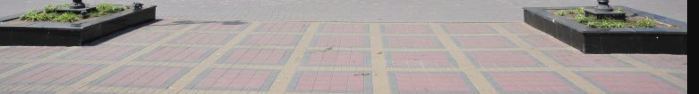
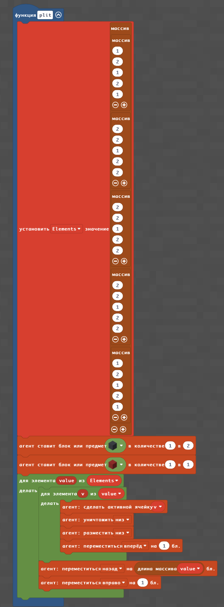
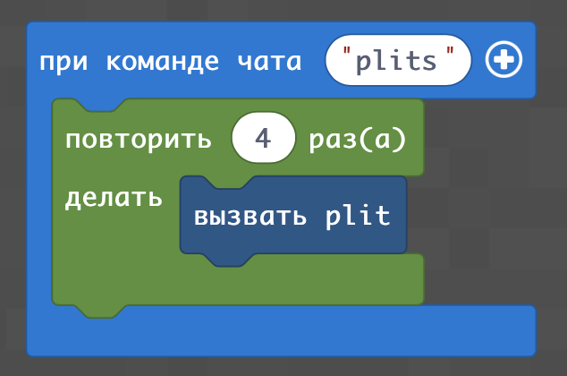
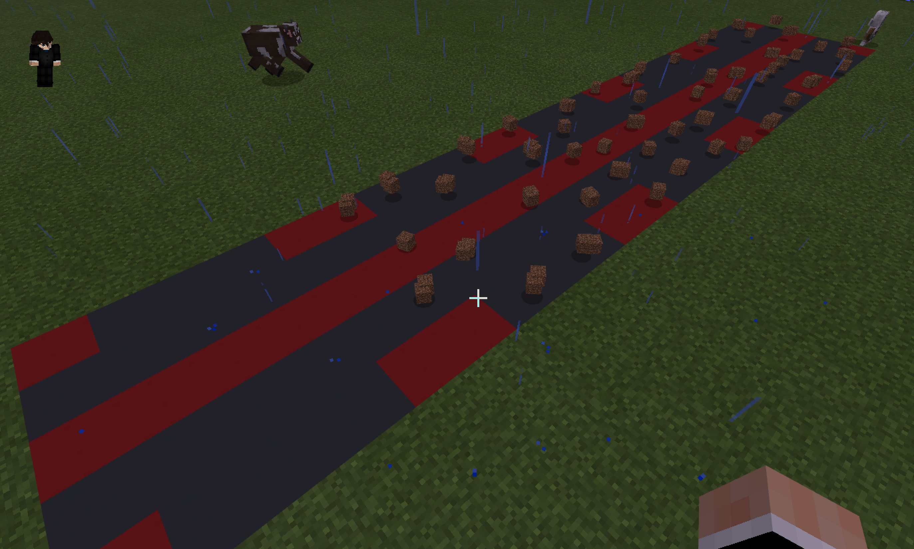
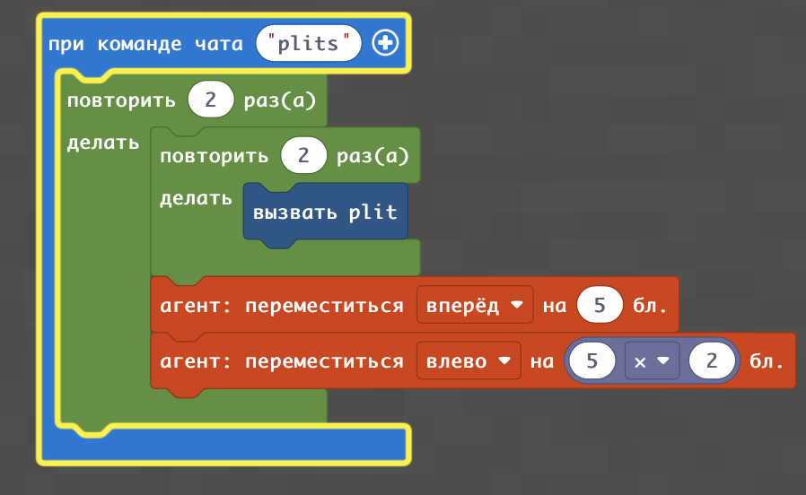
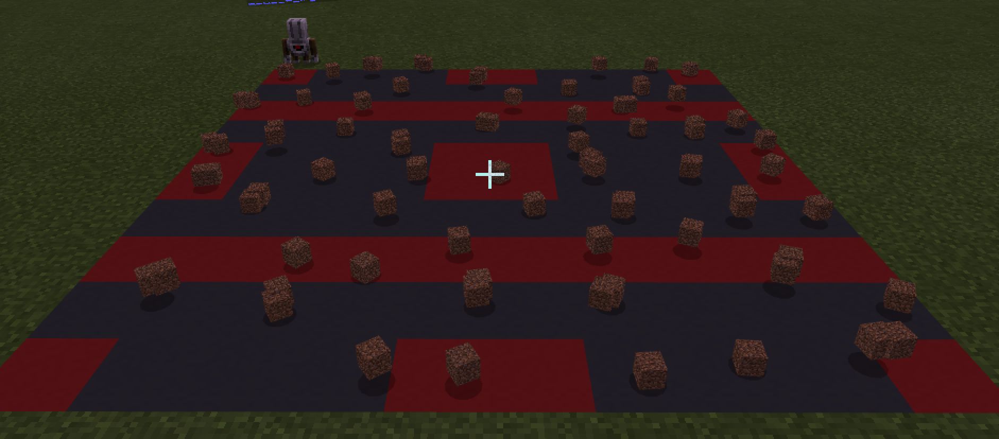

# Двумерные изоражения. Тратуарная плитка.
## Тратуарная плитка
|#|Задание|Код|Результат|
|---|---|---|---|
|1|1. Постройте квадарт 5х5 с тратуарной плиткой |  ||

### Творческое задание:
1. Реализуйте тратуарную плитку, аналогичную той, которая нариована на картинке.

  

## Линия тратуарной плитки
|#|Задание|Код|Результат|
|---|---|---|---|
|2|1. Замостите площадь плиткой по примеру |  ||

## Квадрат тратуарной плитки
|#|Задание|Код|Результат|
|---|---|---|---|
|2|1. Замостите площадь плиткой по примеру |  ||
