# Неігрові персонажі та команди до них
1. Створення неігрового персонажу.
2. Команди до неігрових персонажів.
3. Огорожа простору бою (телепортація в сітку і боротьба із мобами).

## Телепорт
|№|Завдання|Код|Результат|
|---|---|---|---|
|1|1. При введенні в чат команди teleport телепортуватися в точку (0;4;30). 2. При введені в чат команди teleport телепортуватися в точку (10;4;30). 1. При введені в чат команди teleportup телепортуватися в точку (0;14;30). |player.onChat("teleport", function () { player.teleport(world(0, 4, 30)) })|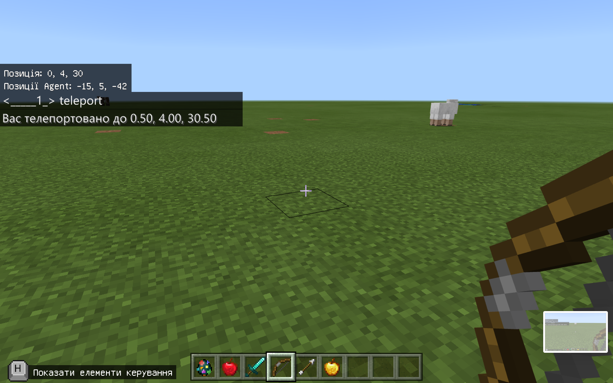|

## Огорожа
|№|Завдання|Код|Результат|
|---|---|---|---|
|2|1. При введенні в чат команди border побудувати огорожу від точки (0;4;30) до точки (10;4;40) |player.onChat("border", function () {     blocks.fill(     OAK_FENCE,     world(0, 4, 20),     world(10, 14, 40),     FillOperation.Hollow     )     blocks.fill(     AIR,     world(1, 4, 19),     world(9, 4, 39),     FillOperation.Hollow     ) })||

## Огорожа з телепортом
|№|Завдання|Код|Результат|
|---|---|---|---|
|2|1. При введенні в чат команди start побудувати огорожу від точки (0;4;30) до точки (10;4;40) і телепортуватися в точку player.teleport(world(0, 4, 30))|player.onChat("border", function () {     player.teleport(world(0, 4, 30))     blocks.fill(     OAK_FENCE,     world(0, 4, 20),     world(10, 14, 40),     FillOperation.Hollow     )     blocks.fill(     AIR,     world(1, 4, 19),     world(9, 4, 39),     FillOperation.Hollow     ) })||

## Створити NPC
|№|Дія|Результат|
|---|---|---|
|1|Переключемо режим "Творець світу" в положення "Так" - в чаті дамо команду /wb|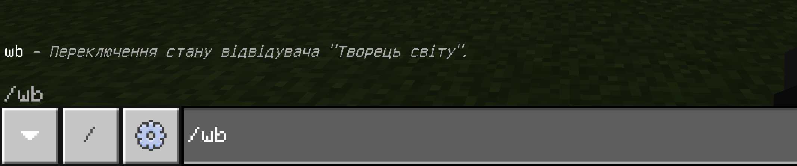|
|2|В інвентарі знайдемо яйце призову NPC|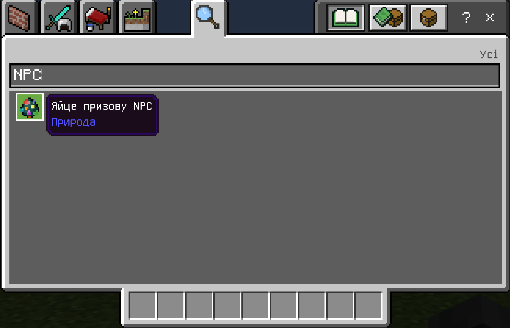|
|3|Додамо яйце призову NPC в свою ячейку|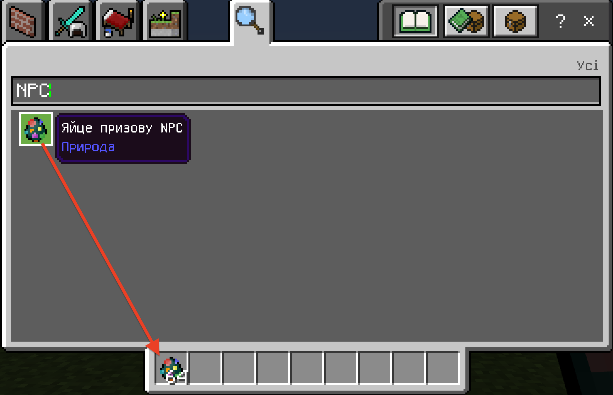|
|4|ВИкористаємо яйце призову NPC - натиснувши правою клавішою за умови, що яйце в знаходиться в активній ячійці|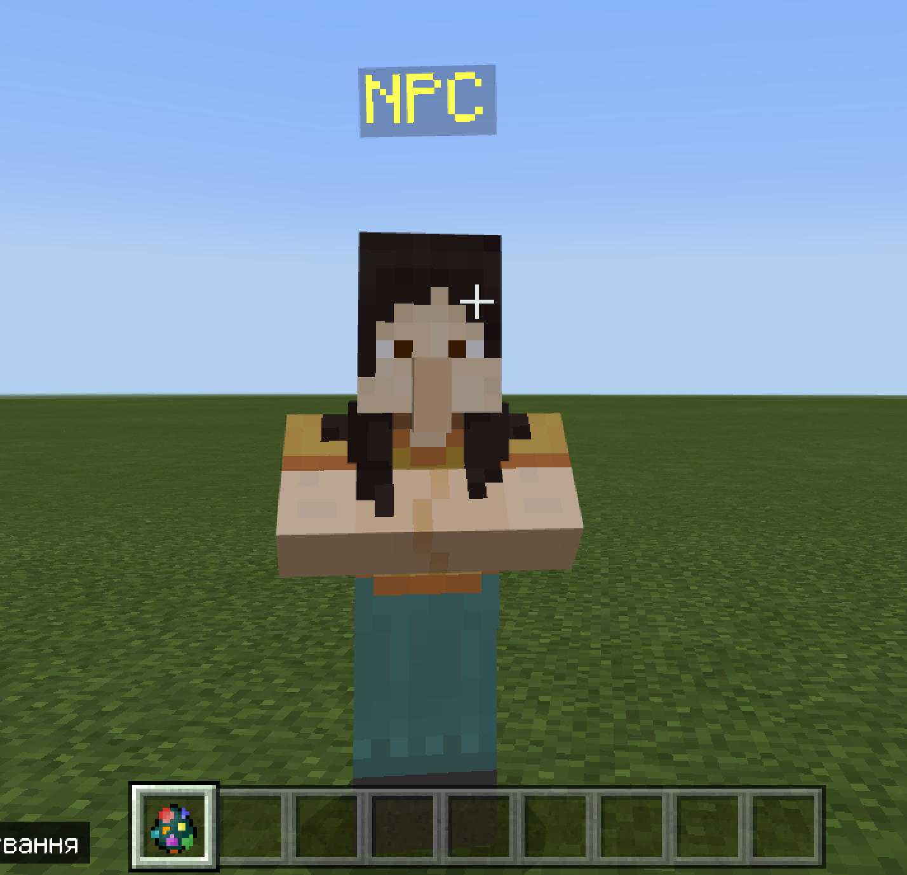|
|5|Оберемо ім'я NPC (поле 1) та оберемо скін (поле 3)|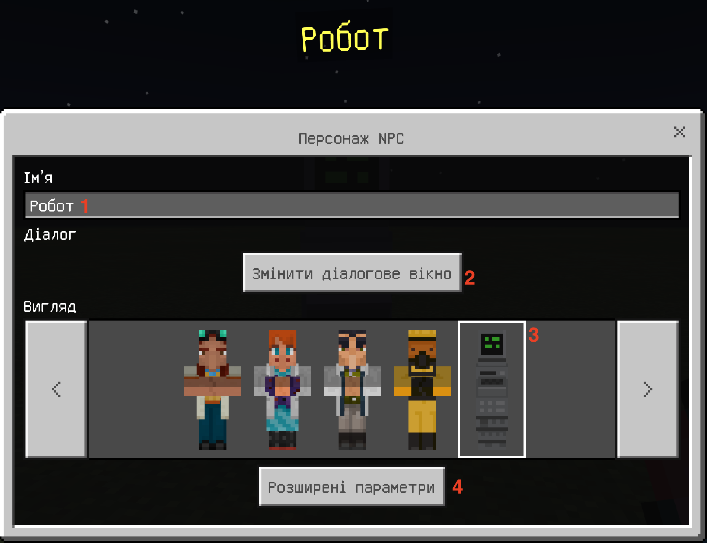|
|6|Введемо текст, який буде виводити NPC (поле 2 на попередній картинці)|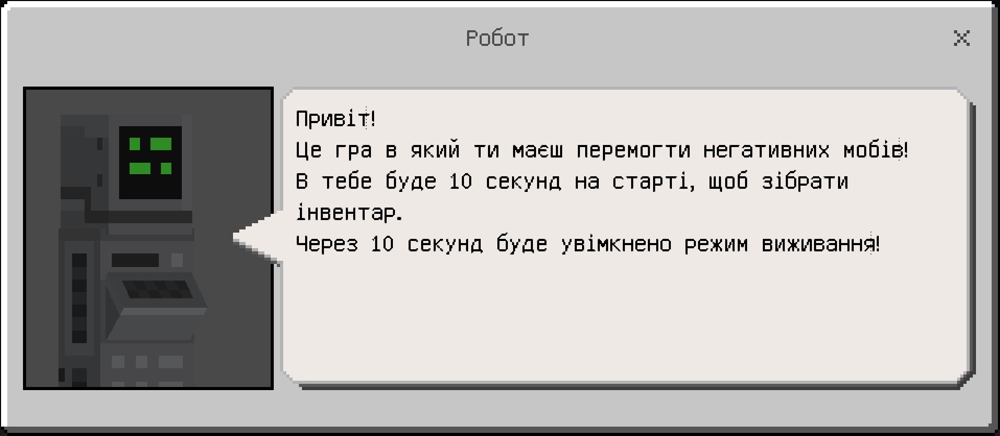|
|7|Після завершення дій - закриємо вікно|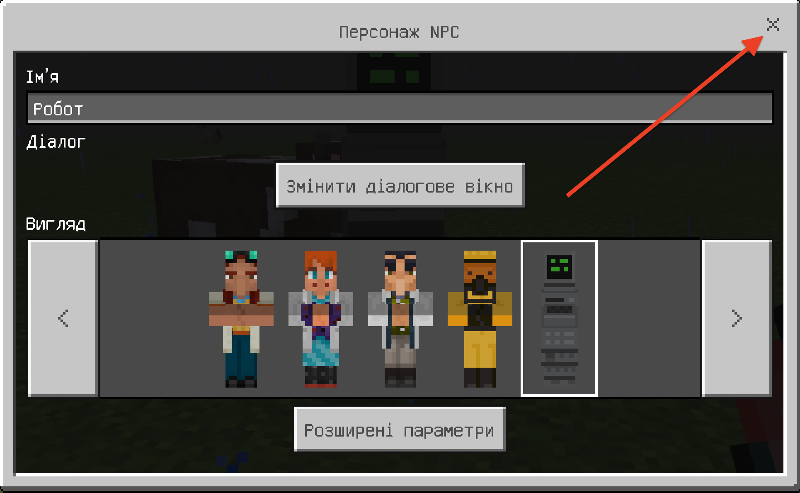|
|8|Переключемо режим "Творець світу" в положення "Ні" - в чаті дамо команду /wb |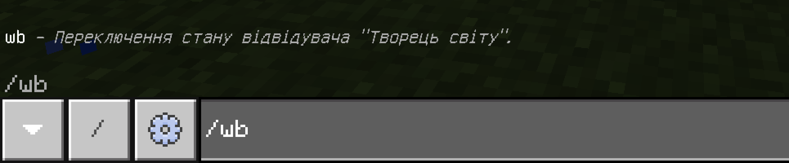|
|9|Побачемо NPC|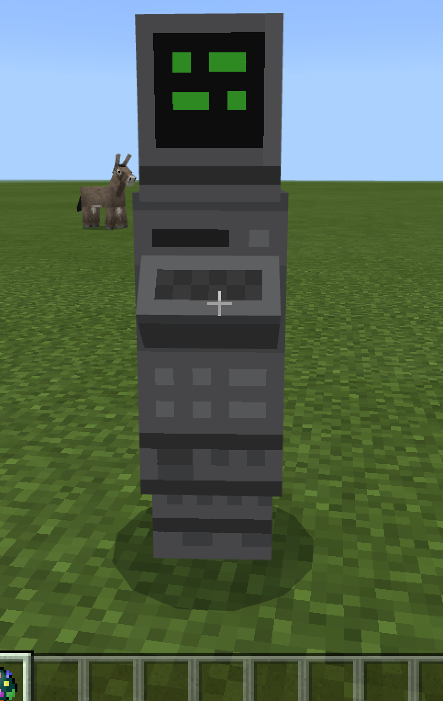|
|10|При нажатті правої клавіші миші на NPC побачемо інформаційне повідомлення |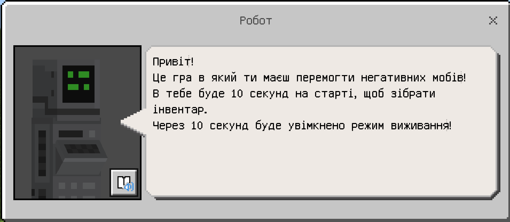|

### Творче завдання
1. Додайте NPC, який описує ваше гру, яку ви створили на попередньому занятті (в тому числі - які команди можна натискамти)

### СуперТворче завдання
1. Поєднайте дане заняття із попереднім (щоб гра стартувала не просто з появи негативних мобів, а також щоб створювалася клітка для битви і гравця переносило в цю клітку).

### Команди NPC
NPC Може не тільки писати текст, але й відображати команди.   

Для підготовки команди - її варто відпрацювати в чаті:  
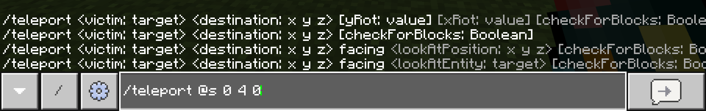
  
В NPC натиснемо "Додаткові функції  
  
Оберемо поле "Команда"  
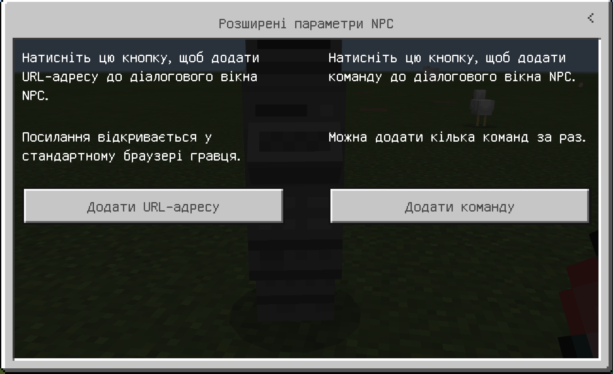

Додамо код (наприклад - телепорту)  
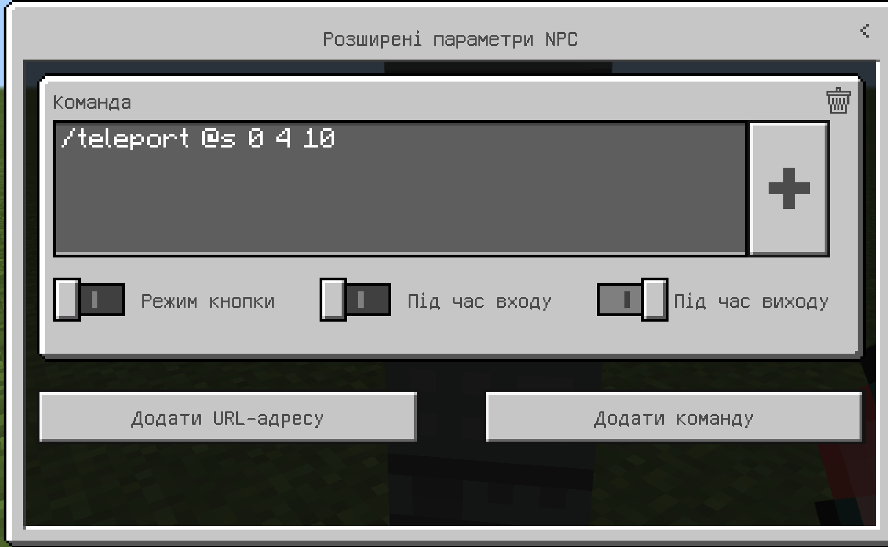

## Отримати інвентар
За допомогою  NPC (або командами) можна надати інвентар гравцю.
Протестуємо команду передачі алмазного меча найближчому гравцю:

`/give @p diamond_sword`

`/give` - команда передачі предмету гравці
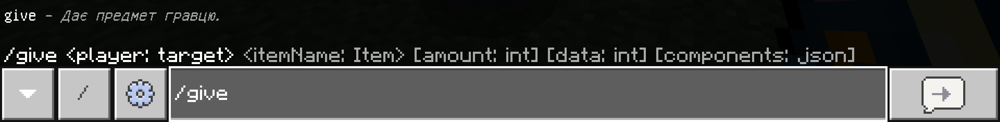

`@p` - найближчему гравцеві
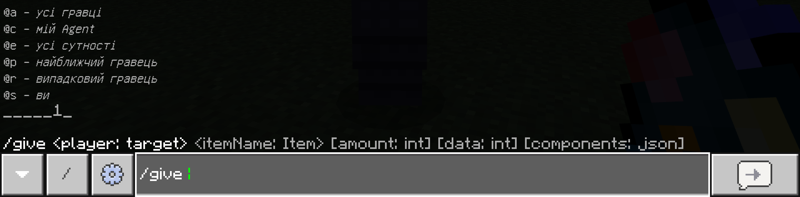

`diamond_sword` - алмазного меча
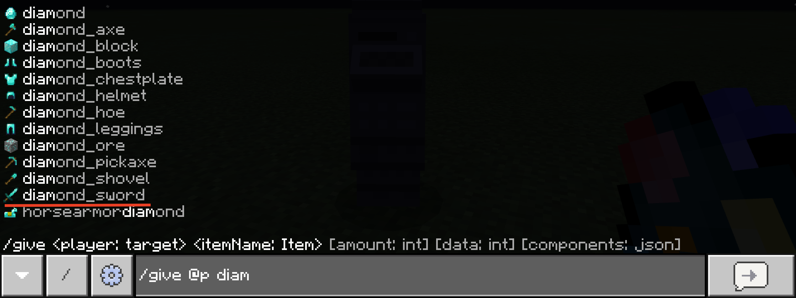

(замість @p можна вказати ім'я гравця)

## Кнопка з отримання інвентаря
Увімкнемо режим "Творець світу  

Зайдемо в NPC та оберемо меню "**Розширені параметри**"  

Включемо "Режим кнопки" та додамо команду отримання меча  
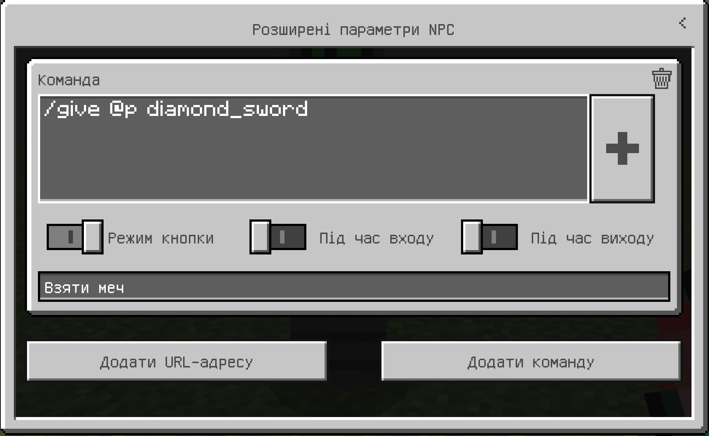

|№|Завдання|Код|Результат|
|---|---|---|---|
|3|1. Додайте NPC, кнопку "Взяти меч", що надає гравцеві алмазного меча.  2. Додайте NPC, кнопку "Отримати лук та стріли", що надає гравцеві лук (bow) та стріли (arrow).  3. Додайте NPC, кнопку "Отримати тризуб", що надає гравцеві тризуб (trident).||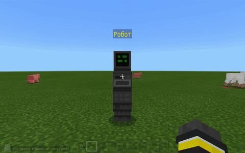|