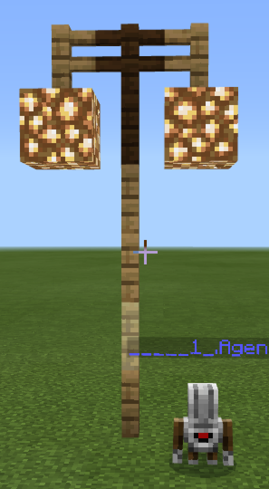

# Массивы
## Дорога
Массивы позволяют хранить информацию
|#|Альтернативное задание|Код|Результат|
|---|---|---|---|
|1|1. Построить дорогу из 7 блоков. Основа дороги из черных блоков бетона, разметка - из белых блоков бетона по схеме (бччбчччб) 2. Построй однополосную дорогу: основа из черного бетона, разметка из белого бетона по схеме (бчччб) 3. Построй "велодорожку": основа из черного бетона, разметка из белого бетона по схеме (чбч) |let ar: number[] = [] player.onChat("road", function () { agent.setItem(BLACK_CONCRETE, 1, 1) agent.setItem(WHITE_CONCRETE, 1, 2) ar = [2,1,1,2,1,1,2] for (let index = 0; index < 20; index++) { for (let value of ar) { agent.setSlot(value) agent.destroy(DOWN) agent.place(DOWN) agent.move(RIGHT, 1) } agent.move(LEFT, 7) agent.move(FORWARD, 1) } })||

**Творческое задание:**
1. С помощью массива написать свое имя с помощью блоков используя шифр азбуки Морзе.

## Фонарь

|№|Альтернативные задания|Код|Скриншот|
|---|---|---|---|
|1|1. Построить фонарь с палочкой из забора из дуба (1), забора из березы (2), забора из темного дуба (3) по формуле (1-2-1-1-3)2. Построить фонарь на 1 блок ниже предыдущего по своей формуле. 3. Построить фонарь на 2 блока выше предыдущего по своей формуле. |let ar: number[] = [] let column: number[] = [] let crossbar: number[] = [] player.onChat("road", function () {     agent.setItem(BLACK_CONCRETE, 1, 1)     agent.setItem(WHITE_CONCRETE, 1, 2)     ar = [     2,     1,     1,     2,     1,     1,     2     ]     for (let index = 0; index < 20; index++) {         for (let value of ar) {             agent.setSlot(value)             agent.destroy(DOWN)             agent.place(DOWN)             agent.move(RIGHT, 1)         }         agent.move(LEFT, 7)         agent.move(FORWARD, 1)     } }) player.onChat("t", function () {     agent.teleportToPlayer() }) player.onChat("light", function () {     agent.setItem(OAK_FENCE, 1, 1)     agent.setItem(BIRCH_FENCE, 1, 2)     agent.setItem(DARK_OAK_FENCE, 1, 3)     agent.setItem(GLOWSTONE, 1, 4)     column = [     1,     2,     1,     1,     3     ]     for (let value of column) {         agent.setSlot(value)         agent.place(FORWARD)         agent.move(UP, 1)     }     agent.move(LEFT, 1)     crossbar = [1, 3, 1]     for (let value of crossbar) {         agent.setSlot(value)         agent.place(FORWARD)         agent.move(RIGHT, 1)     }     agent.move(DOWN, 1)     agent.move(LEFT, 3)     agent.setSlot(4)     agent.place(FORWARD)     agent.move(RIGHT, 2)     agent.place(FORWARD)     agent.move(DOWN, column.length - 1) }) ||

**Творческие задания:**
1. Построить аллею фонарей.
2. Построить аллею фонарей вдоль дороги.
3. Построить аллею фонарей вдоль дороши (справа от фонарей - дорога, слева - велодорожка).

**Супер-творческое задание:**
1. Построить микрорайон: дома, между которыми проходят дороги, дорожки и велодорожки, размещены фонари, чтобы даже ночью было видно куда идти. На главной площади выложите узор.