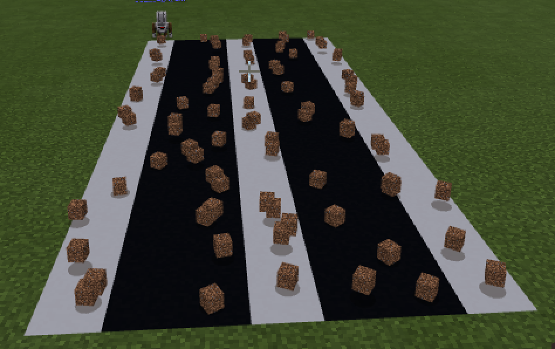

# Массивы
Массивы позволяют хранить информацию
|#|Альтернативное задание|Код|Результат|
|---|---|---|---|
|1|1. Построить дорогу из 7 блоков. Основа дороги из черных блоков бетона, разметка - из белых блоков бетона по схеме (бччбчччб) 2. Построй однополосную дорогу: основа из черного бетона, разметка из белого бетона по схеме (бчччб) 3. Построй "велодорожку": основа из черного бетона, разметка из белого бетона по схеме (чбч) |let ar: number[] = [] player.onChat("road", function () { agent.setItem(BLACK_CONCRETE, 1, 1) agent.setItem(WHITE_CONCRETE, 1, 2) ar = [2,1,1,2,1,1,2] for (let index = 0; index < 20; index++) { for (let value of ar) { agent.setSlot(value) agent.destroy(DOWN) agent.place(DOWN) agent.move(RIGHT, 1) } agent.move(LEFT, 7) agent.move(FORWARD, 1) } })||