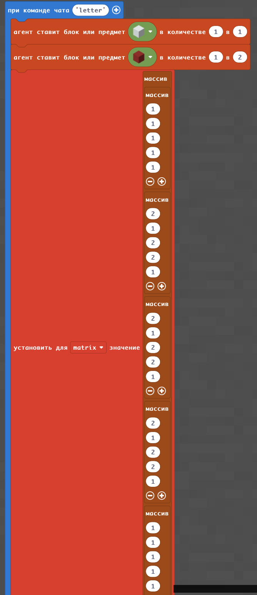

# Массивы
## Дорога
Массивы позволяют хранить информацию
|#|Альтернативное задание|Код|Результат|
|---|---|---|---|
|1|1. Построить дорогу из 7 блоков. Основа дороги из черных блоков бетона, разметка - из белых блоков бетона по схеме (бччбчччб) 2. Построй однополосную дорогу: основа из черного бетона, разметка из белого бетона по схеме (бчччб) 3. Построй "велодорожку": основа из черного бетона, разметка из белого бетона по схеме (чбч) |||

**Творческое задание:**
1. С помощью массива написать свое имя с помощью блоков используя шифр азбуки Морзе.

## Фонарь

|№|Альтернативные задания|Код|Скриншот|
|---|---|---|---|
|2|1. Построить фонарь с палочкой из забора из дуба (1), забора из березы (2), забора из темного дуба (3) по формуле (1-2-1-1-3) 2. Построить фонарь на 1 блок ниже предыдущего по своей формуле. 3. Построить фонарь на 2 блока выше предыдущего по своей формуле. |||

**Творческие задания:**
1. Построить аллею фонарей.
2. Построить аллею фонарей вдоль дороги.
3. Построить аллею фонарей вдоль дороши (справа от фонарей - дорога, слева - велодорожка).

**Супер-творческое задание:**
1. Построить микрорайон: дома, между которыми проходят дороги, дорожки и велодорожки, размещены фонари, чтобы даже ночью было видно куда идти. На главной площади выложите узор.

|№|Альтернативные задания|Код|Скриншот|
|---|---|---|---|
|3|1. Написать букву A. 2. Написать букву B. 3. Написать букву C.  4. Написать букву D.  Написать букву E. |  ||

**Творческие задания:**
1. Написать свое имя с помощью созданных букв

**Супер-творческое задание:**
1. Нарисовать на листочке узор 5х5.
2. Реализовать нарисованный узор с помощью двумерного массива 5х5.