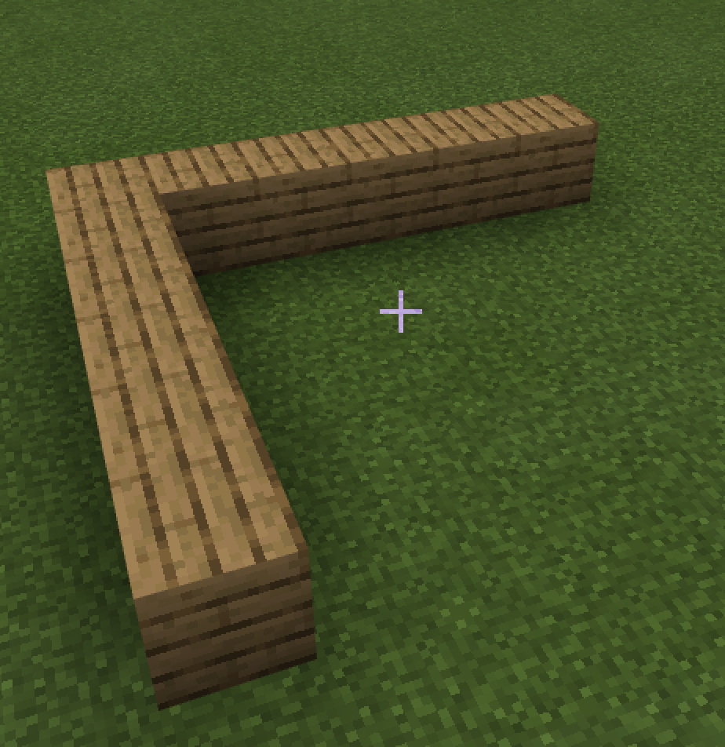

# Бассейн с рыбой

|#|Описание|Код|Скриншот|
|---|---|---|---|
|1|1-й Блок из 5 элементов|||
|2|2-й Блок из 5 элементов|||
|3|3-й Блок из 5 элементов|||
|4|4-й Блок из 5 элементов|||
|5|Вода|||
|6|Рыба (лосось)|||
## Дополнительные задания
1. Создайте бассейн в 2 раза шире
2. Добавьте высоту бассейна (3 блока)
3. Создайте 10 рыб в бассейне, разместив их в случайное положение внутри бассейна
4. По аналогии сделайте курятник курами.
5. По аналогии сделайте клетку с папугаями (как в зоопарке).