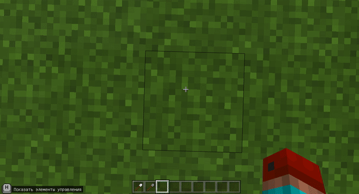
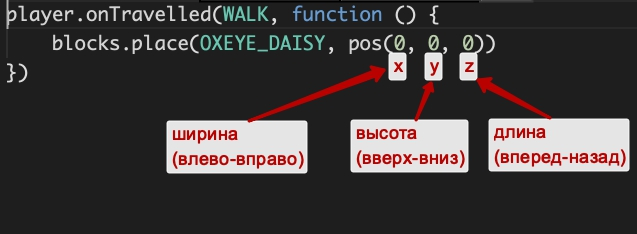
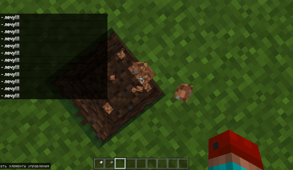
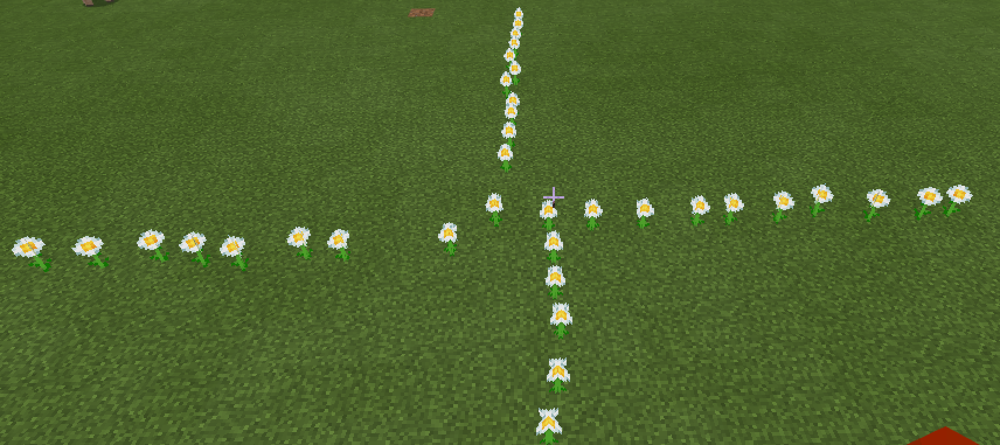
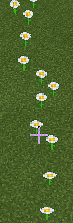
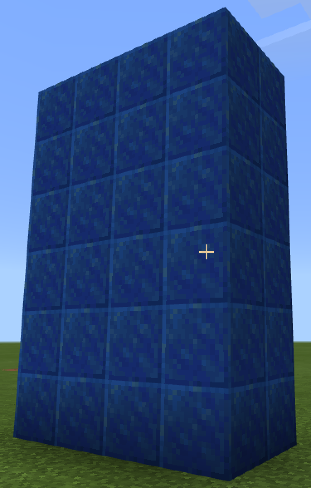
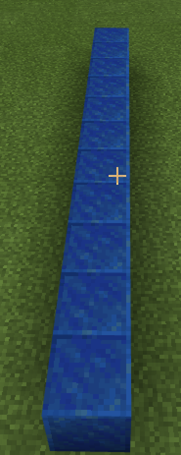
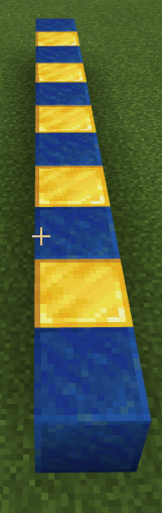
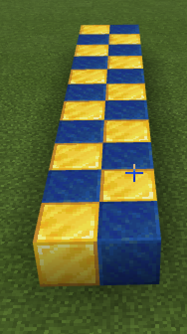

# Блоки
В программировании в Майнкрафте можно запрограммировать размещение блоков.  
Данный код заменяет 1 блок под игроком на блок воздуха  
```js
player.onChat("п", function () {
    blocks.place(AIR, pos(0, -1, 0))
})
```
  


Такой код - позволяет **"пробивать землю"**, для этого игрок должен начать падать (**FALL**)  


Координаты в Minecraft распределяются так:  



```js
player.onTravelled(FALL, function () {
    player.runChatCommand("п")
    player.say("Я - лечу!!!")
})
player.onChat("п", function () {
    blocks.place(AIR, pos(0, -1, 0))
})
```


**Задание:**
5 раз "пробить" землю из полета.

##  Сажать цветы
Также можно запрограммировать **ходьбу** (**WALK**) игрока.
```js
player.onTravelled(WALK, function () {
    blocks.place(OXEYE_DAISY, pos(0, 0, 0))
})
```


PINK_TULIP - розовый тюльпан  
WHITE_TULIP - белый тюльпан  
ORANGE_TULIP - оранжевый тюльпан  
RED_TULIP - красный тюльпан  
YELLOW_FLOWER - одуванчик  
POPPY - мак  
BLUE_ORCHID - синяя орхидея  
ALLIUM - лук  
AZURE_BLUET - голубой василек  
BAMBOO - бамбук  
CORNFLOWER - василек  
LILY_OF_THE_VALLEY - ландыш  
BROWN_MUSHROOM - гриб (коричневый)   
RED_MUSHROOM - мухомор (красный)  
TORCH - факел  

|#|Дополниительные задания|Код|внешний вид|
|---|---|---|---|
|1|1. Посадить линию ромашек <br>2. Посадить крест ромашек<br>3. Посадить линию маков<br>4. Посадить крест белых тюльпанов<br>5. Поставить крест факелов|player.onTravelled(WALK, function () {blocks.place(OXEYE_DAISY, pos(0, 0, 0))})||

## Блоки
В майнкрафте можно с помощью кода можно разместить группы блоков:
```js
player.onItemInteracted(IRON_SHOVEL, function () {
    blocks.fill(
    LAPIS_LAZULI_BLOCK,
    pos(0, 0, 0),
    pos(3, 5, 1),
    FillOperation.Replace
    )
})
```


|#|Дополниительные задания|Код|внешний вид|
|---|---|---|---|
|2|1. Построить параллелипипед из лазуритных блоков размером 4х6х2<br>2. Построить параллелипипед из лазуритных блоков размером 5х5х5<br>3. Построить параллелипипед из алмазных блоков размером 3х3х3<br>4. Построить параллелипипед из изумродных блоков размером 4х12х4<br>5. Построить параллелипипед из лазуритных блоков размером 10х1х1<br>|player.onItemInteracted(IRON_SHOVEL, function () {<br>blocks.fill(<br>LAPIS_LAZULI_BLOCK<br>pos(0, 0, 0),<br>pos(3, 5, 1),<br>FillOperation.Replace<br>)<br>})||

**Творческое задание:** построить "город" - 10+ зданий из различных материалов.


## Циклы и блоки

С помощью блоков можно строить линии на земле из блоков: 
```js
player.onItemInteracted(IRON_SHOVEL, function () {
    blocks.fill(
    LAPIS_LAZULI_BLOCK,
    pos(0, 0, 0),
    pos(0, 0, 10),
    FillOperation.Replace
    )
})

```


Но точно такого же эффекта можно добиться, если заполнять не область, а ставить 10 раз блок, увеличивая координату в цикле на 1 каждый раз
```js
player.onItemInteracted(STONE_SHOVEL, function () {
    for (let index = 0; index <= 5; index++) {
        blocks.place(LAPIS_LAZULI_BLOCK, pos(0, 0, index))
    }
})
```
  


Использование циклов позволяет строить "умные линии"
```js
player.onItemInteracted(STONE_SHOVEL, function () {
    for (let index = 0; index <= 10; index++) {
        if (index % 2 == 0) {
            blocks.place(LAPIS_LAZULI_BLOCK, pos(1, 0, index))
        } else {
            blocks.place(GOLD_BLOCK, pos(1, 0, index))
        }
    }
})
```




|#|Дополниительные задания|Код|внешний вид|
|---|---|---|---|
|3|1. Сделать последовательность из 10 чередующихся лазуритных и золотых блоков.<br>2. Сделать последовательность из 7 чередующихся изумрудных и алмазных блоков, начиная с изумрудного.<br>3. Сделать последовательность из 5 любых блоков и 5 блоков воздуха<br> 4. Посадить 8 чередующихся цветов (на ваш выбор)<br>5.Поставить 12 чередующихся блоков и цветов|player.onItemInteracted(STONE_SHOVEL, function () {<br>for (let index = 0; index <= 10; index++) {<br>if (index % 2 == 0) {<br>blocks.place(LAPIS_LAZULI_BLOCK, pos(1, 0, index))<br>} else {<br>blocks.place(GOLD_BLOCK, pos(1, 0, index))<br>}<br>}<br>})||


## Узоры и усложнения
С помощью размещения блоков и циклов можно строить различные узоры:
 ```js
player.onItemInteracted(STONE_SHOVEL, function () {
    for (let index = 0; index <= 10; index++) {
        if (index % 2 == 0) {
            blocks.place(LAPIS_LAZULI_BLOCK, pos(1, 0, index))
            blocks.place(GOLD_BLOCK, pos(2, 0, index))
        } else {
            blocks.place(GOLD_BLOCK, pos(1, 0, index))
            blocks.place(LAPIS_LAZULI_BLOCK, pos(2, 0, index))
        }
    }
})
```
