# Блоки
В программировании в Майнкрафте можно запрограммировать размещение блоков.  
Данный код заменяет 1 блок под игроком на блок воздуха
  

Координаты в Minecraft распределяются так:

Такой код - позволяет **"пробивать землю"**, для этого игрок должен начать падать (**FALL**)

  

**Задание:**
5 раз "пробить" землю из полета.

##  Сажать цветы
Также можно запрограммировать **ходьбу** (**WALK**) игрока.
  

PINK_TULIP - розовый тюльпан  
WHITE_TULIP - белый тюльпан  
ORANGE_TULIP - оранжевый тюльпан  
RED_TULIP - красный тюльпан  
YELLOW_FLOWER - одуванчик  
POPPY - мак  
BLUE_ORCHID - синяя орхидея  
ALLIUM - лук  
AZURE_BLUET - голубой василек  
BAMBOO - бамбук  
CORNFLOWER - василек  
LILY_OF_THE_VALLEY - ландыш  
BROWN_MUSHROOM - гриб (коричневый)   
RED_MUSHROOM - мухомор (красный)  
TORCH - факел  

|#|Дополниительные задания|Код|внешний вид|
|---|---|---|---|
|1|1. Посадить линию ромашек  2. Посадить крест ромашек 3. Посадить линию маков 4. Посадить крест белых тюльпанов 5. Поставить крест факелов|  ||

## Блоки
В майнкрафте можно с помощью кода можно разместить группы блоков:  
  
  

|#|Дополниительные задания|Код|внешний вид|
|---|---|---|---|
|2|1. Построить параллелипипед из лазуритных блоков размером 4х6х2 2. Построить параллелипипед из лазуритных блоков размером 5х5х5 3. Построить параллелипипед из алмазных блоков размером 3х3х3 4. Построить параллелипипед из изумродных блоков размером 4х12х4 5. Построить параллелипипед из лазуритных блоков размером 10х1х1 | ||

**Творческое задание:** построить "город" - 10+ зданий из различных материалов.

## Циклы и блоки

С помощью блоков можно строить линии на земле из блоков: 
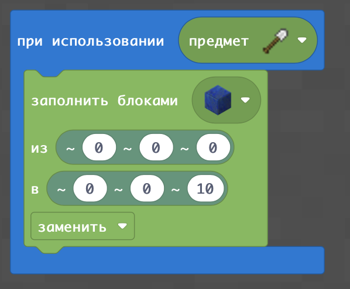

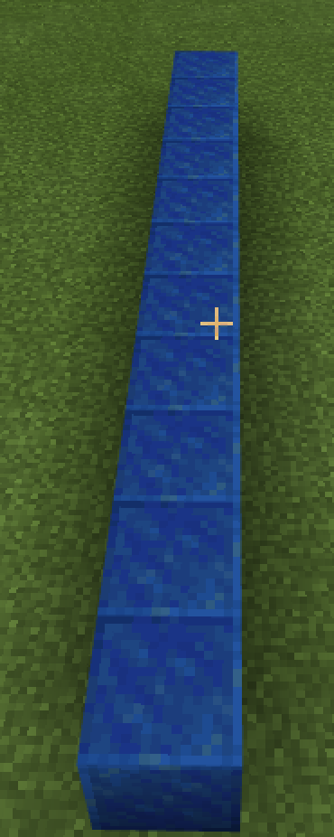

Но точно такого же эффекта можно добиться, если заполнять не область, а ставить 10 раз блок, увеличивая координату в цикле на 1 каждый раз

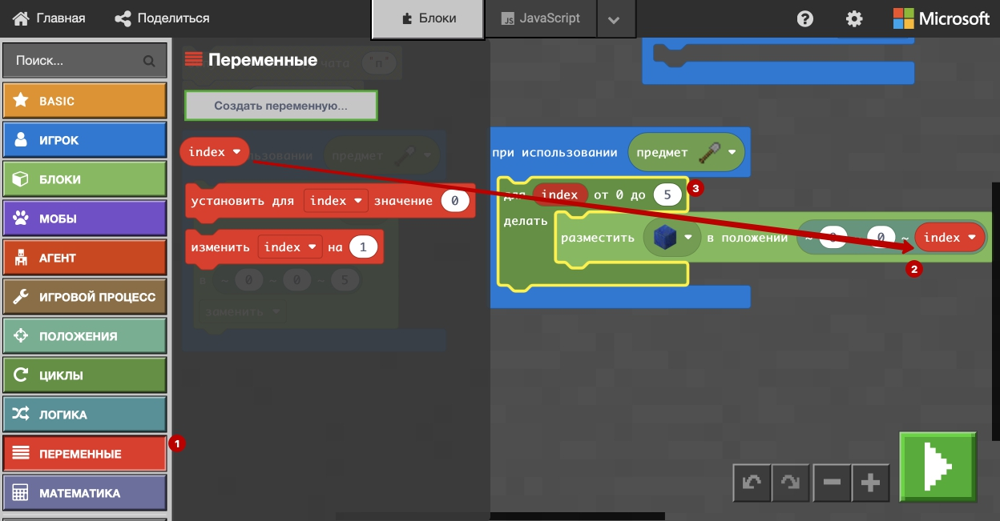    
  

Использование циклов позволяет строить "умные линии"
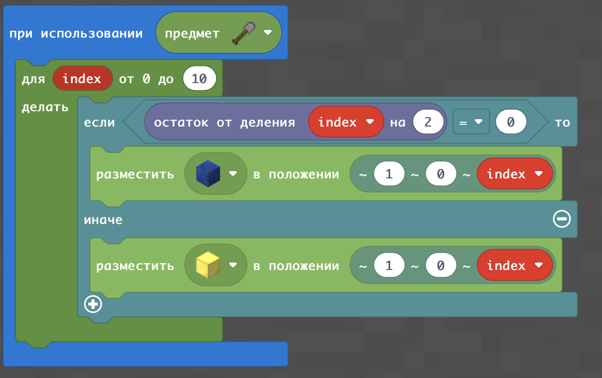  

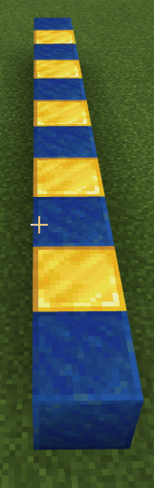

|#|Дополниительные задания|Код|внешний вид|
|---|---|---|---|
|3|1. Сделать последовательность из 10 чередующихся лазуритных и золотых блоков. 2. Сделать последовательность из 7 чередующихся изумрудных и алмазных блоков, начиная с изумрудного. 3. Сделать последовательность из 5 любых блоков и 5 блоков воздуха  4. Посадить 8 чередующихся цветов (на ваш выбор) 5.Поставить 12 чередующихся блоков и цветов|  ||

## Узоры и усложнения
С помощью размещения блоков и циклов можно строить различные узоры:
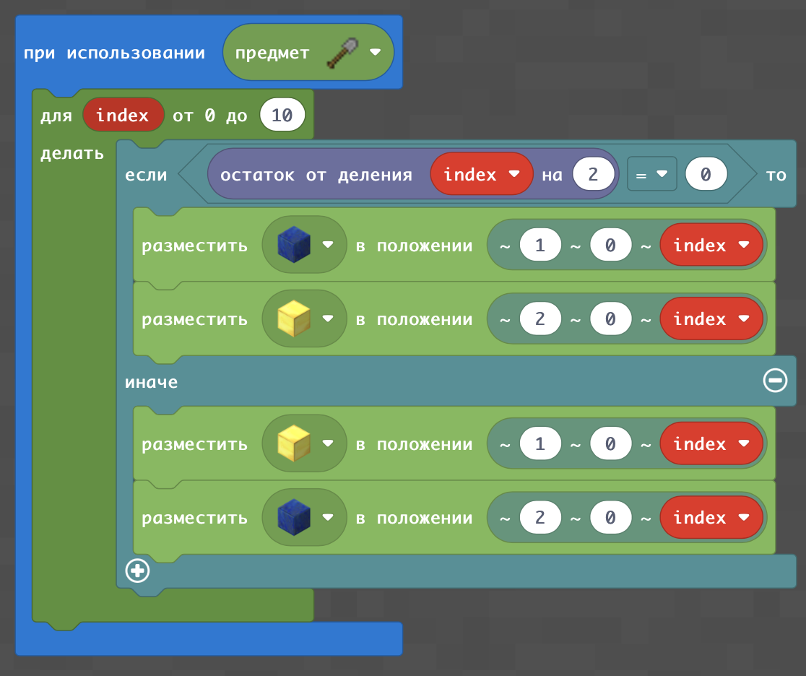  

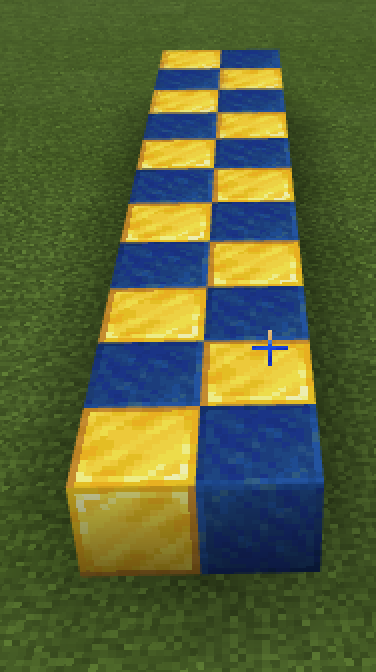  
  
Также с помощью кодов можно сделать сложные флаги:  
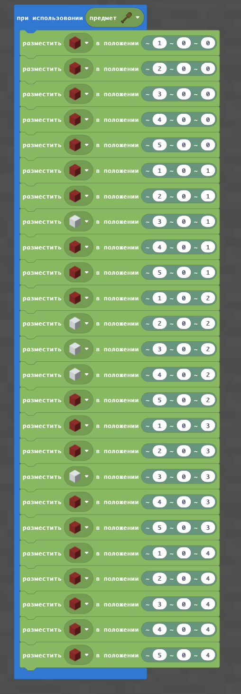

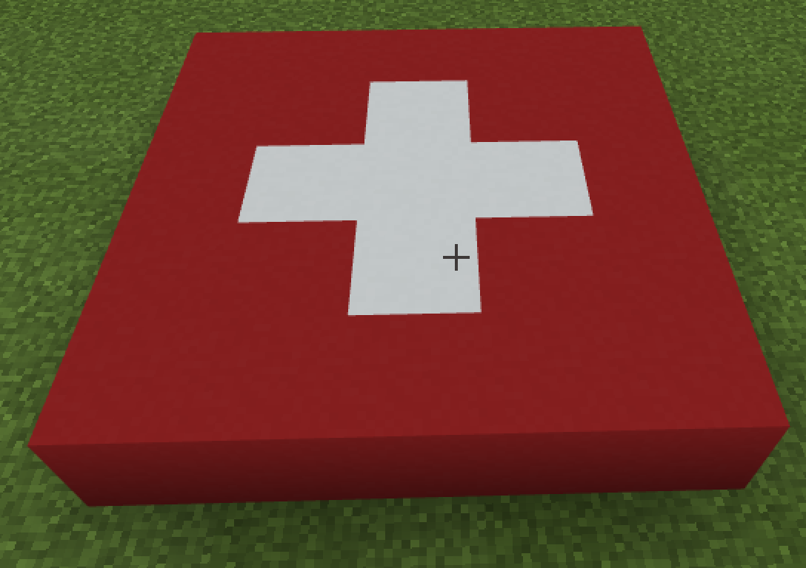  

**Специальное задание:** с помощьюю помещения блоков по координатам создайте флаги различных стран:  
  
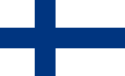  
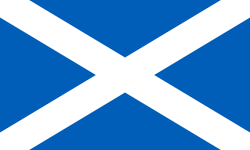  
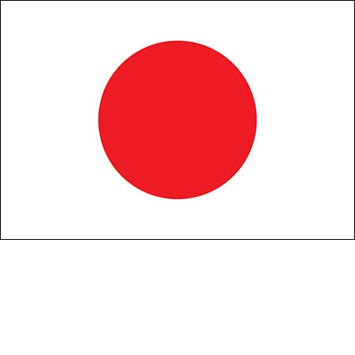  

## Программирование букв
Вы можете в размере 5x5 блоков реализовать буквы: 

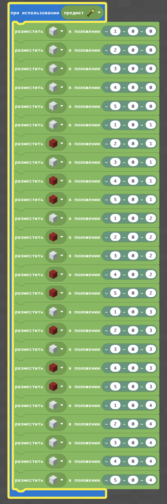

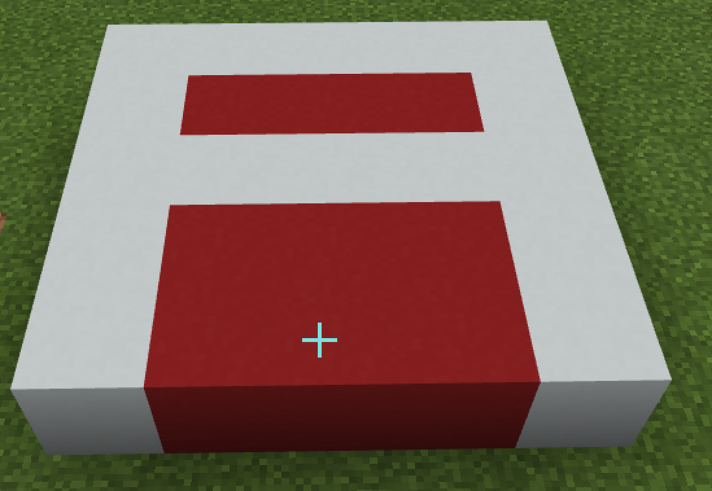

|#|Дополниительные задания|Код|внешний вид|
|---|---|---|---|
|4|1. Создайте из блоков букву A 2. Создайте из блоков букву B 3. Создайте из блоков букву C 4. Создайте из блоков букву D 1. Создайте из блоков букву F |||

**Творческое задание:**
1. Напишите с помощью блоков свое имя
2. Напишите с помощью блоков сообщение для ребят в вашей группе
3. Напишите ваше имя буквами и под ними - азбукой Морзе.