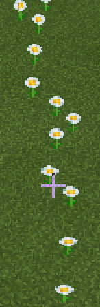

# Блоки
В программировании в Майнкрафте можно запрограммировать размещение блоков.  
Данный код заменяет 1 блок под игроком на блок воздуха
  


Координаты в Minecraft распределяются так:

Такой код - позволяет **"пробивать землю"**, для этого игрок должен начать падать (**FALL**)


  


**Задание:**
5 раз "пробить" землю из полета.

##  Сажать цветы
Также можно запрограммировать **ходьбу** (**WALK**) игрока.
  


PINK_TULIP - розовый тюльпан  
WHITE_TULIP - белый тюльпан  
ORANGE_TULIP - оранжевый тюльпан  
RED_TULIP - красный тюльпан  
YELLOW_FLOWER - одуванчик  
POPPY - мак  
BLUE_ORCHID - синяя орхидея  
ALLIUM - лук  
AZURE_BLUET - голубой василек  
BAMBOO - бамбук  
CORNFLOWER - василек  
LILY_OF_THE_VALLEY - ландыш  
BROWN_MUSHROOM - гриб (коричневый)   
RED_MUSHROOM - мухомор (красный)  
TORCH - факел  

|#|Дополниительные задания|Код|внешний вид|
|---|---|---|---|
|1|1. Посадить линию ромашек <br>2. Посадить крест ромашек<br>3. Посадить линию маков<br>4. Посадить крест белых тюльпанов<br>5. Поставить крест факелов|  ||

## Блоки
В майнкрафте можно с помощью кода можно разместить группы блоков:  
  
  

|#|Дополниительные задания|Код|внешний вид|
|---|---|---|---|
|2|1. Построить параллелипипед из лазуритных блоков размером 4х6х2<br>2. Построить параллелипипед из лазуритных блоков размером 5х5х5<br>3. Построить параллелипипед из алмазных блоков размером 3х3х3<br>4. Построить параллелипипед из изумродных блоков размером 4х12х4<br>5. Построить параллелипипед из лазуритных блоков размером 10х1х1<br>| ||

**Творческое задание:** построить "город" - 10+ зданий из различных материалов.


## Циклы и блоки

С помощью блоков можно строить линии на земле из блоков: 
```js
player.onItemInteracted(IRON_SHOVEL, function () {
    blocks.fill(
    LAPIS_LAZULI_BLOCK,
    pos(0, 0, 0),
    pos(0, 0, 10),
    FillOperation.Replace
    )
})

```

```js
player.onItemInteracted(IRON_SHOVEL, function () {
    blocks.fill(
    LAPIS_LAZULI_BLOCK,
    pos(0, 0, 0),
    pos(0, 0, 10),
    FillOperation.Replace
    )
})
```

```js
player.onItemInteracted(STONE_SHOVEL, function () {
    for (let index = 0; index <= 5; index++) {
        blocks.place(LAPIS_LAZULI_BLOCK, pos(0, 0, index))
    }
})
```