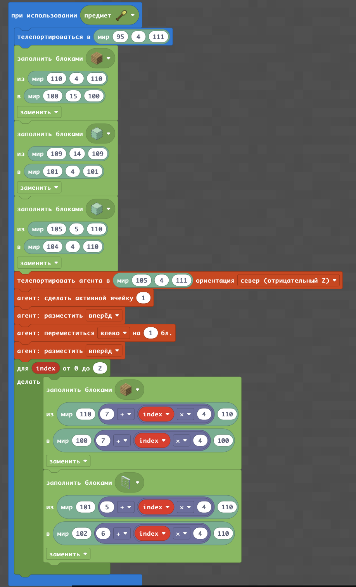
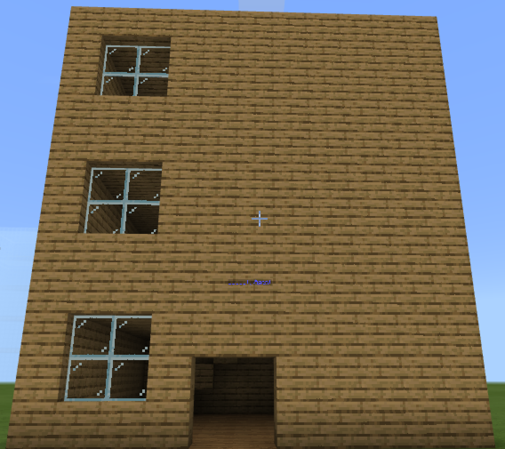
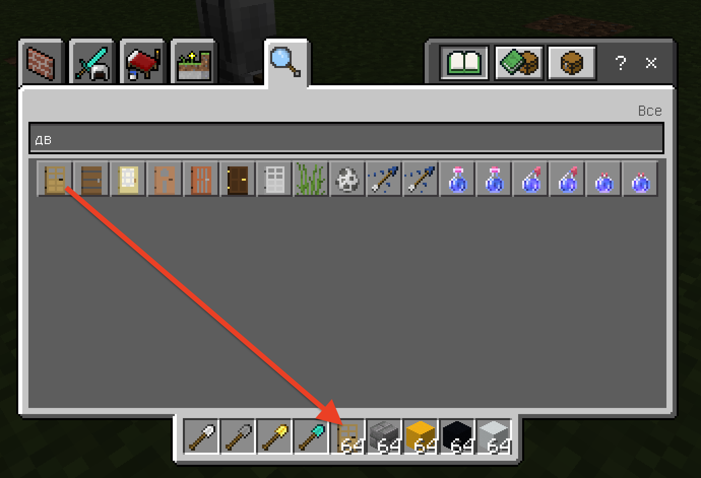
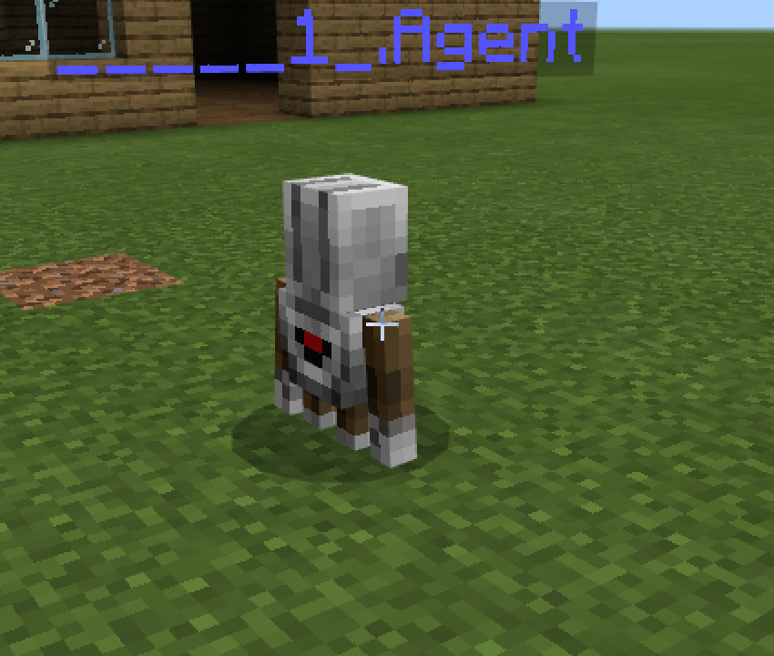
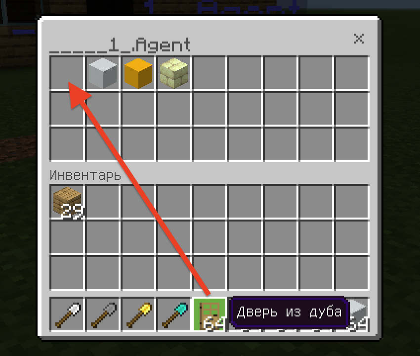
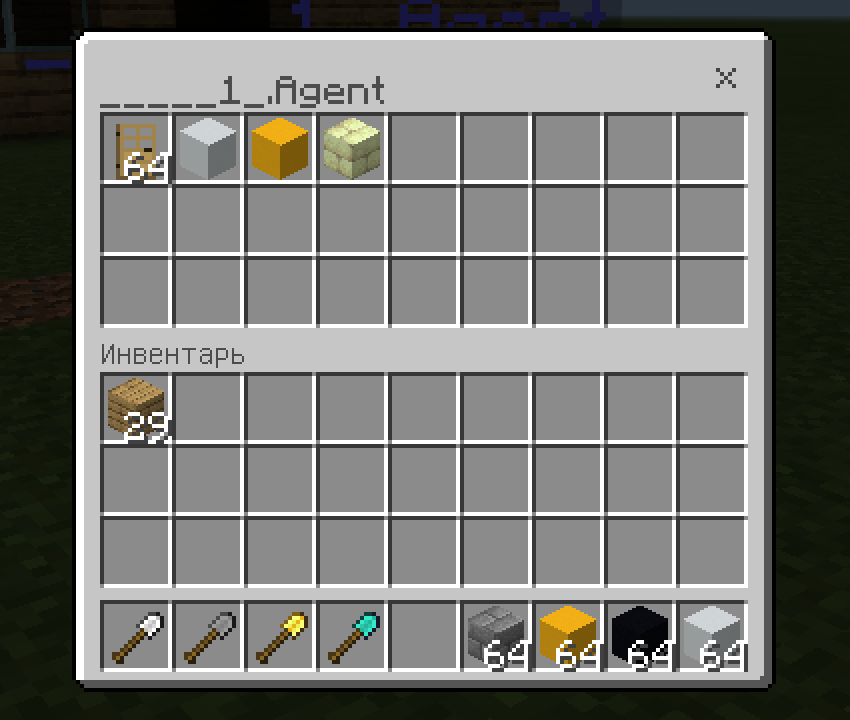
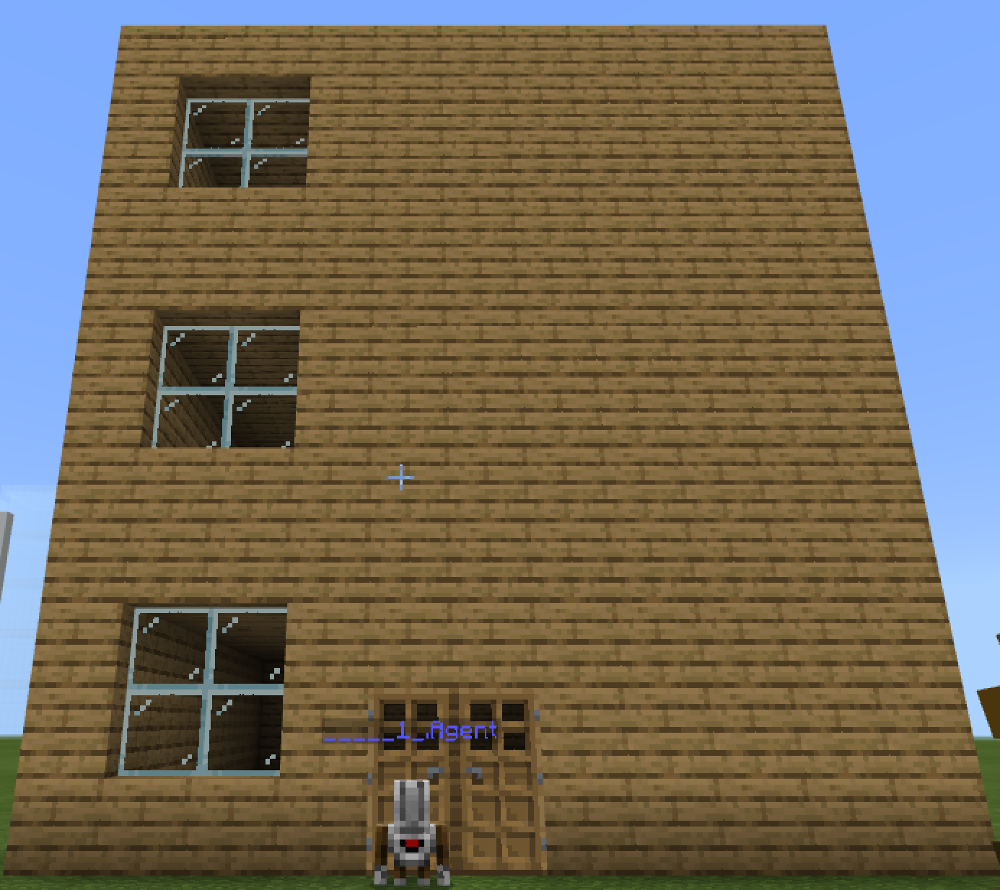
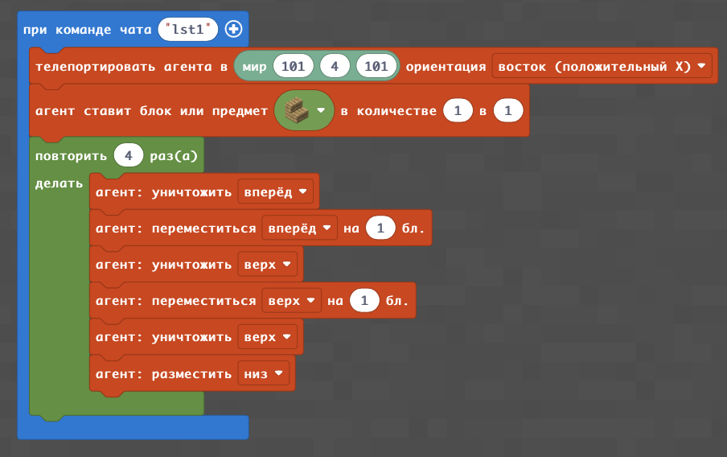
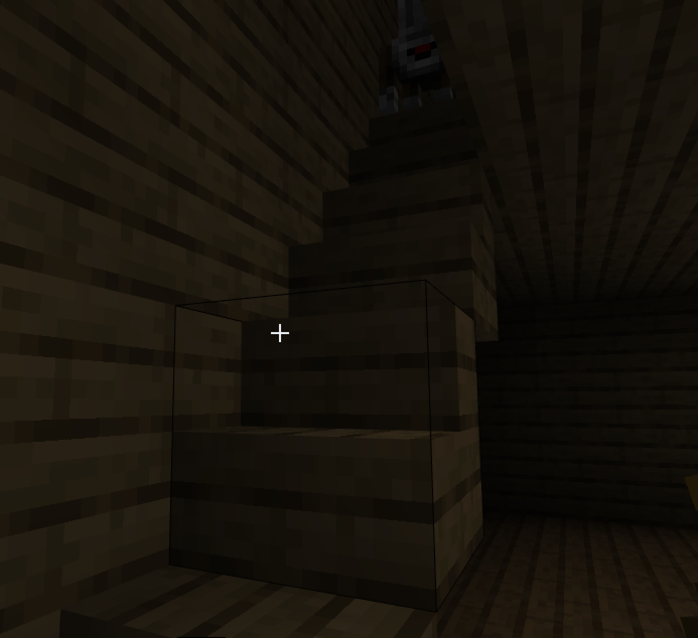

## Дом по координатам

#|Название|Альтернативные задания|Код|Результат|
|---|---|---|---|---|
|1||1. Построить дом с окнами 2. Построить дом, начиная с точки (0;4;0) 3. Построить дом с высотой этажа 4|||

### Агент ставит двери
Часть материалов агент не может ставить с помощью кода. Но игрок может поместить определенную вещь (например, дверь) в ячейку агента.  
  
  
  
  

## Лестница
#|Задания|Код|Результат|
|---|---|---|---|
|2|1. Постройте лестницу в доме на первом этаже 2. Постройте лестницу в доме на втором этаже 3. Постройте лестницу в доме на третьем этаже|||

## Винтовая лестница

