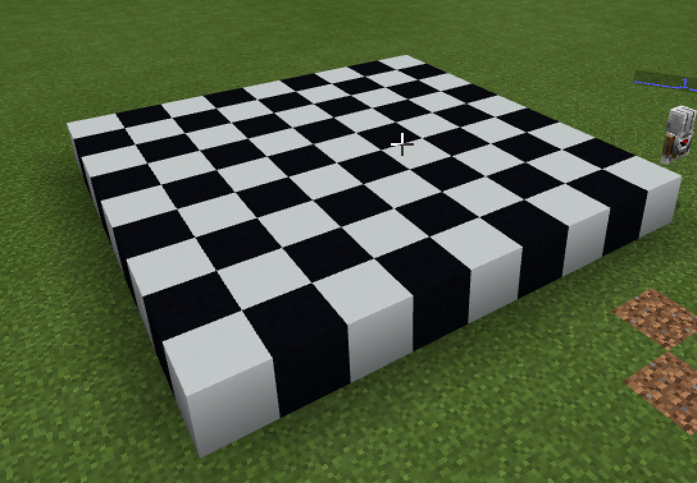

# Флаги
## Линия
Мы с Вами уже умеем создавать линию из блоков в Minecraft

# Линии
|#|Название|Альтернативные задания|Код|Результат|
|---|---|---|---|---|
|1|Шахматная доска| 1. Сделать белые и красные клетки   2. Сделать синие и желтые клетки   3. Увеличить доску в 2 раза   4. Увеличить доску в 4 раза|let k = 0  player.onChat("chess", function () { &nbsp;&nbsp;agent.setItem(WHITE_CONCRETE, 1, 1) &nbsp;&nbsp;agent.setItem(BLACK_CONCRETE, 1, 2) &nbsp;&nbsp;agent.move(UP, 1) &nbsp;&nbsp;for (let i = 0; i <= 8; i++) { &nbsp;&nbsp;&nbsp;&nbsp;for (let j = 0; j <= 8; j++) { &nbsp;&nbsp;&nbsp;&nbsp;&nbsp;&nbsp;agent.setSlot(Math.abs(k-j % 2)+1) &nbsp;&nbsp;&nbsp;&nbsp;&nbsp;&nbsp;agent.place(DOWN) &nbsp;&nbsp;&nbsp;&nbsp;&nbsp;&nbsp;agent.move(FORWARD, 1) &nbsp;&nbsp;&nbsp;&nbsp;} &nbsp;&nbsp;&nbsp;&nbsp;agent.move(BACK, 9) &nbsp;&nbsp;&nbsp;&nbsp;agent.move(RIGHT, 1) &nbsp;&nbsp;&nbsp;&nbsp;k = 1 - k &nbsp;&nbsp;} })||

