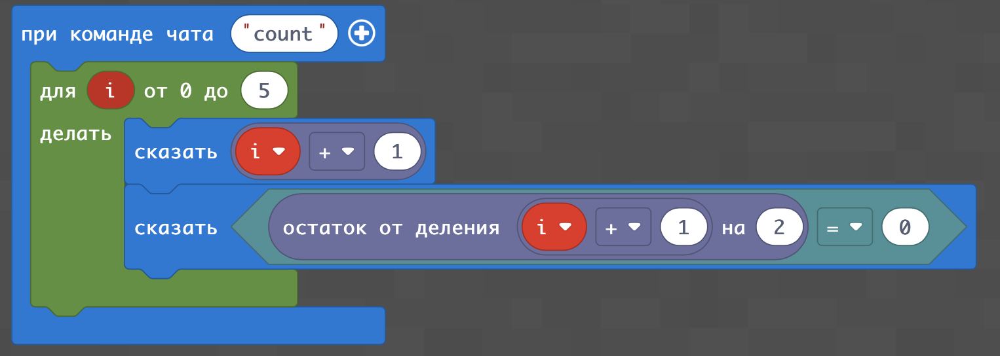

# Флаги
## Линия
Мы с Вами уже умеем создавать линию из блоков в Minecraft
## Забор
Мы уже умеем строить линии из блоков. Но в архитектуре часто встречаются такие конструкции, которые идут "зубцами".  
Для этого нам нужно ставить блок не каждый раз, а каждые два раза (через 1). В программировании для этого очень помагает такая операция как остаток от деления. Он обозначается %2 и если число делится на 2 без остатка такое выражение будет иметь результатом 0, если с остатком - 1
|Выражение||результат|
|:---:|:---:|:---:|
|0%2|=|0|
|1%2|=|1|
|2%2|=|0|
|3%2|=|1|
|4%2|=|0|
|5%2|=|1|
|6%2|=|0|
|7%2|=|1|

Для остатка от деления на 3 такая таблица будет выглядесть слудующим образом:
|Выражение||результат|
|:---:|:---:|:---:|
|0%3|=|0|
|1%3|=|1|
|2%3|=|2|
|3%3|=|0|
|4%3|=|1|
|5%3|=|2|
|6%3|=|0|
|7%3|=|1|  
  
Оператор остатка от деления позволяет отделить размещать элементы не при каждом шаге, а, напрмиер, через один (каждый второй шаг). Для этого нужно написать оператор выбора, который размещает блок только в том случае, когда остаток от деления параметра цикла на 2 будет равен нулю
|Выражение||результат|
|:---:|:---:|:---:|
|0%2==0|=|Истина|
|1%2==0|=|Ложь|
|2%2==0|=|Истина|
|3%2==0|=|Ложь|
|4%2==0|=|Истина|
|5%2==0|=|Ложь|
|6%2==0|=|Истина|
|7%2==0|=|Ложь|  

Для простой демонстрации - запустим цикл и выведем все значения его параметра в консоль
```js
player.onChat("count", function() {
    for(let i = 0;i<10;i++){
        player.say(i)
    }
})
```
В результате - получим на экране числа от 0 до 9  


Если мы хотим вывести на экран числа от 1 до 10, нам нужно в предыдущем цикле к параметру, который выводится на экран добавить 1
```js
player.onChat("count", function() {
    for(let i = 0;i<10;i++){
        player.say(i+1)
    }
})
```
Либо же изменив начальное значение параметра цикла и условие окончания цикла
```js
player.onChat("count", function() {
    for(let i = 1;i<=10;i++){
        player.say(i)
    }
})
```

  
|#|Название|Альтернативные задания|Код|Результат|
|---|---|---|---|---|
|1|Последовательность чисел от 1 до 10| 1. Вывести последовательность чисел от 10 до 20 <br> 2. Вывести последовательность чисел от 510 до 520 <br> 3. Вывести последовательность чисел от 10 до 1 <br> 4. Вывести последовательность чисел от 5 до -5 5. Вывести последовательность чисел от -5 до -10 6. Вывести числа 1,4,9,16,25,26 (квадраты чисел от 1 до 6) |||


Мы уже умеем строить линии из блоков. Но в архитектуре часто встречаются такие конструкции, которые идут "зубцами".  
Для этого нам нужно ставить блок не каждый раз, а каждые два раза (через 1). В программировании для этого очень помагает такая операция как остаток от деления. Он обозначается %2 и если число делится на 2 без остатка такое выражение будет иметь результатом 0, если с остатком - 1
|Выражение||результат|
|:---:|:---:|:---:|
|0%2|=|0|
|1%2|=|1|
|2%2|=|0|
|3%2|=|1|
|4%2|=|0|
|5%2|=|1|
|6%2|=|0|
|7%2|=|1|

Для остатка от деления на 3 такая таблица будет выглядесть слудующим образом:
|Выражение||результат|
|:---:|:---:|:---:|
|0%3|=|0|
|1%3|=|1|
|2%3|=|2|
|3%3|=|0|
|4%3|=|1|
|5%3|=|2|
|6%3|=|0|
|7%3|=|1|  
  
Оператор остатка от деления позволяет отделить размещать элементы не при каждом шаге, а, напрмиер, через один (каждый второй шаг). Для этого нужно написать оператор выбора, который размещает блок только в том случае, когда остаток от деления параметра цикла на 2 будет равен нулю
|Выражение||результат|
|:---:|:---:|:---:|
|0%2==0|=|Истина|
|1%2==0|=|Ложь|
|2%2==0|=|Истина|
|3%2==0|=|Ложь|
|4%2==0|=|Истина|
|5%2==0|=|Ложь|
|6%2==0|=|Истина|
|7%2==0|=|Ложь| 
  
  
|#|Название|Альтернативные задания|Код|Результат|
|---|---|---|---|---|
|1|Вывести делятся ли числа на 2 для чисел от 1 до 5| 1. Вывести числа от 3 до 9 и признаки того, что они делятся на  3 без остатка <br> 2. Вывести числа от 10 до 20 и признаки того, что они делятся на 4 без остатка <br> 3. Вывести числа от 30 до 36 и признаки того, что они делятся на  5 без остатка  |||


Мы - разобрались с тем, как определять остаток от деления. С помощью оператора выбора if мы сможем выводить или не выводить соответствующее значение. Например, вывести все четные числа в промежутке от 1 до 10:
```js
player.onChat("count", function() {
    for(let i = 1;i<=10;i++){
        if (i%2==0){
            player.say(i)
        }
    }
})
```


|#|Название|Альтернативные задания|Код|Результат|
|---|---|---|---|---|
|1|Вывести делятся ли числа на 2 для чисел от 1 до 5| 1. Вывести числа от 3 до 9 и признаки того, что они делятся на  3 без остатка <br> 2. Вывести числа от 10 до 20 и признаки того, что они делятся на 4 без остатка <br> 3. Вывести числа от 30 до 36 и признаки того, что они делятся на  5 без остатка  |||

Взятие остатка от деления используется в большом количестве алгоритмов. Например - нам необходимо построить зубцы на заборе: будем делать их через один. Для этого - используем цикл и оператор выбора (при срабатывании условия оператора выбора - агент будет ставить блок, иначе - нет)


ЫВ)

|#|Название|Альтернативные задания|Код|Результат|
|---|---|---|---|---|
|1|Забор c зубцами| 1. Сделать забор высотой 3 блока <br> 2. Сделать забор из кирпича <br> 3. Поставить зубцы на каждом 3-м месте (сейчас на каждом 2-м) <br> 4. Построит забор длинной 30 блоков  <br>  5. Построить квадратное ограждение из забора 10х10 |||


## Шахматная доска
|#|Название|Альтернативные задания|Код|Результат|
|---|---|---|---|---|
|1|Шахматная доска| 1. Сделать белые и красные клетки <br> 2. Сделать синие и желтые клетки <br> 3. Увеличить доску в 2 раза <br> 4. Увеличить доску в 4 раза|||

