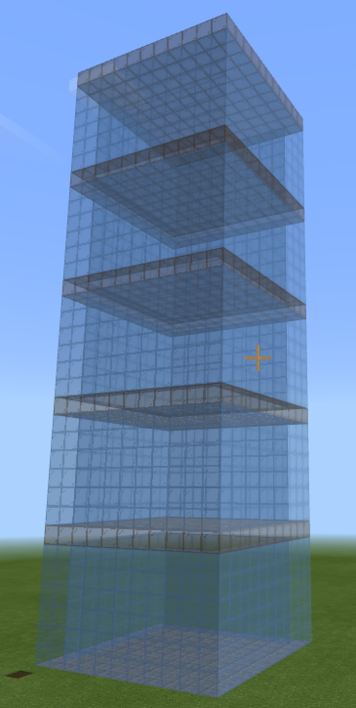

# Строительство по чертежам
## Строительство высотных зданий:
Если объединить циклы и строительство блоков мы получим возможность строить высотные здания (многоэтажные, с разным количестом этажей, разными материалами и разной высотой эжтажа)

|#|Альтернативное задание|Код|Результат|
|---|---|---|---|
|1|1. Постройте многоэтажку в 5 этажей из координаты 0;4;0 размером 10х10 с фундаментом из булыжника, этажами из синих стеклянных блоков высотой 6 блоков и перекрытиями из коричневых стеклянных блоков.  2. Постройте многоэтажку в 8 этажей из координаты 0;4;0 размером 10х10 с фундаментом из белого бетона, этажами из желтых стеклянных блоков высотой 5 блоков и перекрытиями из синих бетонных блоков.  3. Постройте многоэтажку в 3 этажа из координаты 0;4;0 размером 5х5 с фундаментом из синего бетона, этажами из зеленых стеклянных блоков высотой 5 блоков и перекрытиями из серых стеклянных блоков.  |player.onChat("building", function () {     blocks.fill(     CHISELED_STONE_BRICKS,     world(0, 3, 0),     world(10, 3, 10),     FillOperation.Replace     )     for (let index = 0; index <= 4; index++) {         blocks.fill(         LIGHT_BLUE_STAINED_GLASS,         world(0, index * 7 + 4, 0),         world(10, index * 7 + 10, 10),         FillOperation.Replace         )         blocks.fill(         AIR,         world(1, index * 7 + 4, 1),         world(9, index * 7 + 10, 9),         FillOperation.Replace         )         blocks.fill(         BROWN_STAINED_GLASS,         world(0, index * 7 + 10, 0),         world(10, index * 7 + 10, 10),         FillOperation.Replace         )     } }) ||

## Построение по схеме

## Здания по фотографии

  

