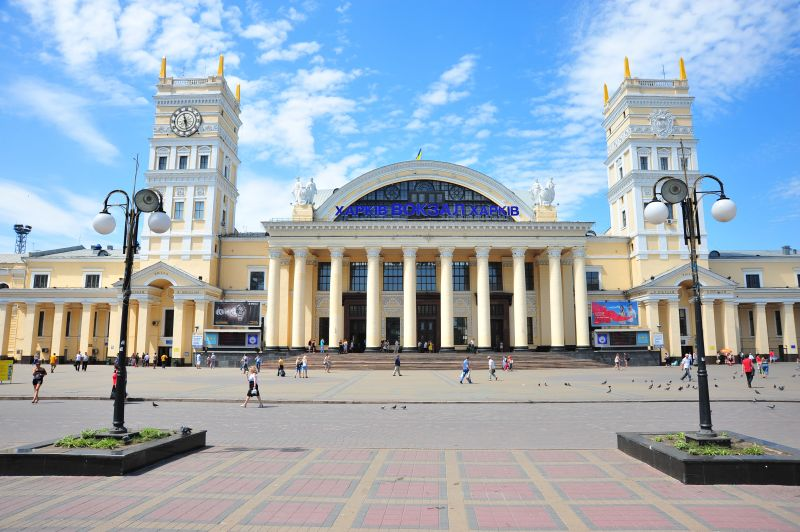

# Строительство по чертежам
## Строительство высотных зданий:
Если объединить циклы и строительство блоков мы получим возможность строить высотные здания (многоэтажные, с разным количестом этажей, разными материалами и разной высотой эжтажа)

|#|Альтернативное задание|Код|Результат|
|---|---|---|---|
|1|1. Постройте многоэтажку в 5 этажей из координаты 0;4;0 размером 10х10 с фундаментом из булыжника, этажами из синих стеклянных блоков высотой 6 блоков и перекрытиями из коричневых стеклянных блоков.  2. Постройте многоэтажку в 8 этажей из координаты 0;4;0 размером 10х10 с фундаментом из белого бетона, этажами из желтых стеклянных блоков высотой 5 блоков и перекрытиями из синих бетонных блоков.  3. Постройте многоэтажку в 3 этажа из координаты 0;4;0 размером 5х5 с фундаментом из синего бетона, этажами из зеленых стеклянных блоков высотой 5 блоков и перекрытиями из серых стеклянных блоков.  |player.onChat("building", function () {     blocks.fill(     CHISELED_STONE_BRICKS,     world(0, 3, 0),     world(10, 3, 10),     FillOperation.Replace     )     for (let index = 0; index <= 4; index++) {         blocks.fill(         LIGHT_BLUE_STAINED_GLASS,         world(0, index * 7 + 4, 0),         world(10, index * 7 + 10, 10),         FillOperation.Replace         )         blocks.fill(         AIR,         world(1, index * 7 + 4, 1),         world(9, index * 7 + 10, 9),         FillOperation.Replace         )         blocks.fill(         BROWN_STAINED_GLASS,         world(0, index * 7 + 10, 0),         world(10, index * 7 + 10, 10),         FillOperation.Replace         )     } }) ||

## Постройка нескольких зданий
|#|Альтернативное задание|Код|Результат|
|---|---|---|---|
|2| 1. Постройте 5 многоэтажек в ряд в 5 этажей из координаты 0;4;0 размером 10х10 с фундаментом из булыжника, этажами из синих стеклянных блоков высотой 6 блоков и перекрытиями из коричневых стеклянных блоков с интервалом между домами в 4 блока.  2. Постройте 3 многоэтажки в ряд в 4 этажа из координаты 50;4;0 размером 10х10 с фундаментом из булыжника, этажами из синих стеклянных блоков высотой 6 блоков и перекрытиями из коричневых стеклянных блоков с интервалом между домами в 5 блоков.  3. Постройте 5 многоэтажек в ряд в 5 этажей из координаты 0;4;28 размером 10х10 с фундаментом из булыжника, этажами из синих стеклянных блоков высотой 6 блоков и перекрытиями из коричневых стеклянных блоков с интервалом между домами в 4 блока.  4. Постройте 2 ряда из 2-х многоэтажек в 5 этажей из координаты 0;4;0 и 0;4;28 соответственно размером 10х10 с фундаментом из булыжника, этажами из синих стеклянных блоков высотой 6 блоков и перекрытиями из коричневых стеклянных блоков с интервалом между домами в 4 блока.|player.onChat("buildings", function () {     for (let index2 = 0; index2 <= 4; index2++) {         blocks.fill(         CHISELED_STONE_BRICKS,         world(index2 * 15 + 0, 3, 0),         world(index2 * 15 + 10, 3, 10),         FillOperation.Replace         )         for (let index = 0; index <= 4; index++) {             blocks.fill(             LIGHT_BLUE_STAINED_GLASS,             world(index2 * 15 + 0, index * 7 + 4, 0),             world(index2 * 15 + 10, index * 7 + 10, 10),             FillOperation.Replace             )             blocks.fill(             AIR,             world(index2 * 15 + 1, index * 7 + 4, 1),             world(index2 * 15 + 9, index * 7 + 10, 9),             FillOperation.Replace             )             blocks.fill(             BROWN_STAINED_GLASS,             world(index2 * 15 + 0, index * 7 + 10, 0),             world(index2 * 15 + 10, index * 7 + 10, 10),             FillOperation.Replace             )         }     } })||
**Творческие задания:**
1. Постройте микрорайон (с домами, дорогами и фонарями по схеме)  

2. Нарисуйте схему микрорайона, а затем постройте микрорайон по схеме

## Строительство по фотографии:
1. Харьковский вокзал   

2. Харьковский вокзал с плиткой на привокзальной площади  
  

3. Привокзальная площадь  

4. Здание почтампта на привокзальной площади

**Творческие задания:**
1. Найдите фотографию зданий/площади в Интернете и постройте здания аналогично тем, которые на фотографии

