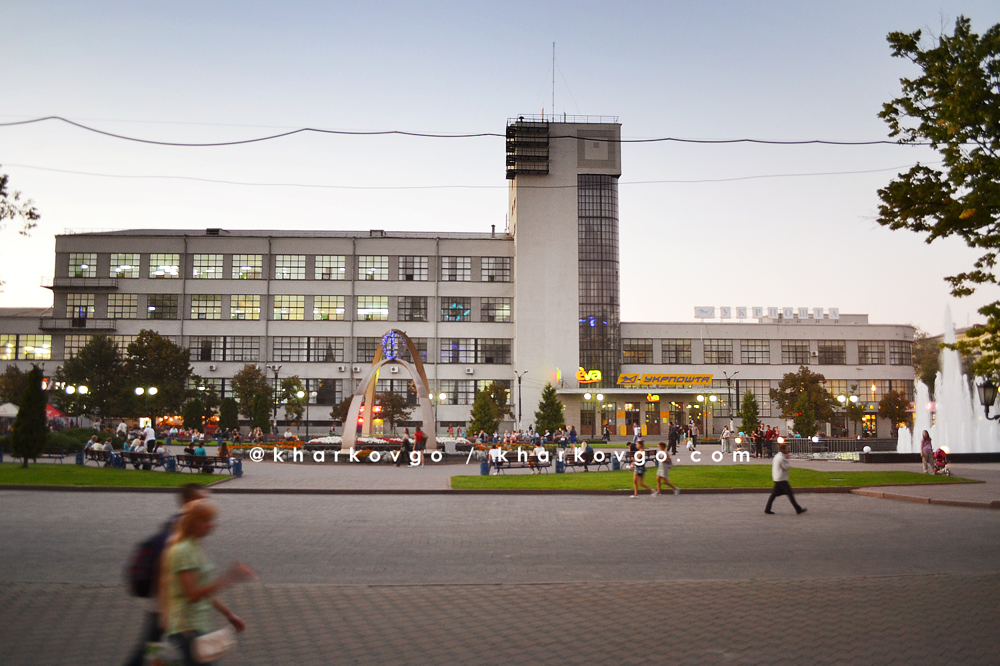

# Строительство по чертежам
## Строительство высотных зданий:
Если объединить циклы и строительство блоков мы получим возможность строить высотные здания (многоэтажные, с разным количестом этажей, разными материалами и разной высотой эжтажа)

|#|Альтернативное задание|Код|Результат|
|---|---|---|---|
|1|1. Постройте многоэтажку в 5 этажей из координаты 0;4;0 размером 10х10 с фундаментом из булыжника, этажами из синих стеклянных блоков высотой 6 блоков и перекрытиями из коричневых стеклянных блоков.  2. Постройте многоэтажку в 8 этажей из координаты 0;4;0 размером 10х10 с фундаментом из белого бетона, этажами из желтых стеклянных блоков высотой 5 блоков и перекрытиями из синих бетонных блоков.  3. Постройте многоэтажку в 3 этажа из координаты 0;4;0 размером 5х5 с фундаментом из синего бетона, этажами из зеленых стеклянных блоков высотой 5 блоков и перекрытиями из серых стеклянных блоков.  |||

## Постройка нескольких зданий
|#|Альтернативное задание|Код|Результат|
|---|---|---|---|
|2| 1. Постройте 5 многоэтажек в ряд в 5 этажей из координаты 0;4;0 размером 10х10 с фундаментом из булыжника, этажами из синих стеклянных блоков высотой 6 блоков и перекрытиями из коричневых стеклянных блоков с интервалом между домами в 4 блока.  2. Постройте 3 многоэтажки в ряд в 4 этажа из координаты 50;4;0 размером 10х10 с фундаментом из булыжника, этажами из синих стеклянных блоков высотой 6 блоков и перекрытиями из коричневых стеклянных блоков с интервалом между домами в 5 блоков.  3. Постройте 5 многоэтажек в ряд в 5 этажей из координаты 0;4;28 размером 10х10 с фундаментом из булыжника, этажами из синих стеклянных блоков высотой 6 блоков и перекрытиями из коричневых стеклянных блоков с интервалом между домами в 4 блока.  4. Постройте 2 ряда из 2-х многоэтажек в 5 этажей из координаты 0;4;0 и 0;4;28 соответственно размером 10х10 с фундаментом из булыжника, этажами из синих стеклянных блоков высотой 6 блоков и перекрытиями из коричневых стеклянных блоков с интервалом между домами в 4 блока.|||
**Творческие задания:**
1. Постройте микрорайон (с домами, дорогами и фонарями по схеме)  

2. Нарисуйте схему микрорайона, а затем постройте микрорайон по схеме

## Строительство по фотографии:
1. Харьковский вокзал   

2. Харьковский вокзал с плиткой на привокзальной площади  
  

3. Привокзальная площадь  

4. Здание почтампта на привокзальной площади

**Творческие задания:**
1. Найдите фотографию зданий/площади в Интернете и постройте здания аналогично тем, которые на фотографии

