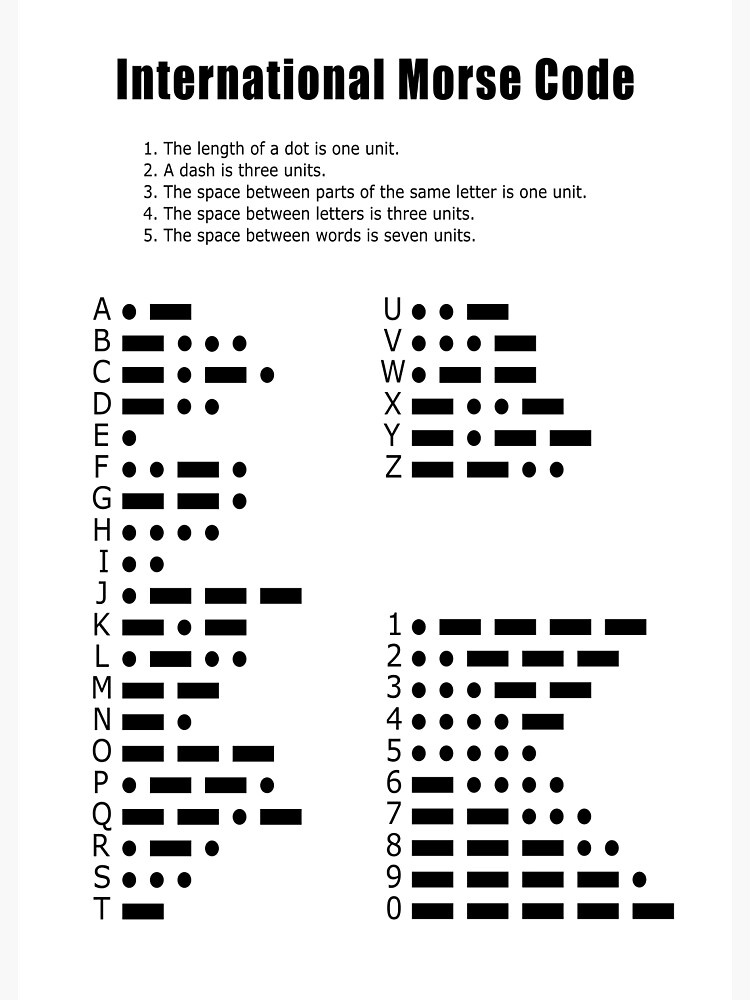

## Азбука Морзе
Существует специальный код передачи символов. С помощью него до изобретения Интернета передавали информацию с помощью светового, а потом и электрического телеграфа.  Коды букв - приведены ниже
 
  
  

## Телеграфист
Напишем код, который позволит вам с помощью агента писать свое имя
При команде чата `start` - агент готовится
```js
player.onChat("start", function() {
    agent.move(UP, 1)
})
```
При команде чата `dot` - ставит точку
```js
player.onChat("dot", function () {
    agent.setItem(WHITE_CONCRETE, 1, 1)
    agent.place(DOWN)
    agent.move(FORWARD, 2)
})
```
При команде чата `dash`  - ставит тире
```js
player.onChat("dash", function() {
    agent.setItem(WHITE_CONCRETE, 1, 1)
    for(let i =0;i<3;i++){
        agent.place(DOWN)
        agent.move(FORWARD, 1)
    }
    agent.move(FORWARD, 1)
})
```

При команде чата `space` - делает отступ

```js
player.onChat("space", function() {
    agent.move(FORWARD, 1)
})
```

При команде чата `finish` - завершает работу
```js
player.onChat("finish", function() {
    agent.move(DOWN, 1)
})
```

## Задания: 
1. С помощью кода и команд чата написать первую букву своего имени азбукой морзе
2. С помощью кода и команд чата написать свое имя
3. С помощью кода и команд чата написать название своего города
4. Сделайте точки и тире из разного материала
5. Сделайте точки и типе - белыми блоками, а пропуски между ними черными блоками.

## Функции
В текстовых языках удобно использовать функции: вы написали код один раз и можете его использовать в других случаях. Например, мы можем написать функцию, которая будет "рисовать" точку. И далее вызывать при команде чата `dot` уже эту функцию
```js
function dot(){
    agent.setItem(WHITE_CONCRETE, 1, 1)
    agent.place(DOWN)
    agent.move(FORWARD, 2)
}
player.onChat("dot", function () {
    dot()
})
```
Добавим аналогичные действия для тире и отступов:

```js
function dot(){
    agent.setItem(WHITE_CONCRETE, 1, 1)
    agent.place(DOWN)
    agent.move(FORWARD, 2)
}
function dash(){
    agent.setItem(WHITE_CONCRETE, 1, 1)
    for(let i =0;i<3;i++){
        agent.place(DOWN)
        agent.move(FORWARD, 1)
    }
    agent.move(FORWARD, 1)
}
function space(){
    agent.move(FORWARD, 1)
}
player.onChat("dot", function () {
    dot()
})

player.onChat("dash", function() {
    dash()
})

player.onChat("space", function() {
    space()
})
player.onChat("start", function() {
    agent.move(UP, 1)
})
player.onChat("finish", function() {
    agent.move(DOWN, 1)
})
```

Реализация таких функций - позволяет набором элементов печатать уже целые слова, например при команде чата `it` напечатать слово `it` азбукой Морзе
```js
function dot(){
    agent.setItem(WHITE_CONCRETE, 1, 1)
    agent.place(DOWN)
    agent.move(FORWARD, 2)
}
function dash(){
    agent.setItem(WHITE_CONCRETE, 1, 1)
    for(let i =0;i<3;i++){
        agent.place(DOWN)
        agent.move(FORWARD, 1)
    }
    agent.move(FORWARD, 1)
}
function space(){
    agent.move(FORWARD, 1)
}
player.onChat("it", function() {
    dot()
    dot()
    space()
    dash()
})
```
## Задания:
1. Напишите с помощью функций слово goiteens
2. Напишите с помощью функций свое имя
3. Напишите с помощью функцию название слово "Ракета"
4. Напишите с помощью функций свою фамилию
5. Измените способ написания, чтобы блоки были не над землей, а в земле.