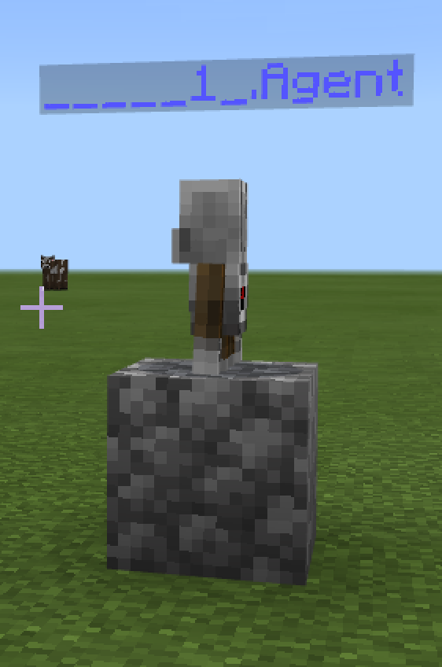
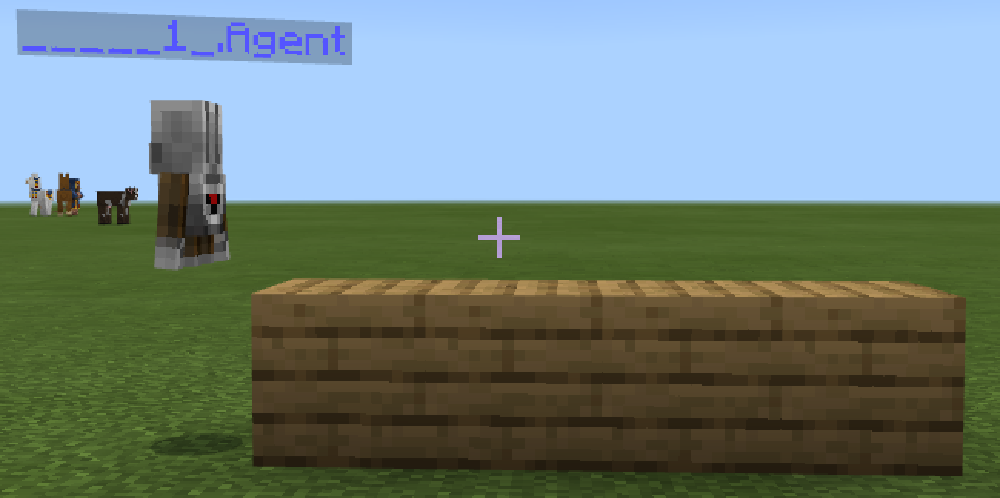

# Minecraft. Программирование на JavaScript
## Вызов команд
В Майнкрафте команды запускаются двуме остновными способами: при команде чата и при использовании предмета
При команде чата "run":
```js
player.onChat("run", function () {
	
})
```
При использовании железной лопаты (`IRON_SHOVEL`)
```js
player.onItemInteracted(IRON_SHOVEL, function () {
	
})
```
Обратите внимание, что и в первом и во втором случае команда начинается со слова `player`. Это показывает то, что и метод `onChat` и метод `onItemInteracted` выполняются в приложении к объекту `player`. Если сказать применительно к Minecraft, то "выполняются игроком".

## Работа агента
`agent.move(FORWARD, 1)` - агент идет вперед на 1 шаг  
`agent.move(BACK, 1)` - агент идет назад на 1 шаг  
`agent.move(LEFT, 1)`- агент идет влево на 1 шаг  
`agent.move(RIGHT, 1)`- агент идет вправо на 1 шаг  
`agent.move(UP, 1)`- агент идет вверх на 1 шаг  
`agent.move(DOWN, 1)`- агент идет вниз на 1 шаг  
  
`agent.turn(LEFT_TURN)` - агент повернуться наелево  
`agent.turn(RIGHT_TURN)` - агент повернуться направо  
  
`agent.setItem(PLANKS_OAK, 1, 1)` - агент ставит доски из древисины дуба в количестве 1 в слот 1  
  
`agent.place(DOWN)` - агент разместить вниз  
`agent.place(UP)` - агент разместить вверх  
`agent.place(FORWARD)` - агент разместить вперед  
`agent.place(BACK)` - агент разместить назад  
`agent.place(LEFT)` - агент разместить влево  
`agent.place(RIGHT)` - агент разместить вправо  
  
`agent.teleportToPlayer()` - агент телепортироваться к игроку  
  
Например, программа в которой агент поднялся на 1 блок, добавил в ячейку 1 один блок дубовых досок и разместил их вниз.
```js
player.onChat("run", function () {
    agent.move(UP, 1)
    agent.setItem(PLANKS_OAK, 1, 1)
    agent.place(DOWN)
})
```
Добавим к данному действию использование цикла
```js
    for (let index = 0; index < 4; index++) {
    }
```
В данном цикле при старте переменная `index` получает значение `0`, цикл будет выполняться до того времени, пока переменная index будет меньше 4 `index < 4;` на каждом шагу цикла переменная index будет увеличиваться на 1 `index++`
```js
player.onChat("line", function () {
    agent.move(UP, 1)
    agent.setItem(PLANKS_OAK, 1, 1)
    for (let index = 0; index < 4; index++) {
        agent.place(DOWN)
        agent.move(FORWARD, 1)
    }
})
```
## Материалы
`WHITE_CONCRETE` - белый бетон  
`GRAY_CONCRETE` - серый бетон  
`YELLOW_CONCRETE` - желтый бетон  
`WHITE_CONCRETE_POWDER` - белый цемент  
`WHITE_STAINED_GLASS` - белое стекло  
`PLANKS_SPRUCE` - доски из древисины сосны  
`PLANKS_OAK` - доски из древисины дуба  
`PLANKS_BIRCH` - доски из древисины березы  
`PLANKS_JUNGLE` - доски из древисины тропического дерева   
`PLANKS_ACACIA` - доски из древисины акации  
`PLANKS_DARK_OAK` - доски из древисины темного дуба  
`COBBLESTONE` - булыжник  

## Карта №1. Поставить блок
|Описание|Дополнительные задания|Код|Результат|
|---|---|---|---|
|Поставленный блок|Поставьте блоки в разных точках:<br> 1. Из серого бетона (GRAY_CONCRETE)<br> 2. Из желтого бетона (YELLOW_CONCRETE)<br>3. Из белого стекла (WHITE_STAINED_GLASS)<br>4. Из булыжника (COBBLESTONE) <br> 5. Из досок из древисины акации (PLANKS_ACACIA)|  player.onChat("step", function () { <br>   agent.move(UP, 1)<br>   agent.setItem(COBBLESTONE, 1, 1) <br>   agent.place(DOWN)<br>})| |


## Карта №2. Поставить несколько блоков
|Описание|Дополнительные задания|Код|Результат|
|---|---|---|---|
|Линия блоков|Поставьте линию из: <br>1. 10 роз<br> 2. 7 дубовых блоков <br>3. 5 блоков булыжника. <br>4. 7 белых тюльпанов <br>5. 12 блоков белого бетона|player.onChat("line", function () {<br>&nbsp;&nbsp; agent.move(UP, 1)<br>&nbsp;&nbsp; agent.setItem(PLANKS_OAK, 1, 1)<br>&nbsp;&nbsp; for (let index = 0; index < 4; index++) {<br>&nbsp;&nbsp; &nbsp;&nbsp; agent.place(DOWN)<br>&nbsp;&nbsp; &nbsp;&nbsp; agent.move(FORWARD, 1)<br>&nbsp;&nbsp; }<br>})||

