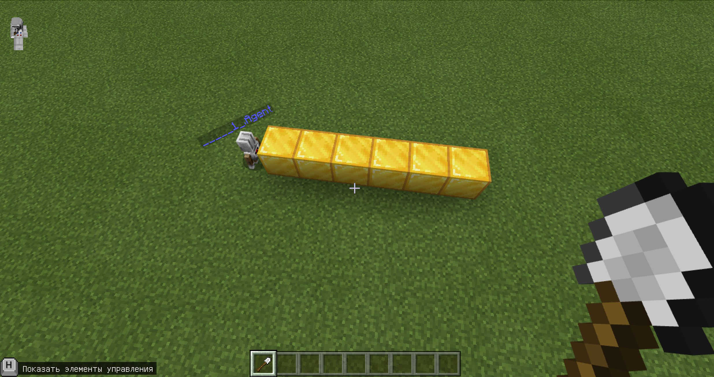
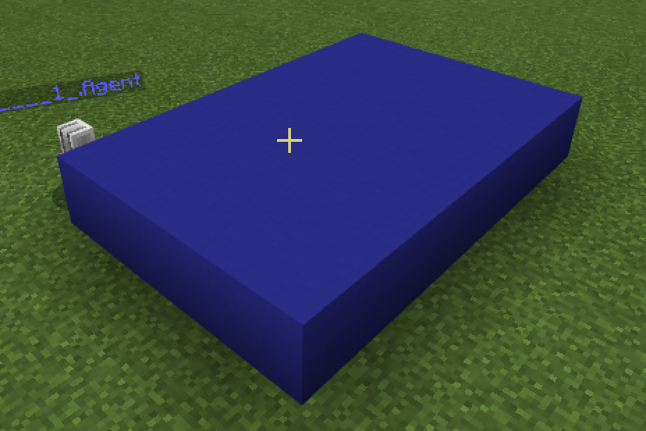
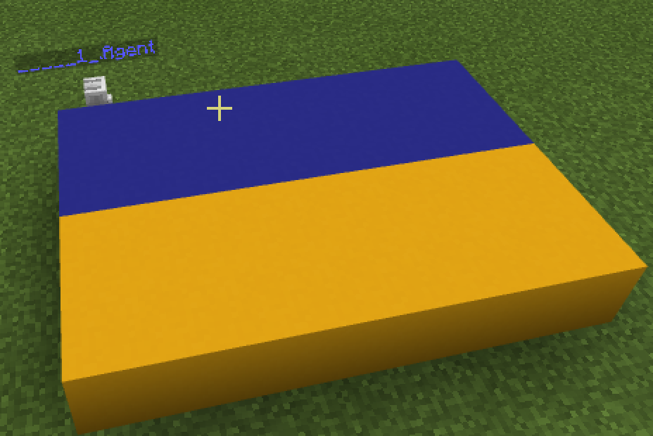
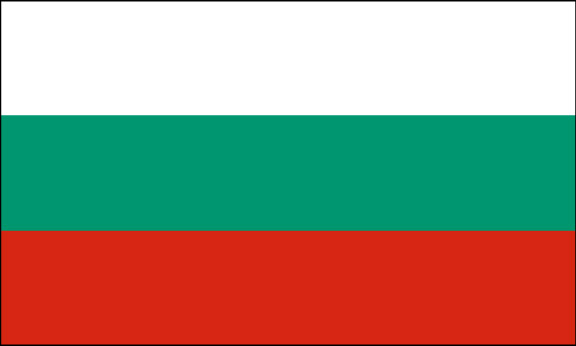
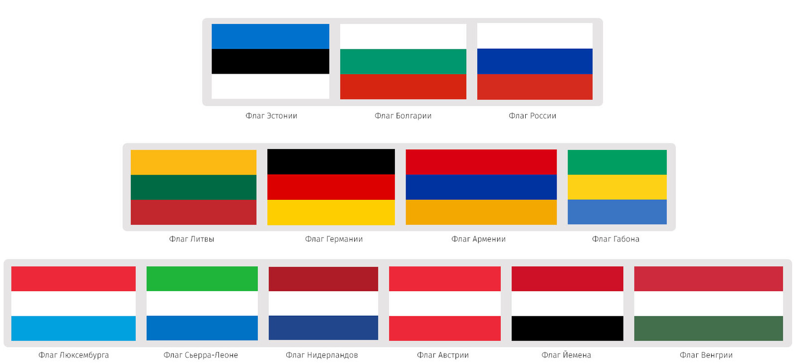
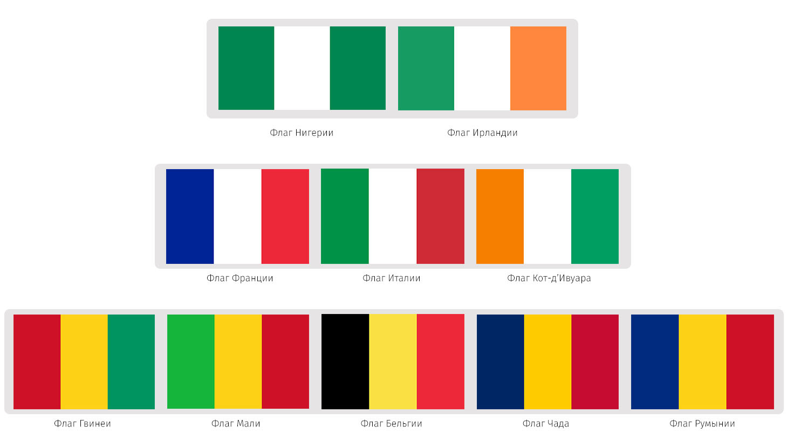

# Флаги
## Линия
Мы с Вами уже умеем создавать линию из блоков в Minecraft

# Линии
|#|Название|Альтернативные задания|Код|Результат|
|---|---|---|---|---|
|1|Линия блоков| 1. 6 золотых   2. 6 алмазных блоков   3. 9 изумрудных блоков   4. 12 железных блоков  5. 15 угольных блоков|player.onChat("line", function () {     agent.setItem(GOLD_BLOCK, 1, 1)     agent.move(UP, 1)     for (let index = 0; index < 6; index++) {         agent.place(DOWN)         agent.move(FORWARD, 1)     }     agent.move(DOWN, 1) })||

|#|Название|Альтернативные задания|Код|Результат|
|---|---|---|---|---|
|1|Линия блоков| 1. 6x6 белых бетонных блоков   2. 6x4 красных бетонных блоков   3. 12x8 зеленых бетонных блоков    4. 8х8 голубых бетонных блоков  5. 10х10 черных бетонных блоков|player.onChat("square", function () {     agent.setItem(BLUE_CONCRETE, 1, 1)     agent.move(UP, 1)     for (let index = 0; index < 4; index++) {     for (let index = 0; index < 6; index++) {         agent.place(DOWN)         agent.move(FORWARD, 1)     }         agent.move(BACK, 6)         agent.move(LEFT, 1)     }     agent.move(DOWN, 1) })||

|#|Название|Альтернативные задания|Код|Результат|
|---|---|---|---|---|
|1|Линия блоков| 1. 6x6 белых бетонных блоков   2. 6x4 красных бетонных блоков   3. 12x8 зеленых бетонных блоков    4. 8х8 голубых бетонных блоков  5. 10х10 черных бетонных блоков|player.onChat("ukr", function () {     agent.move(UP, 1)     agent.setItem(YELLOW_CONCRETE, 1, 1)     for (let index = 0; index < 2; index++) {     for (let index = 0; index < 6; index++) {         agent.place(DOWN)         agent.move(FORWARD, 1)     }         agent.move(BACK, 6)         agent.move(LEFT, 1)     }    agent.setItem(BLUE_CONCRETE, 1, 1)     for (let index = 0; index < 2; index++) {     for (let index = 0; index < 6; index++) {         agent.place(DOWN)         agent.move(FORWARD, 1)     }         agent.move(BACK, 6)         agent.move(LEFT, 1)     }     agent.move(DOWN, 1) })||

# Задания
**Создайте флаги таких государств:**
Польша:    
  
Венгрия:  
  
Болгария:  
  
Австрия:  
  

**Выберите флаги, которые вам больше нравятся и постройте 3 из них:**
  
  
**Выберите флаги, которые вам больше нравятся и постройте 3 из них:**
  
