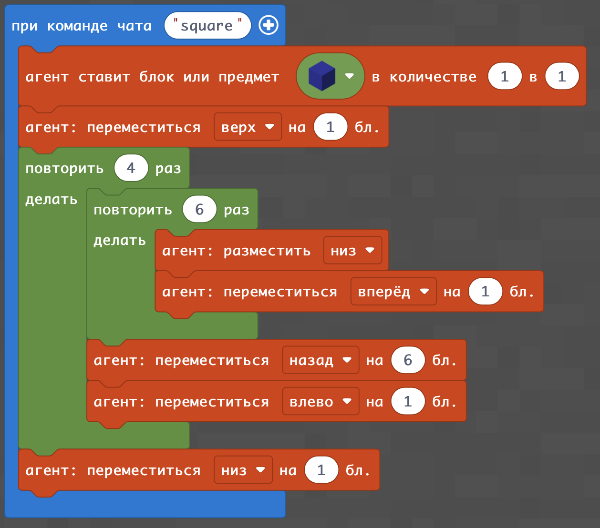

# Флаги
## Линия
Мы с Вами уже умеем создавать линию из блоков в Minecraft

# Линии
|#|Название|Альтернативные задания|Код|Результат|
|---|---|---|---|---|
|1|Линия блоков| 1. 6 золотых   2. 6 алмазных блоков   3. 9 изумрудных блоков   4. 12 железных блоков  5. 15 угольных блоков|||

# Прямоугольники
Прямоугольник - это несколько линий одна рядом с другой. Реализовать это можно с помощью 2-х циклов.

|#|Название|Альтернативные задания|Код|Результат|
|---|---|---|---|---|
|1|Линия блоков| 1. 6x6 белых бетонных блоков   2. 6x4 красных бетонных блоков   3. 12x8 зеленых бетонных блоков    4. 8х8 голубых бетонных блоков  5. 10х10 черных бетонных блоков|||

 # Флаги 2
Флаги - это несколько разноцветных прямоугольников, которые размещаются рядом
|#|Название|Альтернативные задания|Код|Результат|
|---|---|---|---|---|
|1|Линия блоков| 1. Флаг Украины   2. Флаг Польши   3. Флаг Венгрии   4. Флаг Болгарии  5. Флаг Австрии |||

 # Пример Флагов в 3 линии
Флаги - это несколько разноцветных прямоугольников, которые размещаются рядом
|#|Название|Альтернативные задания|Код|Результат|
|---|---|---|---|---|
|1|Линия блоков| 1. Флаг Болгарии 2. Флаг Венгрии br> 3. Флаг Австрии |||

# Задания
**Создайте флаги таких государств:**
Польша:    
  
Венгрия:  
  
Болгария:  
  
Австрия:  
  

**Выберите флаги, которые вам больше нравятся и постройте 3 из них:**
  
  
**Выберите флаги, которые вам больше нравятся и постройте 3 из них:**
  
