# Постройка железнодорожных путей
## Круговая железная дорога
|#|Задания|Код|Результат|
|---|---|---|---|
|1|1. Построить круговую (квадратную) железную дорогу с длиной стороны 4 |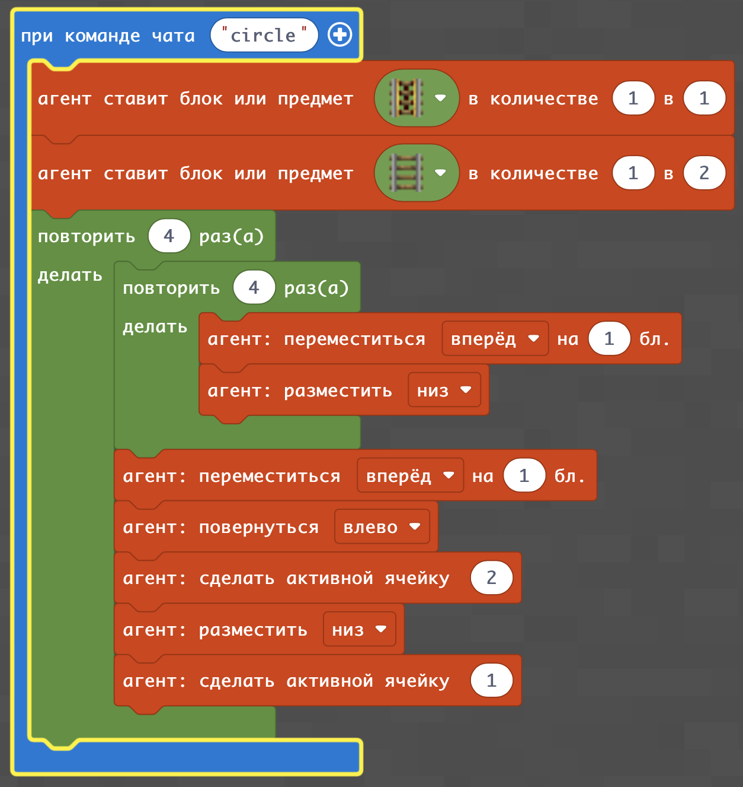|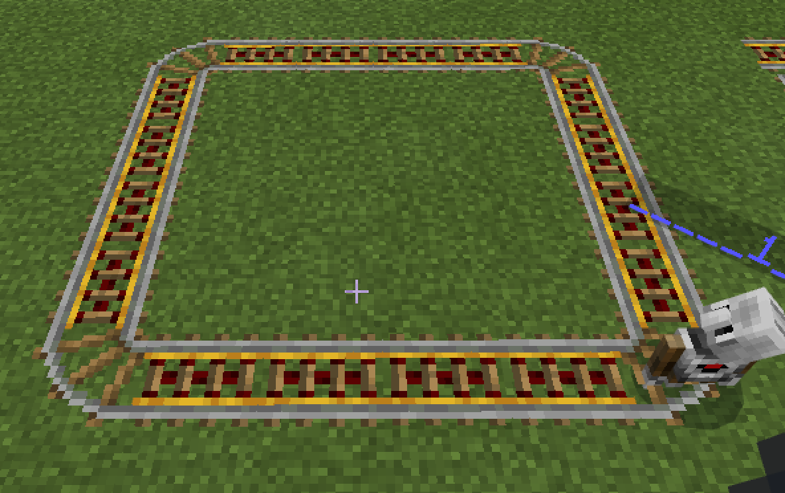|

## Депо для круговой железной дороги
|#|Задания|Код|Результат|
|---|---|---|---|
|2|1. Построить депо к круговой железной дороге с длиной стороны 4 |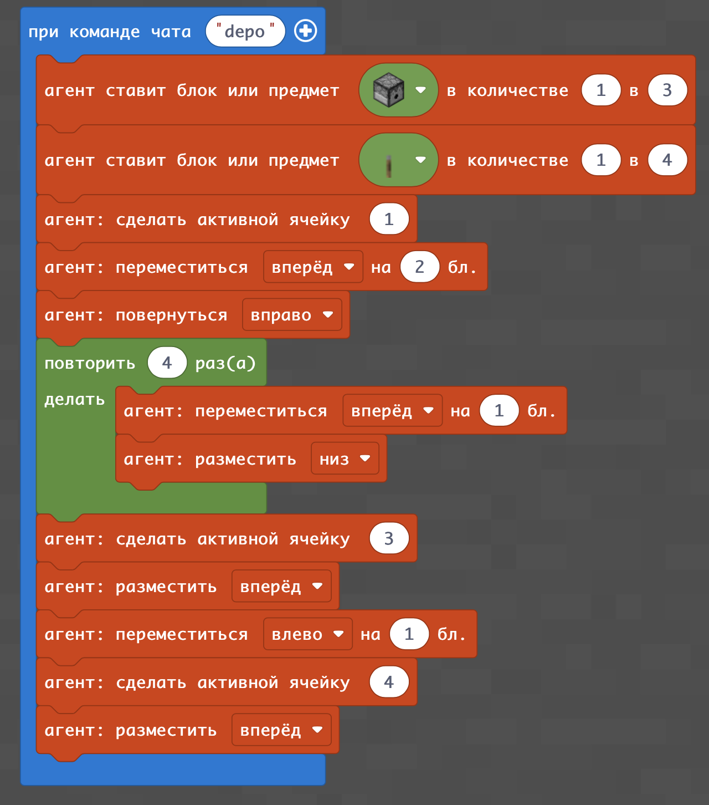|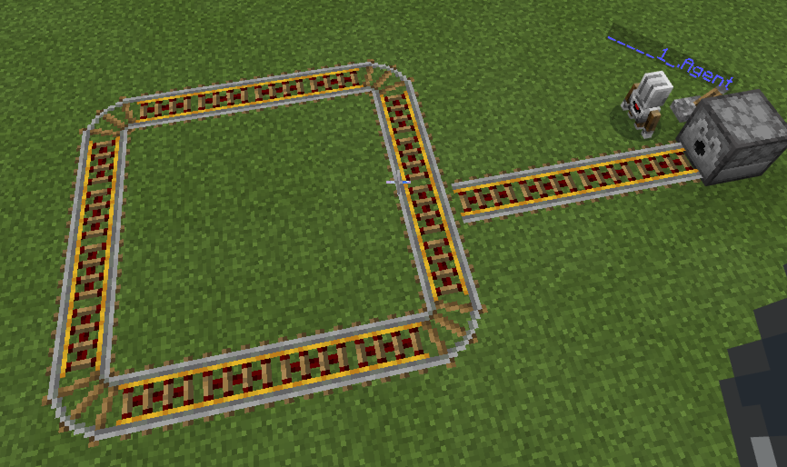|

## Круговая железная дорога с активированными рельсами
Без питания вагонетки на электрорельсах не поедут. Одним из способов подвести напряжение к электрорельсам - это поставить красный камень под рельсы - тогда он не будет занимать дополнительного места на карте и будет касаться рельс и активировать их.

|#|Задания|Код|Результат|
|---|---|---|---|
|3|1. Построить круговую (квадратную) железную дорогу с длиной стороны 4 2. Построить круговую (квадратную) железную дорогу с длиной стороны 10   3. Построить прямоугольную железную дорогу со сторонами 4 и 8|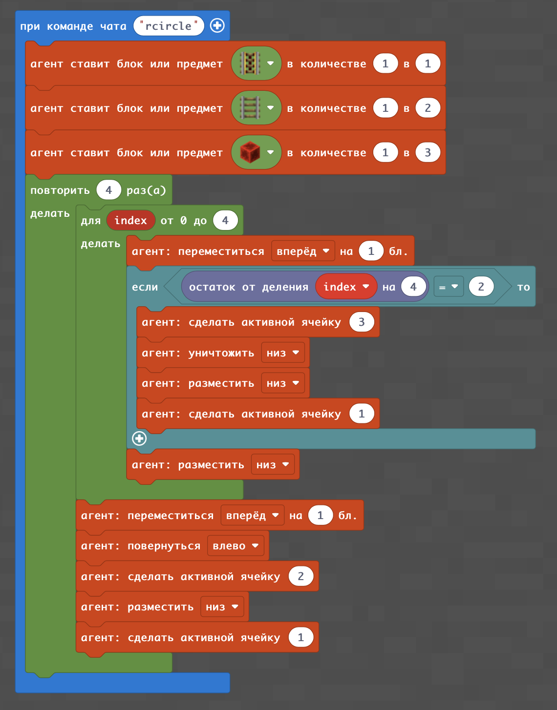|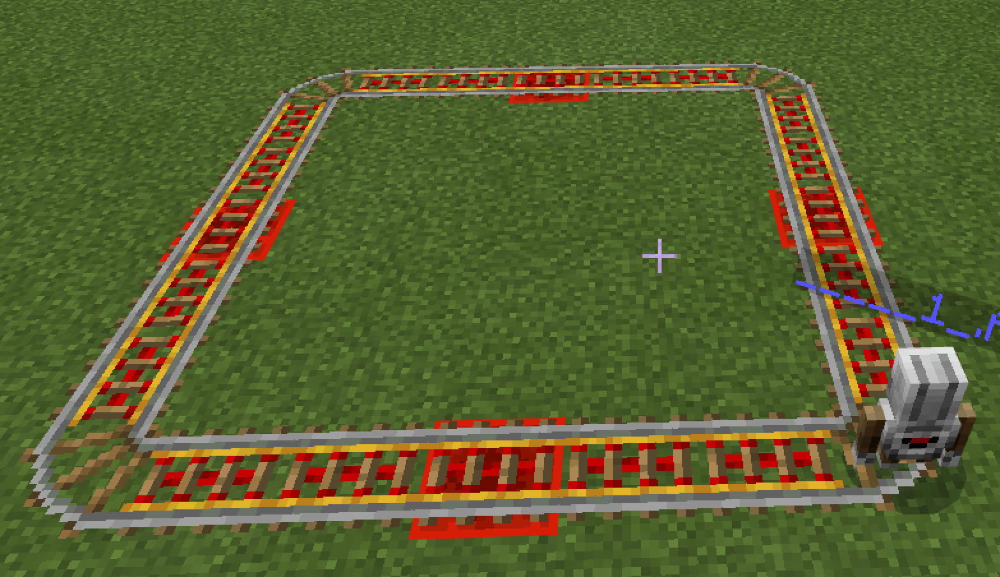|

## Круговая железная дорога с активированными рельсами и депо
|#|Задания|Код|Результат|
|---|---|---|---|
|4|1. Построить депо к круговой железной дороге с длиной ветки 4  2. Построить депо к круговой железной дороге с длиной ветки 8 3. Построить депо с поворотом в ветке, которая ведет к депо|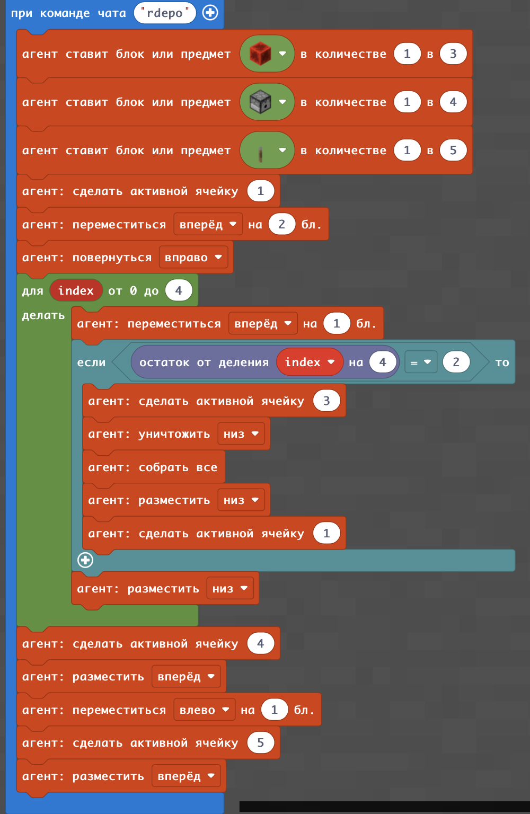|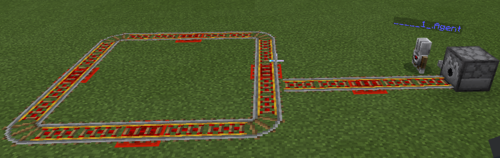|

## Добавление в раздатчик вагонеток

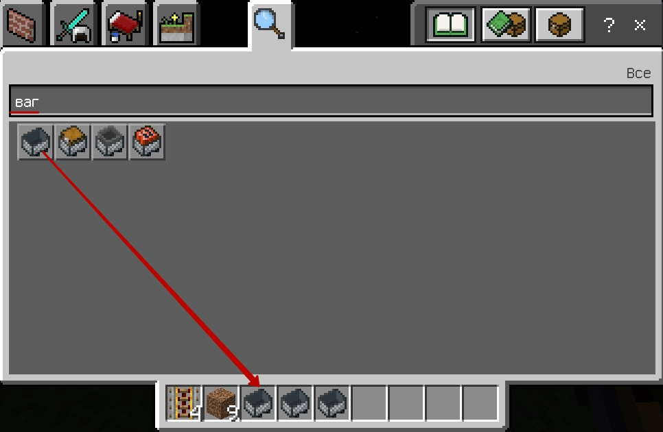  
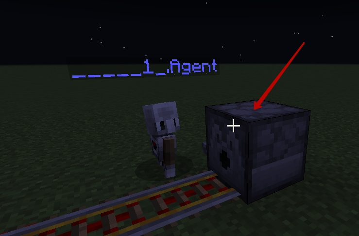  
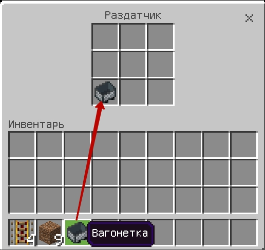  
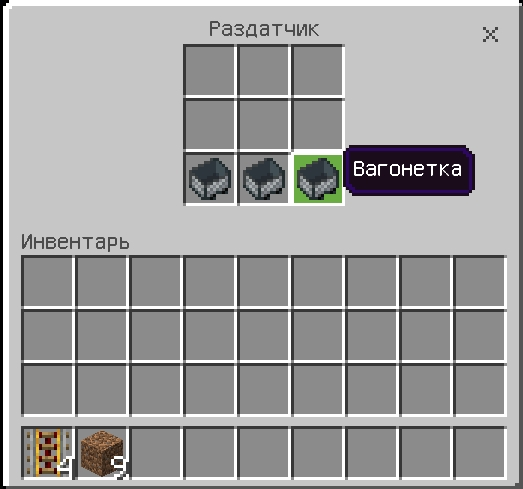

## Запуск вагонетки на линию

|#|Задания|Код|Результат|
|---|---|---|---|
|5|1. Активируйте раздатчик с помощью переключателя|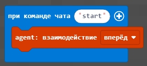|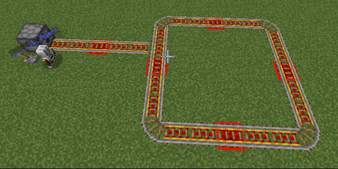|

## Создание станции

|#|Задания|Код|Результат|
|---|---|---|---|
|6|1. Создайте станцию|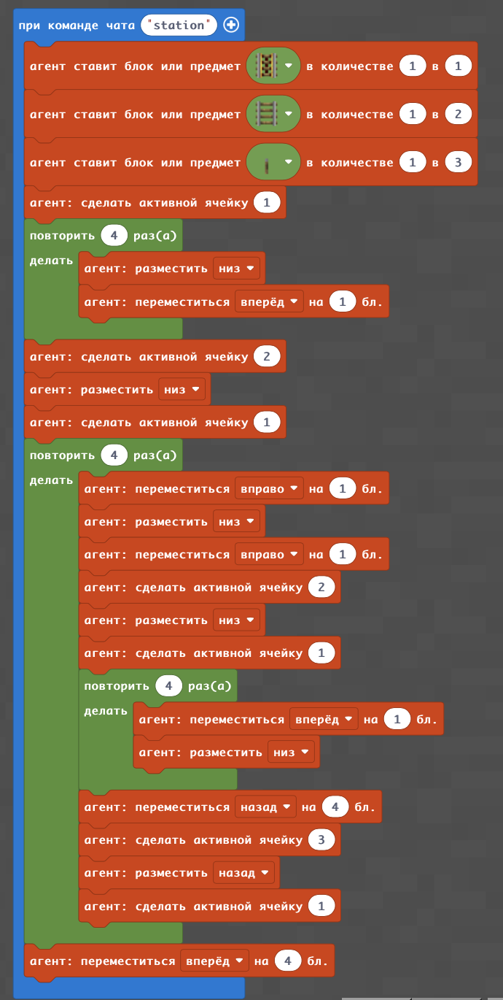|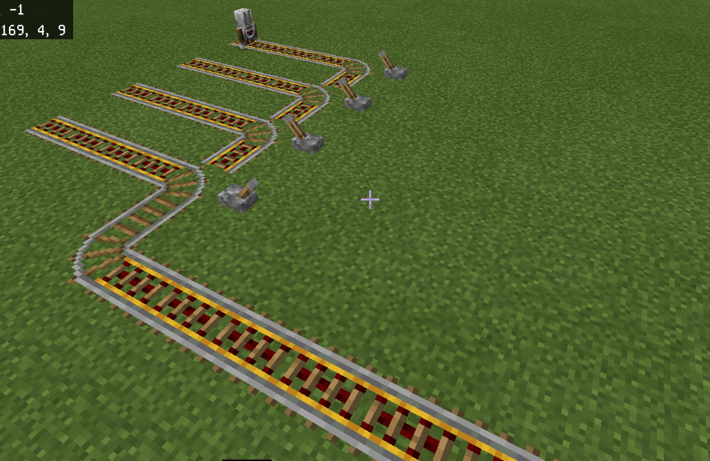|

### Творческое задание
1. Соедините предыдущее задание (круговое движение и выпуск на линию вагонеток из депо) и станцию - через соеденительный путь и стрелку.
2. Постройте путь "восьмеркой" в котором пересечение путей осуществляется на разных уровнях (с помощью моста).
3. Научите агента переключать стрелки так, чтобы вагонетки могли прибывать на разные платформы на станциях.