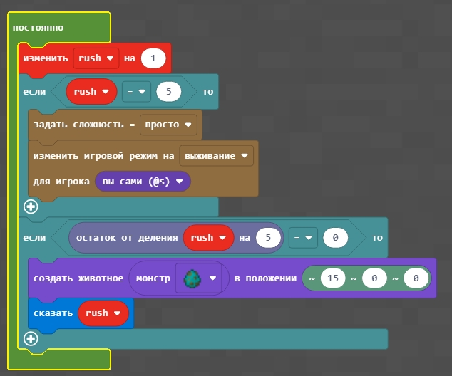

# Игра

|#|Задание|Код|
|---|---|---|
|1|1. Включите счетчик, чтобы он изменялся каждый момент времени. Начиная со значения счетчика = 5 - включите режим выживания и сложность "легко". Каждые 5 значений - создавайте нового зомби на расстоянии 15 блоков от вас. ||