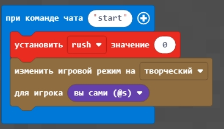
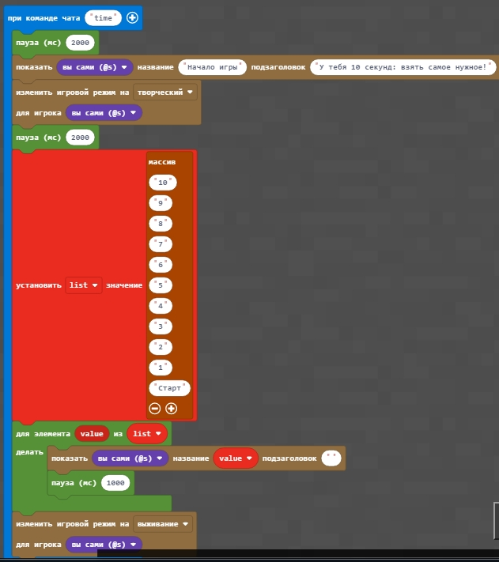
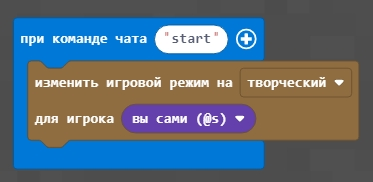
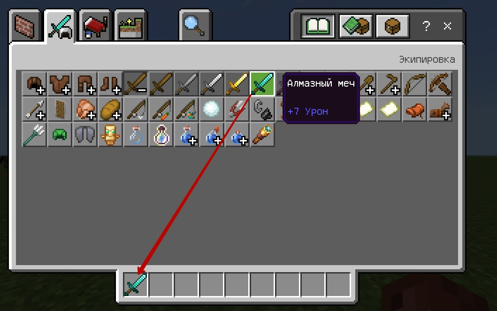
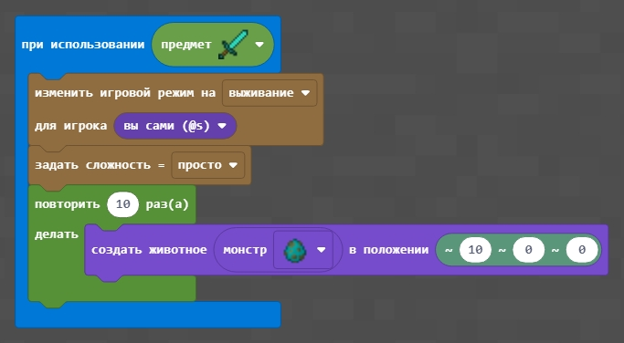

# Игра
## Стартовая игра Zombie rush
|#|Задание|Код|
|---|---|---|
|1|1. Включите счетчик, чтобы он изменялся каждый момент времени. Начиная со значения счетчика = 5 - включите режим выживания и сложность "легко". Каждые 5 значений - создавайте нового зомби на расстоянии 15 блоков от вас.   2. Включите счетчик, чтобы он изменялся каждый момент времени. Начиная со значения счетчика = 5 - включите режим выживания и сложность "мирный". Каждые 10 значений - создавайте нового зомби на расстоянии 20 блоков от вас.  3. Включите счетчик, чтобы он изменялся каждый момент времени. Начиная со значения счетчика = 5 - включите режим выживания и сложность "нормально". Каждые 15 значений - создавайте нового зомби на расстоянии 25 блоков от вас.||

Для того, чтобы установить начальные значения важно включать специальную команду:  

### Творческое задание
1. Зайдите в созданную вами игру и запишите 1 минуту видео.
2. Залейте видео в ваш канал на Youtube

## Начальный отсчет
|#|Задание|Код|
|---|---|---|
|2|1. Создайте эффект обратного отсчета на 10 секунд в начале сообщите игроку в виде заголовка "Начало игры" и в виде подзаголовка "У тебя 10 секунд: взять самое нужное", которые будут появляться на 2 секунды   2. Создайте эффект обратного отсчета на 5 секунд в начале сообщите игроку в виде заголовка "Начало игры" и в виде подзаголовка "У тебя 5 секунд: взять самое нужное", которые будут появляться на 3 секунды   3. Создайте эффект прямого отсчета на 10 секунд в начале сообщите игроку в виде заголовка "Конец игры" и в виде подзаголовка "У тебя 10 секунд: чтобы закончить", которые будут появляться на 2 секунды||

## Rush по заказу
Для подготовки:
- Задайте команду "Start", которая включает творческий режим  

- Возьмите Алмазный меч в инвентаре:  

|#|Задание|Код|
|---|---|---|
|3|1. При использовании алмазного меча создайте 10 зомби на расстоянии 10 блоков от себя.   2. При использовании алмазного меча создайте 5 пауков на расстоянии 15 блоков от себя.  3. При использовании лука (предварительно возьмите его в инвентаре) создайте 5 скелетов на расстоянии 12 блоков от себя. ||