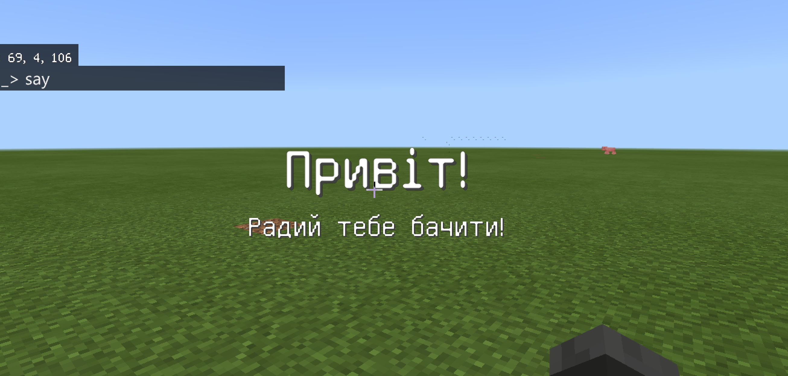
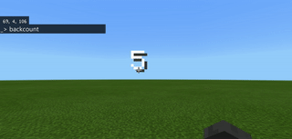
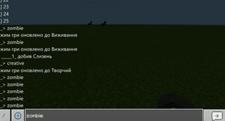

# Игра
Игра будет состоять из нескольких этапов:
1. Запуск - у вас будет несколько секунд, чтобы в креативе взять самое нужное.
2. Арена - вы попадаете в ограниченное пространство.
3. Зомби раш - появляется определенное количество зомби
4. Баллы - за разных убитых зомби вы получаете разные баллы.
5. Бонусные действия - за каждое количество бонусных баллов с вами происходит различное событие.

## Слова
В Minecraft Education есть возможность показывать на экране игрока определенные сообщения. Это делается с помощью объекта gameplay и метода title: мы обращаемся к геймплею и выводим на экран определенного пользователя (первый параметр) заголовок (второй параметр) и подзаголовок (третий параметр).

|№|Задание|Код|Результат|
|---|---|---|---|
|1|1. При введенні команди hello напишіть на екрані вас як гравця заголовок "Привіт!" та підзаголовок  "Радий тебе бачити!"<br>2. При введенні команди how напишіть на екрані вас як гравця заголовок "Як твої справи?" та підзаголовок  "Мені дуже цікаво!" <br> 3. При введенні команди win напишіть на екрані вас як гравця заголовок "Вітаю!" та підзаголовок  "Ти переміг в цьому раунді"|player.onChat("hello", function () { gameplay.title(mobs.target(NEAREST_PLAYER), "Привіт!", "Радий тебе бачити!")})||

### Творческое задание
1. Придумайте свои фразы и команды, которыми вы будете вызывать эти фразы.
2. Возьмите инструмент: 3 разные лопаты и при использовании каждой из лопат - пишите ее название. Например "Золотая лопата".


## Обратный отсчет
С помощью массивов и вывода слов на экран можно сообщать пользователю не одно сообщение, а несколько. Самой простой последовательностью - будет обратный отсчет


|№|Задание|Код|Результат|
|---|---|---|---|
|2|1. При команде чата backcount запустите обратный отсчет от 5 до 1 и в конце выведите команду "Старт". Интервал между командами 1 секунда (1000 мс).<br>1. При команде чата backcount10 запустите обратный отсчет от 10 до 0 и в конце выведите команду "Поехали". Интервал между командами 1 секунда (1000 мс)|player.onChat("backcount", function () {<br>list = ["5","4","3","2","1","Старт"] <br>for (let value of list) { <br>gameplay.title(mobs.target(LOCAL_PLAYER), value, "") <br>loops.pause(1000)<br>}<br>})||

### Творческое задание
1. Выведите на экран 5 мемов с интервалом в 5 секунд.

### Изменение режима
С помощью реализованного механизма обратного отсчета реализуйте время на изменение режима игры (например - на 10 секунд включается креатив, чтобы взять оружие):
```js
player.onChat("time", function () {
    gameplay.setGameMode(
    CREATIVE,
    mobs.target(LOCAL_PLAYER)
    )
    gameplay.title(mobs.target(LOCAL_PLAYER), "Начало игры", "У тебя 10 секунд: взять самое нужное!")
    loops.pause(3000)
    list = [
    "10",
    "9",
    "8",
    "7",
    "6",
    "5",
    "4",
    "3",
    "2",
    "1",
    "Старт"
    ]
    for (let value2 of list) {
        gameplay.title(mobs.target(LOCAL_PLAYER), value2, "")
        loops.pause(1000)
    }
    gameplay.setGameMode(
    SURVIVAL,
    mobs.target(LOCAL_PLAYER)
    )
})

```
## Создание мобов
Для того, чтобы негативные мобы создавались должен быть включен режим игры: выживание и сложность быть сложнее чем "мирно".
```js
player.onChat("fight", function () {
    gameplay.setGameMode(
    SURVIVAL,
    mobs.target(LOCAL_PLAYER)
    )
    gameplay.setDifficulty(EASY)
})
```

Для создания мобов мы можем использовать команды
|№|Задание|Код|Результат|
|---|---|---|---|
|3|1. Создайте зомби (ZOMBIE) на расстоянии 15 блоков от себя по оси Х. <br>2. Создайте крипера (CREEPER) на расстоянии 15 блоков от себя по оси Х.<br>3. Создайте скелета (SKELETON) на расстоянии 15 блоков от себя по оси Х.<br>4. Создайте паука (SPIDER) на расстоянии 15 блоков от себя по оси Х.<br> |player.onChat("zombie", function () {<br>mobs.spawn(mobs.monster(ZOMBIE), pos(15, 0, 0))<br>})||

Также - вы можете создавать мобов не по одному, а сразу по несколько штук, используя цикл.


## Начисление баллов


## Определение победы

