# Додаємо HTML
В Minecraft NPC ми можемо додавати посилання на зовнішні сторінки.  
Перед тим, як додати таке посилання створимо сторінку, на якій розмістимо HTML-інформацію, а також опис гри.  

## Реєстрація на GitHub.com
Всі сучасні програмісти користуються git-сервісами. Це сервіс, який дозволяє зберігати ваш код, на організовувати спільну роботу. Найбільшим та найвідомішим git-сервісом є сервіс GitHub.com  
Навички роботи із git-сервісами є обов'язковою вимогою для ВСІХ сучасних програмістів.

Створимо обліковий запис на сервісі GitHub.com.  
  

1. Перейдемо на сайт <a href = "https://github.com" target = "_blank">github.com</a>
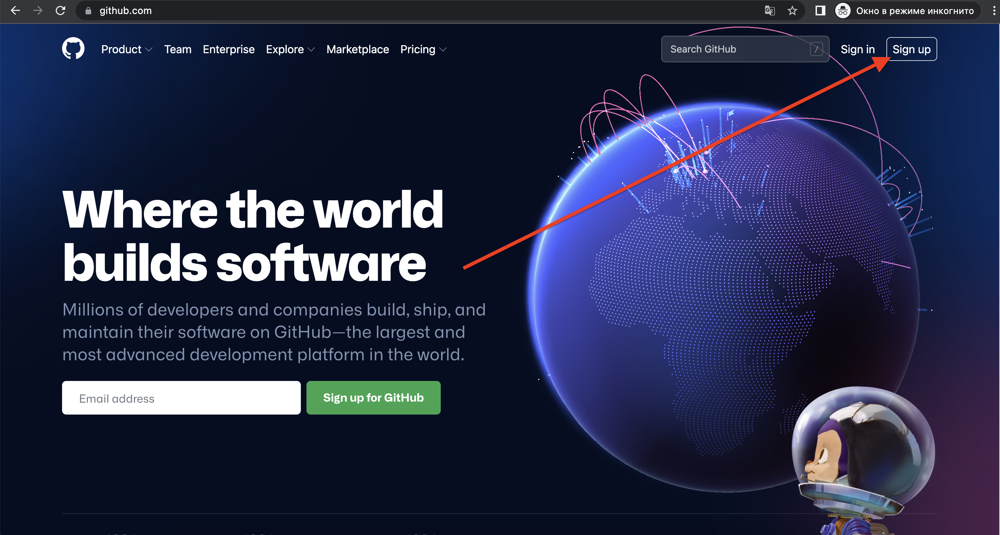  

2. Введемо адресу електронної пошти  
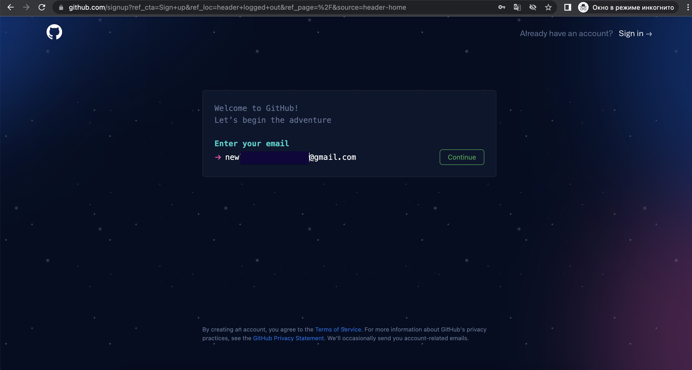  

3. Створіть пароль (обов'язково запам'ятайте його)
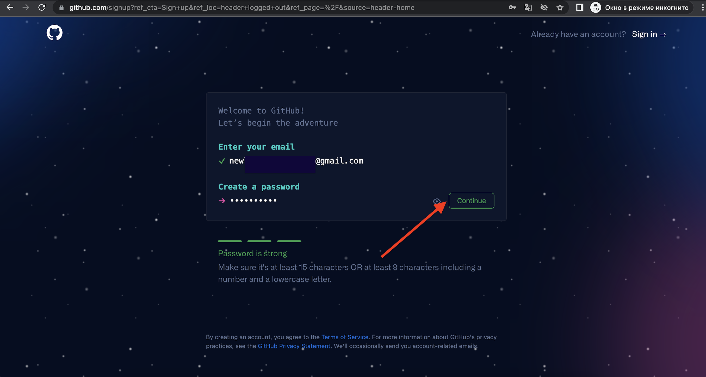  

4. Придумайте та введіть ім'я користувача:  
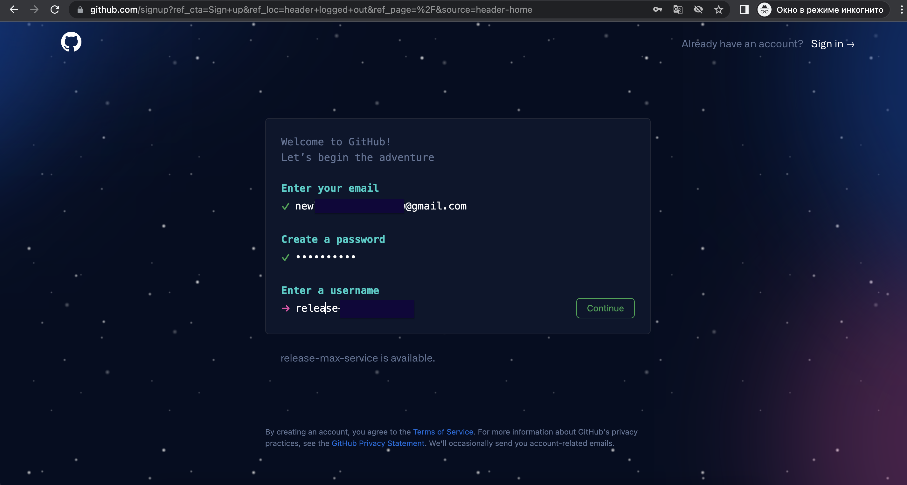  

5. У відповіді на питання про те, чи хочете ви отримувати інформацію про оновлення через email вкажіть n  (ні).
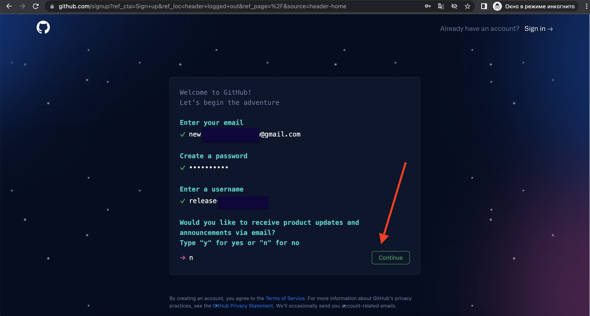  

6. Пройдіть перевірку, що ви людина:  
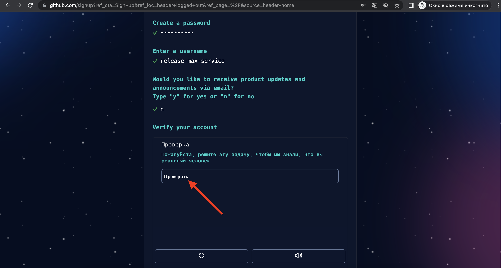  
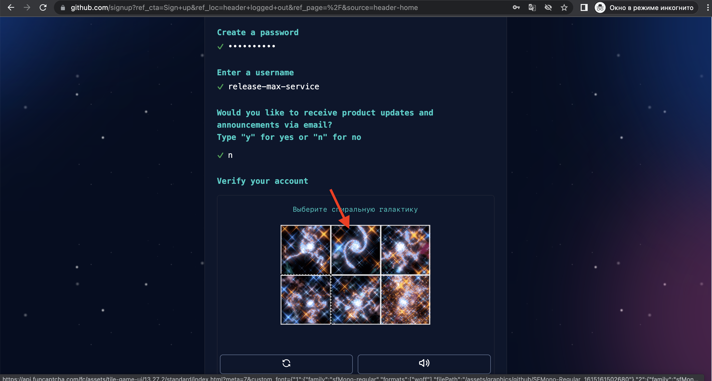  

7. Створіть акаунт
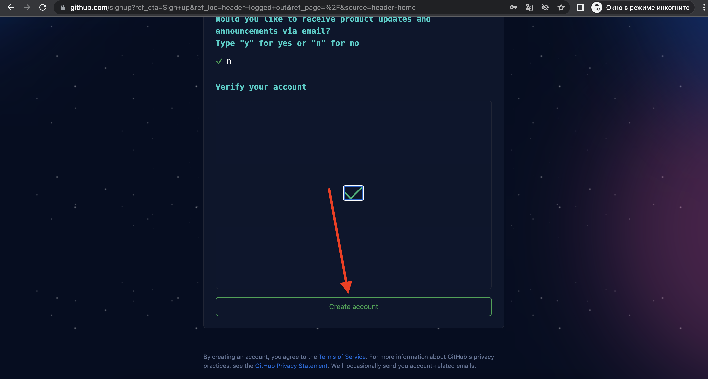  

8. На вказану вами пошту прийде код для підтвердження, введіть його у відповідне поле 
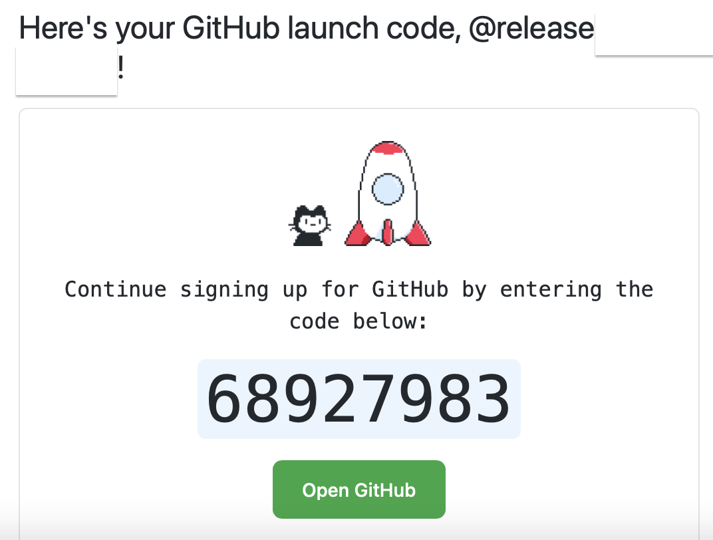  

9. Пропустіть персоналізацію
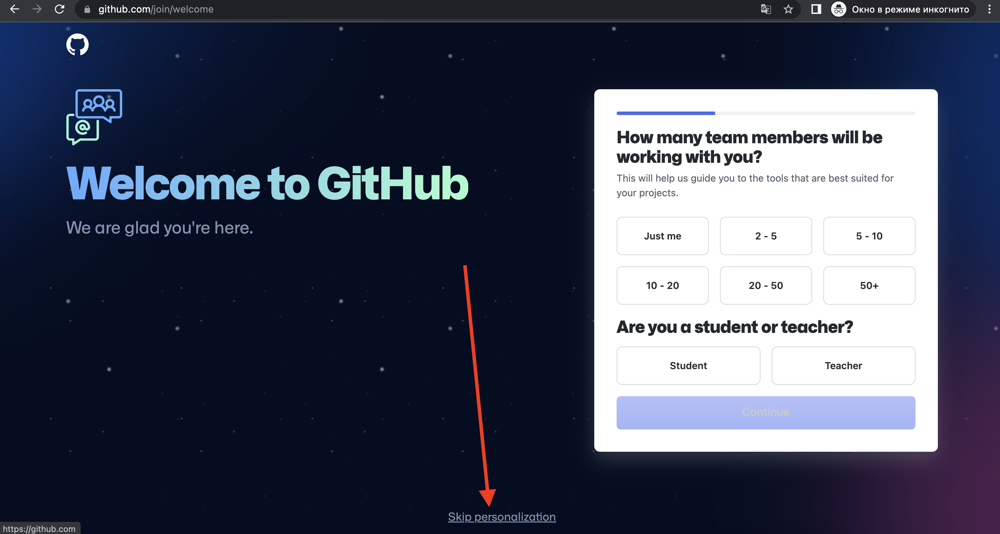  

10. Створіть репозитарій
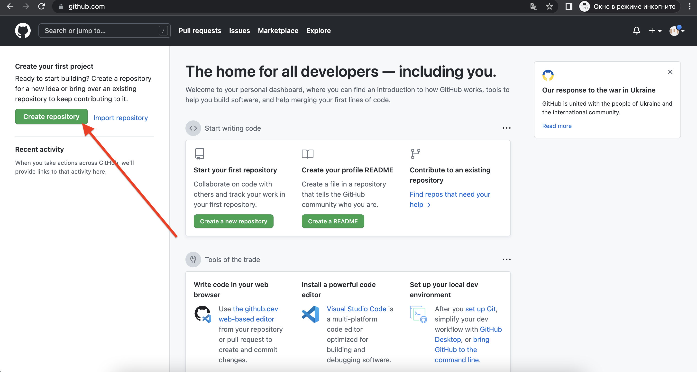  

