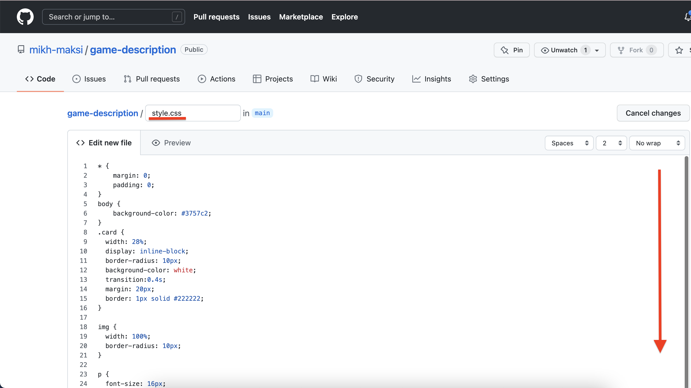
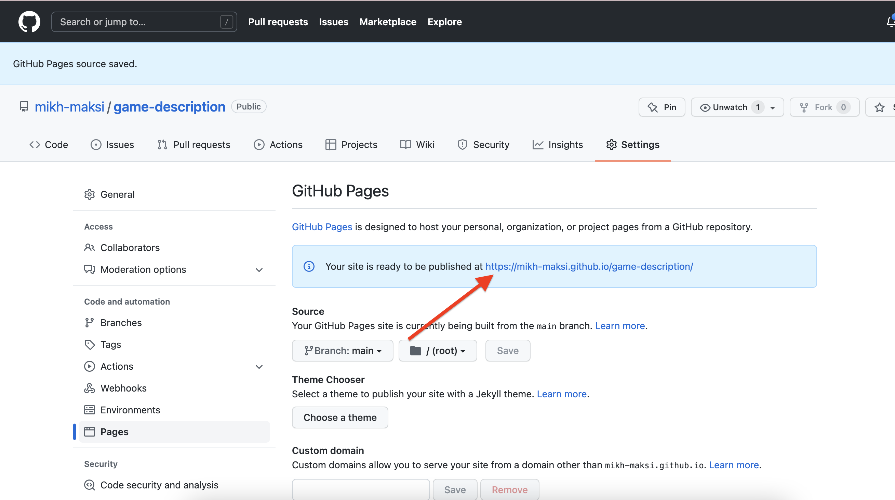

# Додаємо HTML
В Minecraft NPC ми можемо додавати посилання на зовнішні сторінки.  
Перед тим, як додати таке посилання створимо сторінку, на якій розмістимо HTML-інформацію, а також опис гри.  

## Реєстрація на GitHub.com
Всі сучасні програмісти користуються git-сервісами. Це сервіс, який дозволяє зберігати ваш код, на організовувати спільну роботу. Найбільшим та найвідомішим git-сервісом є сервіс GitHub.com  
Навички роботи із git-сервісами є обов'язковою вимогою для ВСІХ сучасних програмістів.

Створимо обліковий запис на сервісі GitHub.com.  
  

1. Перейдемо на сайт <a href = "https://github.com" target = "_blank">github.com</a>
  

2. Введемо адресу електронної пошти  
  

3. Створіть пароль (обов'язково запам'ятайте його)
  

4. Придумайте та введіть ім'я користувача:  
  

5. У відповіді на питання про те, чи хочете ви отримувати інформацію про оновлення через email вкажіть n  (ні).
  

6. Пройдіть перевірку, що ви людина:  
  
  

7. Створіть акаунт
  

8. На вказану вами пошту прийде код для підтвердження, введіть його у відповідне поле 
  

9. Пропустіть персоналізацію
  

10. Створіть репозитарій
  


## Додамо елементи майбутнього сайту (із готового коду)
11. Задайте назву новому репозитарію  
  

12. Отримаємо готовий репозитарій
  

13. Створимо новий файл
  

14. Назвемо новий **index.html** та додамо заготовлений **HTML-код**  
```html
<!DOCTYPE html>
<html>
  <head>
    <meta charset="utf-8">
    <meta name="viewport" content="width=device-width">
    <title>repl.it</title>
    <link href="style.css" rel="stylesheet" type="text/css" />
  </head>
  <body>
    <div class="card">
      
      <div class="text">
        <h2>Minecraft</h2>
        <p>Minecraft - моє життя!</p>
        <a href="https://www.minecraft.net/ru-ru">Перейти до гри </a>
      </div>
    </div>

    <script src="script.js"></script>
  </body>
</html>
```
  
  

15. Створимо новий файл **style.css** та внесемо в нього заготовлений код:
```css
* {
    margin: 0;
    padding: 0;
}
body {
    background-color: #3757c2;
}
.card {
  width: 28%;
  display: inline-block;
  border-radius: 10px;
  background-color: white;
  transition:0.4s;
  margin: 20px;
  border: 1px solid #222222;
}

img {
  width: 100%;
  border-radius: 10px;
}

p {
  font-size: 16px;
  color: #626262;
  margin: 10px 0px;
}

.text {
  padding: 20px;
}

a{
  display: inline-block;
  text-decoration:none;
  padding: 10px 20px;
  color: white;
  background-color: #3d3c;
  text-transform: uppercase; 
  }

  .card:hover {
  width: 30%;
  box-shadow: 0 0 10px #222222;
}
```

  
  
  

## Запустимо обробку HTML+CSS
GitHub.com має можливість відображати HTML+CSS код у вигляді сайта за спеціальним посиланням.
16. Зайдемо в налаштування облікового запису:  
  

17. Перейдемо до пункту **Pages**:  
  

18. Оберемо **main** (вітку, яку буде відображати сторінка)
  

19. Збережемо результат:  
  

20. Після збереження результату ви отримаєте поислання, за яким буде відображено створений сайт.
 

21. Результат:  
  

## Текстовий опис
За допомогою GitHub.com можна робити зручні описи. При цьому використовується мова розмітки MarkDown.  
Для того, щоб побачити відповідну розмітку необхідно змінити файл README.MD, який має лежати в корінній 

22.  Натиснемо на іконку змін на корінній сторінці репозитарію:
  

23. Додамо опис
  

24. Для відображення нових рядків необхідно в кінці кожно рядка поставити 2 пробіла
  

25. Збережемо результат
  

26. Отримаємо результат.
  

27. Даний результат можна відображати за посиланням.
  

## Додамо інформацію до гри через посилання-кнопку в NPC  
1. Увімкнемо режим "Творець світу" 
    

2. Зайдемо в NPC (натиснемо правою клавішею на NPC)  
    

3. Зайдемо в "Розширені параметри"  
   

4. Натиснемо кнопку "Додати URL-адресу"  
    
  
5. Вставимо посилання на опис гри
    
  
6. Вийдемо із даного вікна
   
  
7. Закриємо налаштування NPC
    
  
8. Виключимо режим "Творець світу"
    
   
    

9. Зайдемо в NPC (натиснемо правою клавішею)  
    

10. Натиснемо на кнопку "Докладніше"  
  
  
11. Побачемо сайт, на який давали посилання  
    


