# JavaScript у FrontEnd і Minecraft
План уроку:
Давайте познайомимося ближче із тим, що нам дозволяє робити JavaScript в Minecraft. Та як це можна використати на прикладі роботи у FrontEnd.  

Повторимо запуск JavaScript-коду в Minecraft

|#|Завдання|Код|Результат|
|---|---|---|---|
|1|1. При команді чату "1" виведіть на екран слово "Hello"<br>2. При команді чату "2" виведіть на екран слово "Bye"<br>3. При команді чату "3" виведіть на екран власне ім'я "How are you?"<br>4. При команді чату "4" виведіть на екран слова "How are you?"<br>5. При команді чату "5" виведіть на екран слова "I'm ok!"|player.onChat("1", function () {<br>player.say("hello")<br>})|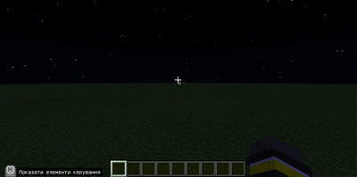|

##  Реалізація запуску JavaScript-коду у FrontEnd

1. Для роботи із файлами на комп'ютері необхідно встановити <a href = "https://code.visualstudio.com/">Visual Studio Code</a>. 
2. Створимо на комп'ютері папку **code01**  
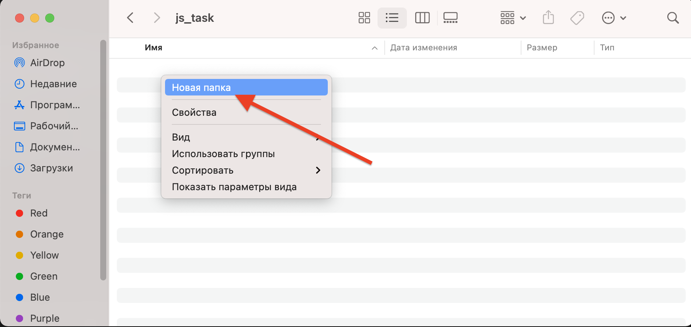  
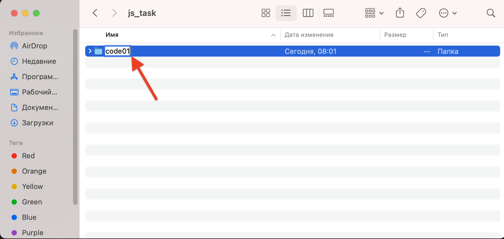  

3. Відкриємо папку в **Visual Studio Code**  
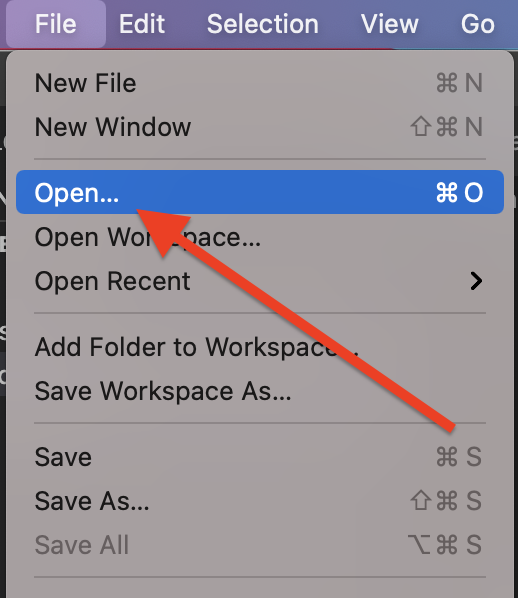  
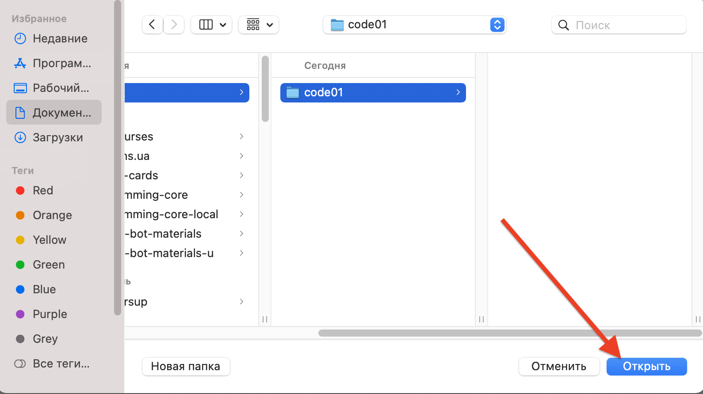  

4. Після відкриття папки **Visual Studio Code** у вбудованому редакторі створимо на комп'ютері файл **index.html**
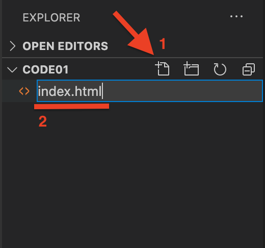  

5. Вставимо до файлу **index.html** такий код:
```html
<!DOCTYPE html>
<html lang="en">

<head>
    <meta charset="UTF-8">
    <meta name="viewport" content="width=device-width, initial-scale=1.0">
    <title>Document</title>
</head>

<body>
    <button id="btn1">1</button>
    <script src="js/js.js"></script>
</body>
  
</html>
```
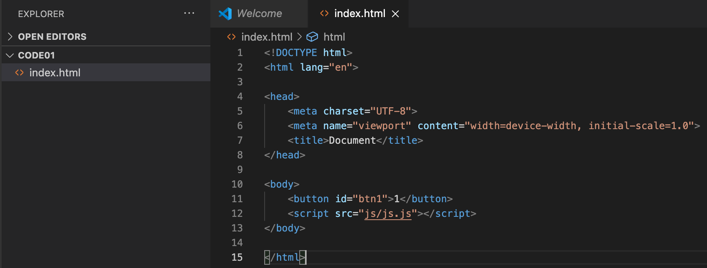  


6. Створимо папку **js**.  
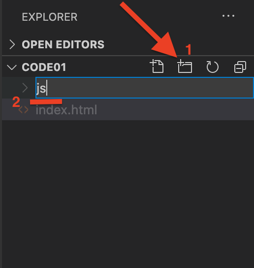  


7. В папці **js** - створемо новий файл **js.js**   
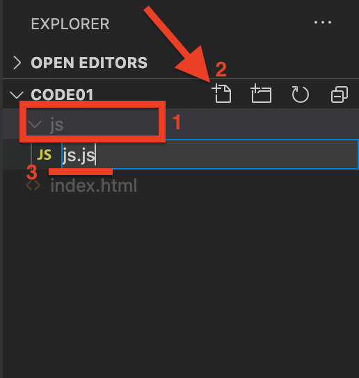  


8. До файлу **js.js** додамо відповідний код:  
```js
btn1.addEventListener("click", function() { alert("Hello") })
```  
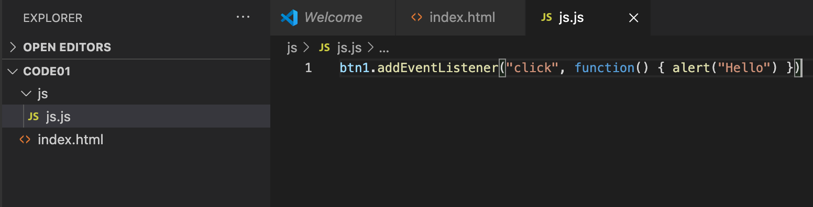  

9. Відкриємо створений файл **index.html** в браузері:  
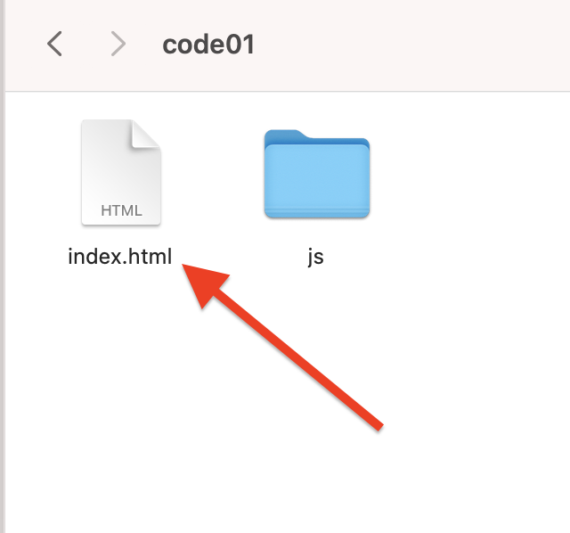  


10. Запустимо файл index.html в браузері та отпримаємо результат.  
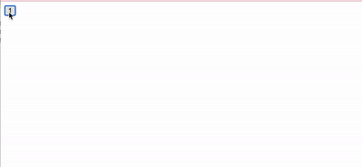   


|#|Завдання|Код|Результат|
|---|---|---|---|
|1|1. Створіть кнопку із текстом "1" та id="btn1", при її нажатті виведіть в сервісне вікно (команда Alert) слово "Hello"<br>2. Створіть кнопку із текстом "2" та id="btn2", при її нажатті виведіть в сервісне вікно (команда Alert) слово "Bye"<br>3. Створіть кнопку із текстом "3" та id="btn3", при її нажатті виведіть в сервісне вікно (команда Alert) власне ім'я <br>4. Створіть кнопку із текстом "4" та id="btn4", при її нажатті виведіть в сервісне вікно (команда Alert) слова "How are you?"<br>5. Створіть кнопку із текстом "5" та id="bt5", при її нажатті виведіть в сервісне вікно (команда Alert) слова "I'm ok!"|btn1.addEventListener("click", function() { alert("Hello") })||

## Додаткове завдання
1. Запустіть створені файли в **GitHub Pages**.


## Функції із параметром

### Minecraft 
```js
player.onChat("mult2", function (num1) {
    player.say(num1 * 2)
})
```


|#|Завдання|Код|Результат|
|---|---|---|---|
|2|1. Створіть команду mult2, що отримує параметр, та повертає значення параметра збільшене вдвічі<br> 2. Створіть команду plus2, що отримує параметр, та повертає значення параметра збільшене на 2 <br> 3. Створіть команду minus2, що отримує параметр, та повертає значення параметра зменшене на 2.<br> 4. Створіть команду div2, що отримує параметр, та повертає значення параметра зменшене вдвічі|player.onChat("mult2",function(num1){<br>player.say(num1 * 2)<br>})|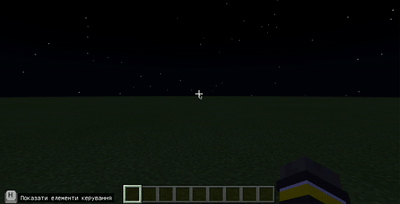|

### FrontEnd
1. Створіть нову папку (наприклад code02), відкрийте її за допомогою **Visual Studio Code** та створіть в ній файл **index.html**, а також папку **js**, а в ній файл **js.js**.
2. До файлу **index.html** додайте код:
```html
<!DOCTYPE html>
<html lang="en">

<head>
    <meta charset="UTF-8">
    <meta name="viewport" content="width=device-width, initial-scale=1.0">
    <title>Document</title>
</head>

<body>
    <input type="text" id="inpt">
    <button id="mult2">Mult2</button>
    <script src="js/js.js"></script>
</body>

</html>
```
3. До файлу **js.js** додайте код:
```js
mult2.addEventListener("click", function() {
    var v = Number(inpt.value);
    alert(v * 2);
})
```
 


|#|Завдання|Код HTML|Код JS|Результат|
|---|---|---|---|---|
|3|1. Створіть кнопку із написом mult2 та id=mult2, що отримує значення від поля вводу, та повертає значення параметра збільшене вдвічі<br> 2. Створіть кнопку із написом  plus2 та id=plus2, що отримує значення від поля вводу, та повертає значення параметра збільшене на 2 <br> 3. Створіть кнопку із написом minus2 та id=minus2, що отримує значення від поля вводу, та повертає значення параметра зменшене на 2.<br> 4. Створіть кнопку із написом div2 та id=div2, що отримує значення від поля вводу, та повертає значення параметра зменшене вдвічі|<br>&lt;input type="text" id="inpt"><br>&lt;button id="mult2">Mult2&lt;/button><br>&lt;script src="js/js.js">&lt;/script><br>&lt;/body>|mult2.addEventListener("click", function() {<br>var v = Number(inpt.value);<br>alert(v * 2);<br>})|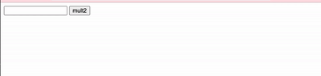|

## Творче завдання
1. Створіть нову папку (наприклад code02), відкрийте її за допомогою **Visual Studio Code** та створіть в ній файл **index.html**, а також папку **js**, а в ній файл **js.js**, а також створіть папку **css**, та в ній файл **style.css**.

2. Додайте коди у відповідні файли:
**index.html**
```html
<!DOCTYPE html>
<html lang="en">

<head>
    <meta charset="UTF-8">
    <meta http-equiv="X-UA-Compatible" content="IE=edge">
    <meta name="viewport" content="width=device-width, initial-scale=1.0">
    <title>Document</title>
    <link rel="stylesheet" href="css/style.css">
</head>

<body>
    <p id="question"></p><br>
    <table class="table">
        <tr>
            <td><label for="a1" id="label1">A</label></td>
            <td><label for="a2" id="label2">Б</label></td>
            <td><label for="a3" id="label3">В</label></td>
            <td><label for="a4" id="label4">Г</label></td>
        </tr>
        <tr>
            <td><input type="radio" name="question" id="a1"></td>
            <td><input type="radio" name="question" id="a2"></td>
            <td><input type="radio" name="question" id="a3"></td>
            <td><input type="radio" name="question" id="a4"></td>
        </tr>
    </table>
    <button id="btn">Відповісти</button>
    <script src="js/js.js"></script>
</body>

</html>
```
3. Додайте до файлу **js.js** наступний код
```js
let arr = [1, 5, 3, 6, 8, 4, 3];
let questions = ["Чому дорівнює 2+2==4", ""];
let answers = [
    ["3", "4", "5", "true"],
    ["", "", "", ""]
]
let right_answers = [3, ""]

question.innerHTML = questions[0];
label1.innerHTML = answers[0][0];
label2.innerHTML = answers[0][1]
label3.innerHTML = answers[0][2]
label4.innerHTML = answers[0][3]

btn.addEventListener("click", check);

function check() {
    n = document.getElementsByName("question");
    k = 0;
    n.forEach(element => {
        if (element.checked) {
            if (k == right_answers[0]) {
                alert("Вірно. Секретний блок знакходиться на координаті (0;3;5)");
            } else {
                alert("Невірно");
            }
        }
        k++;
    });

}

arr.forEach(element => {
    console.log(element);
});

```

4. Додайте до файлу **style.css** код:
```css
*{
    margin: 0;
    padding: 0;
}
.table td{
    padding:5px;
}
```

## Супертворче завдання
1. Попередній код завантажте на GitHub Pages
2. Змініть питання на власне
3. За умови вірної відповіді - надайте інформацію про певний секрет на вашій мапі в Minecraft.