# Лабірінт
Сформуємо схему майбтнього лабіринту. Для цього використаємо файл Google документів (якщо ви не володієте навичками роботи із Google-документами пройдіть курс **IT-Independence**, безкоштовний для студентів GoITeens).  

## Основні коридори
### Внутрішній блок 1.
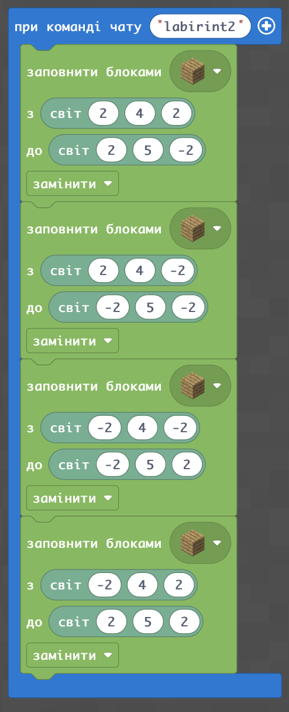  
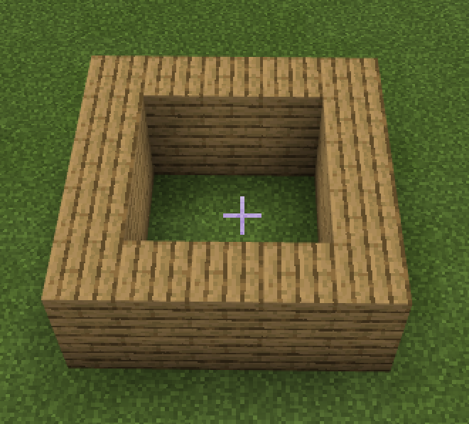  

### Внутрішній блок 2.
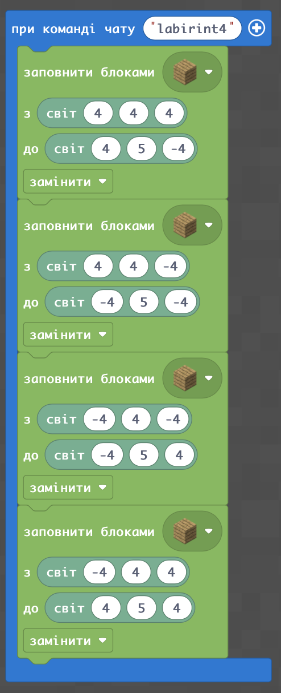  
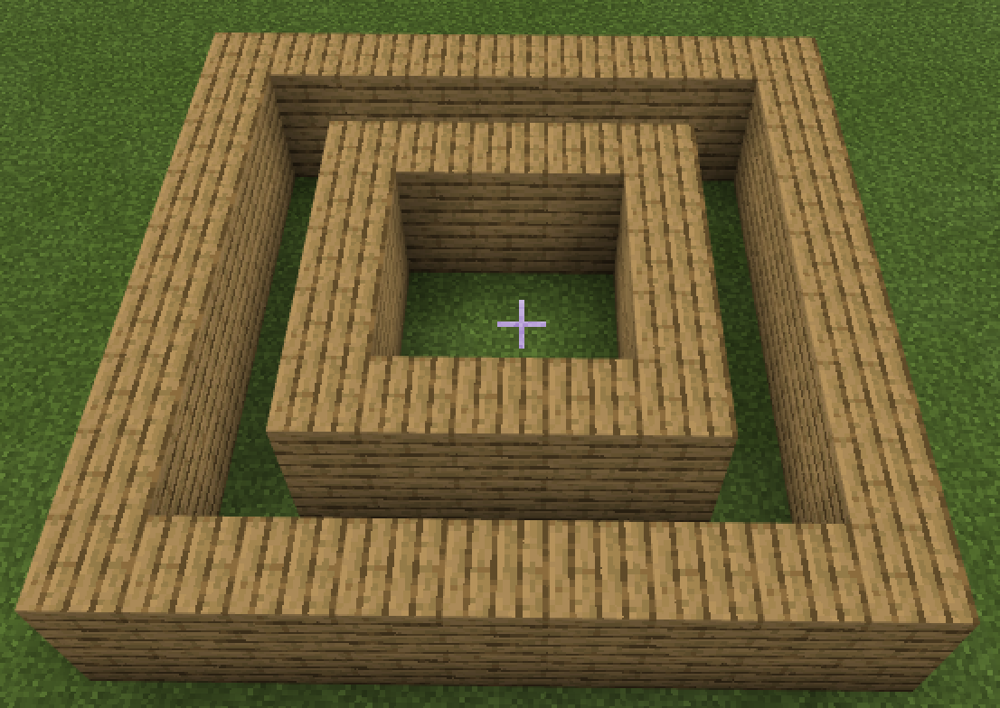  

### Внутрішній блок 3.
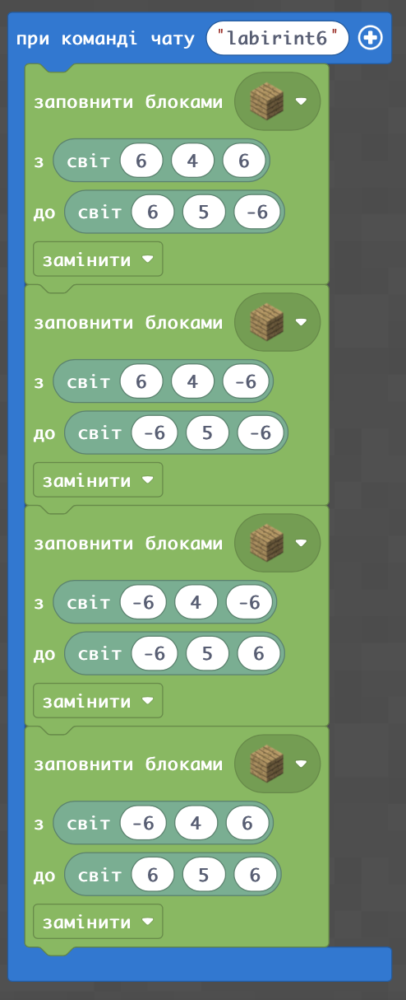  
  

### Внутрішній блок 4.
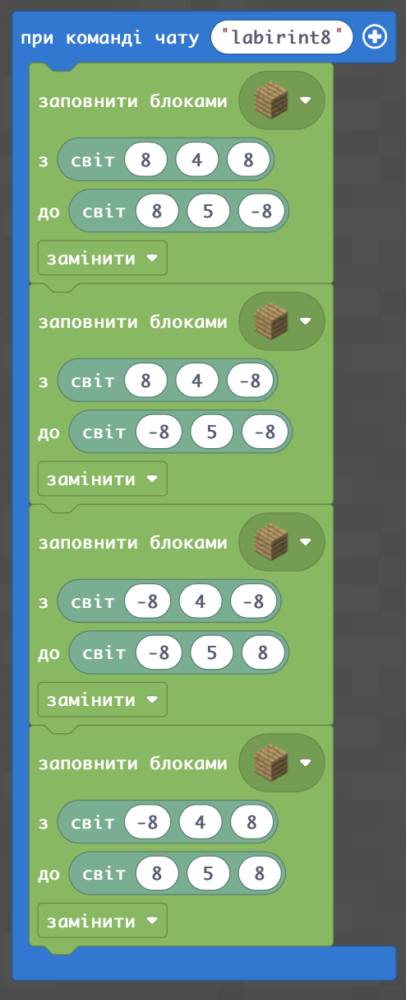  
  

### Творчі завдання
1. Зробіть заготовку для лабіринту із 4-х квадратів різними кольорами елементів:

2. Зробіть заготовку лабіринту із 4-х квадратів навколо точки (20;4;20)
3. Зробіть заготовку лабіринту із 5-и квадратів навколо точки (-20;4;-20)

## Проходи між рівнями в лабірінті
### Прохід у 1-му контурі (внутрішньому)
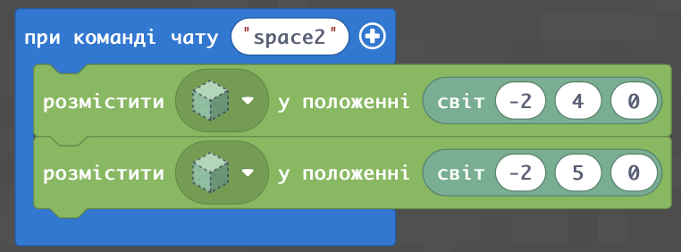  
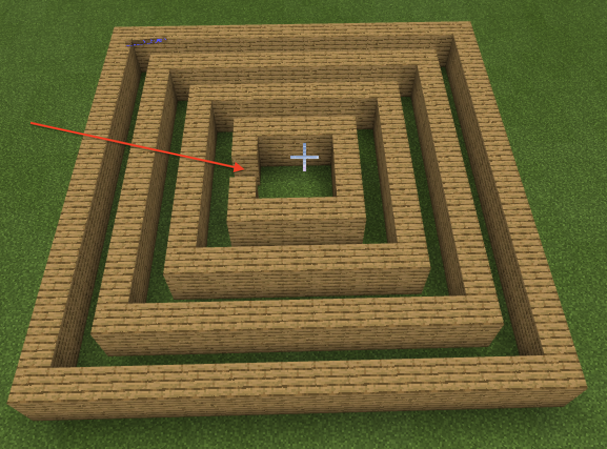

### Прохід у 2-му контурі
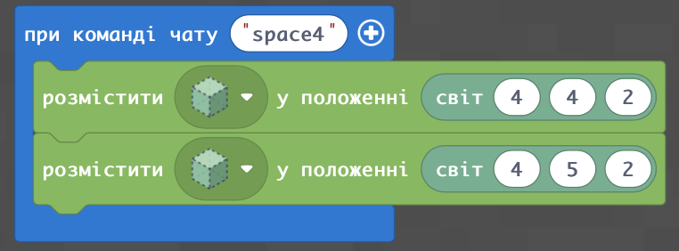  
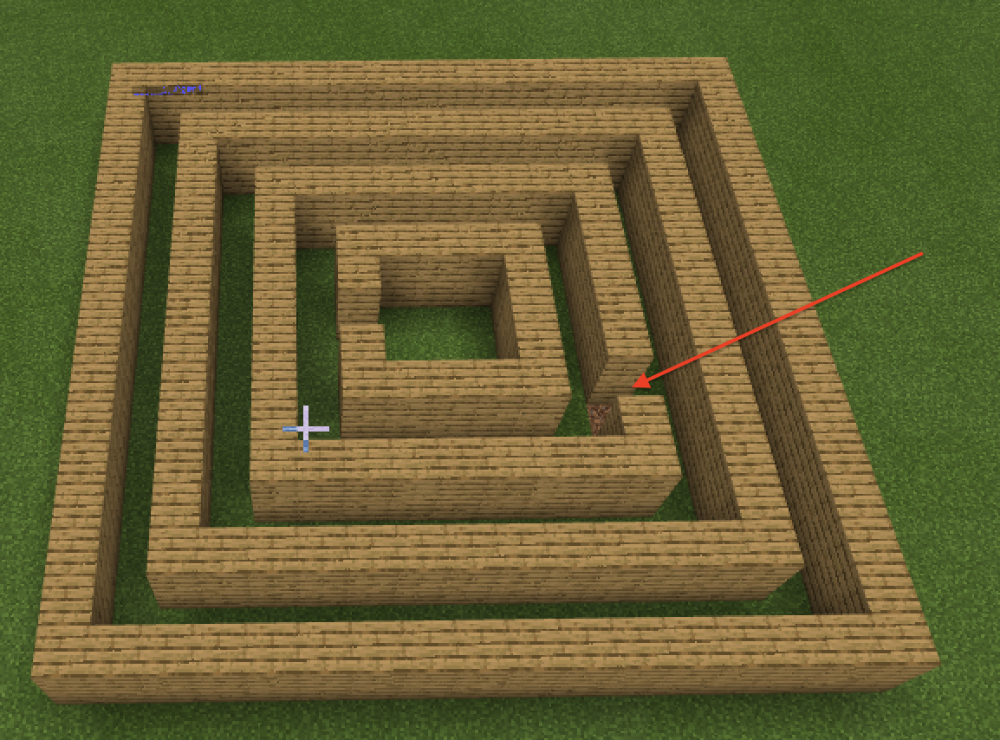

### Прохід у 3-му контурі
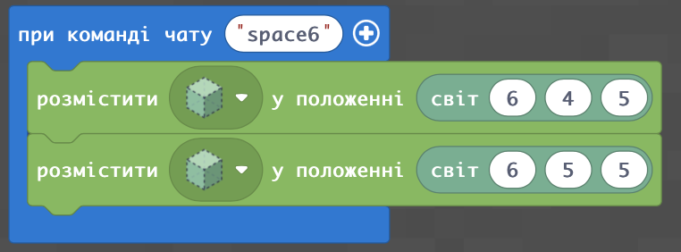  
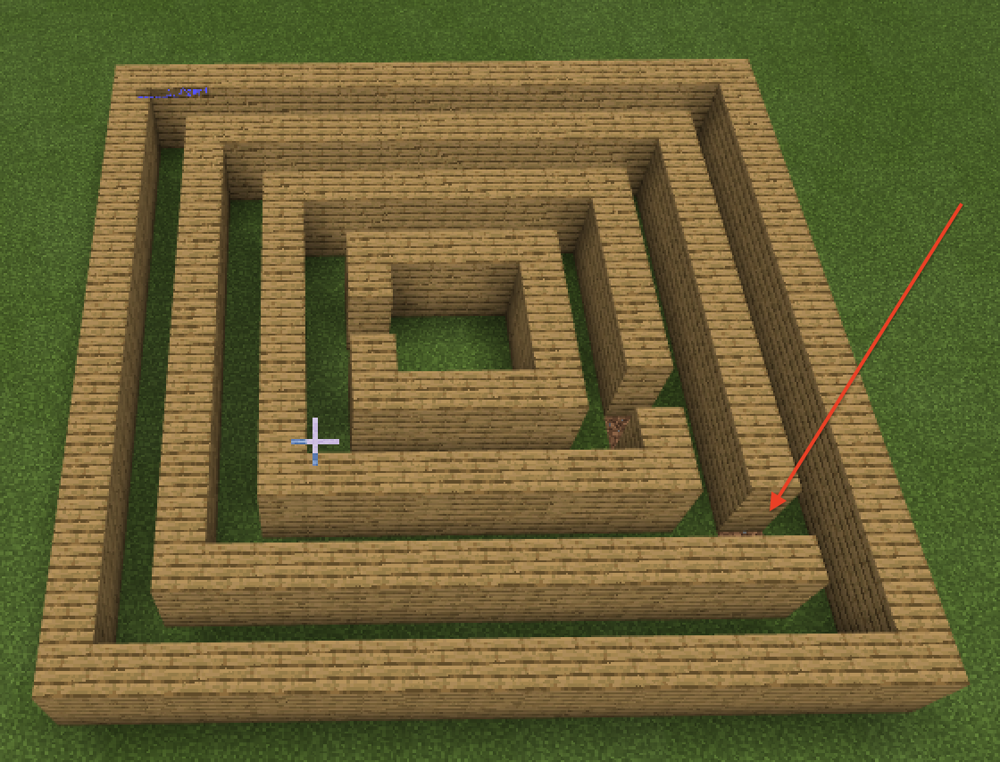

### Прохід у 4-му контурі (зовнішньому)
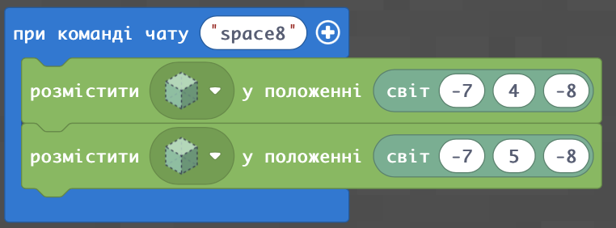  
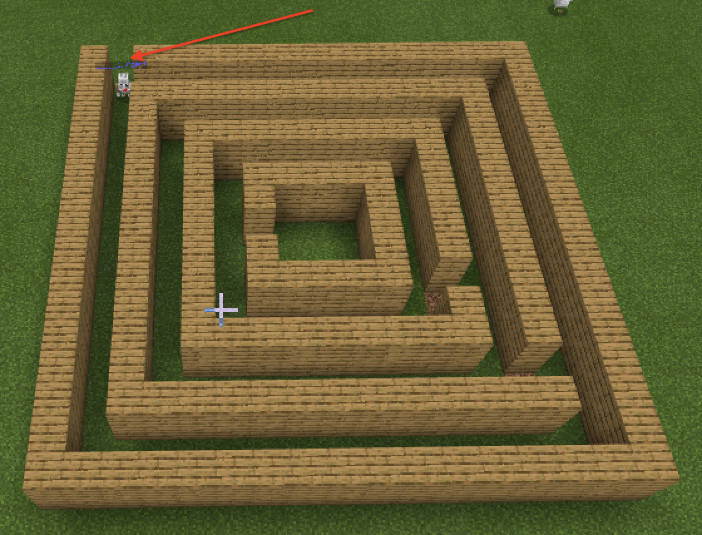

### Творчі завдання
1. Зробіть лабірінт з 4-х контурів навколо точки (20;4;20) та поставьте проходи між контурами за власним вибором
2. Зробіть лабірінт з 5-и контурів навколо точки (-20;4;-20) та поставьте проходи між контурами за власним вибором

## Загородження
Для того, щоб лабіринт був більш складним - закриємо наскрізний прохід по кожному з контурів.

### Загородження у 1-му контурі (внутрішньому)
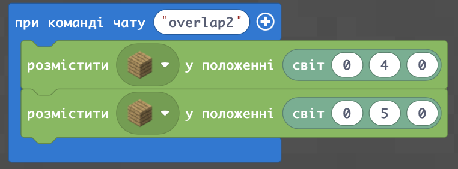  
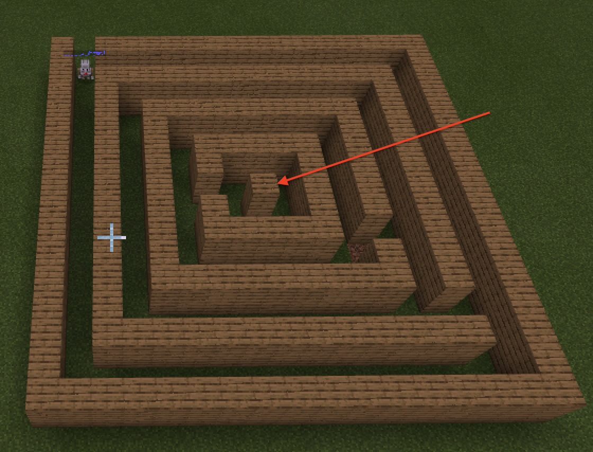

### Загородження у 2-му контурі
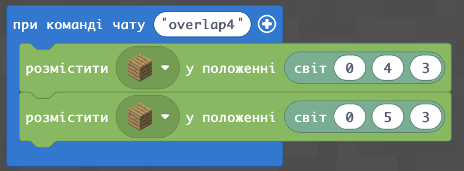  
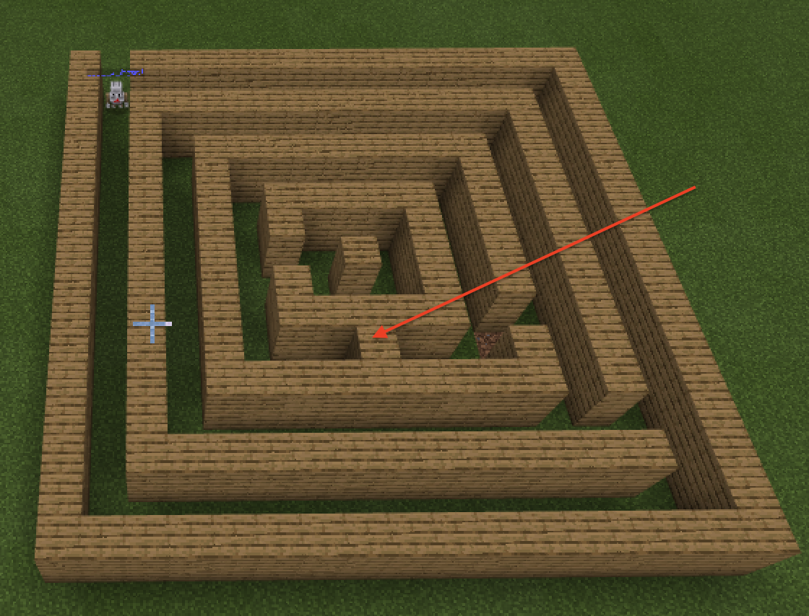

### Загородження у 3-му контурі
  
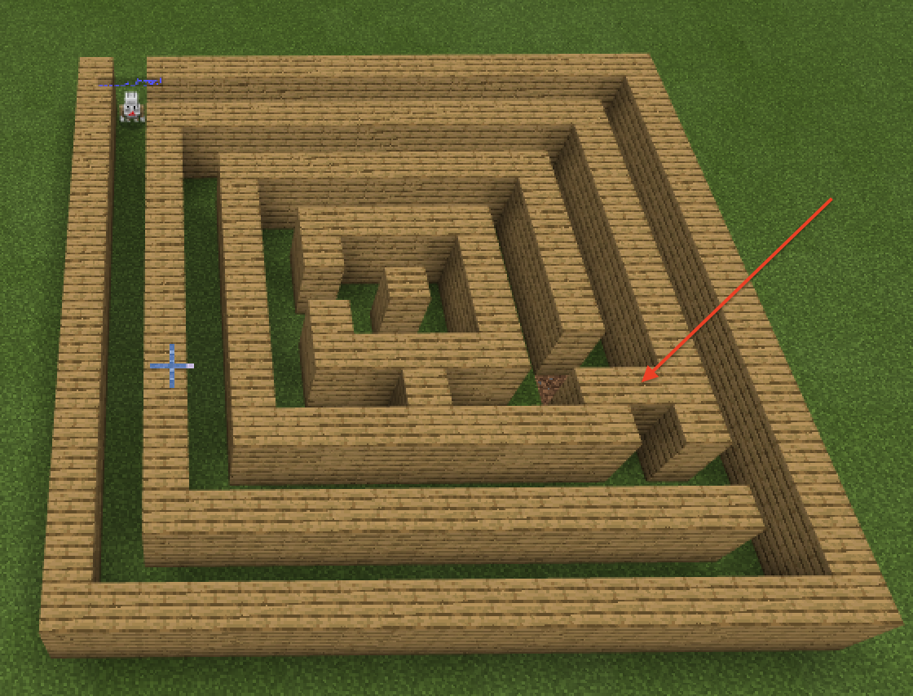

### Загородження у 4-му контурі (зовнішньому)
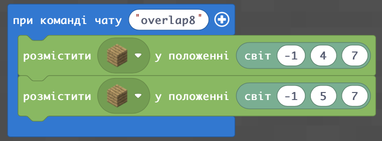  
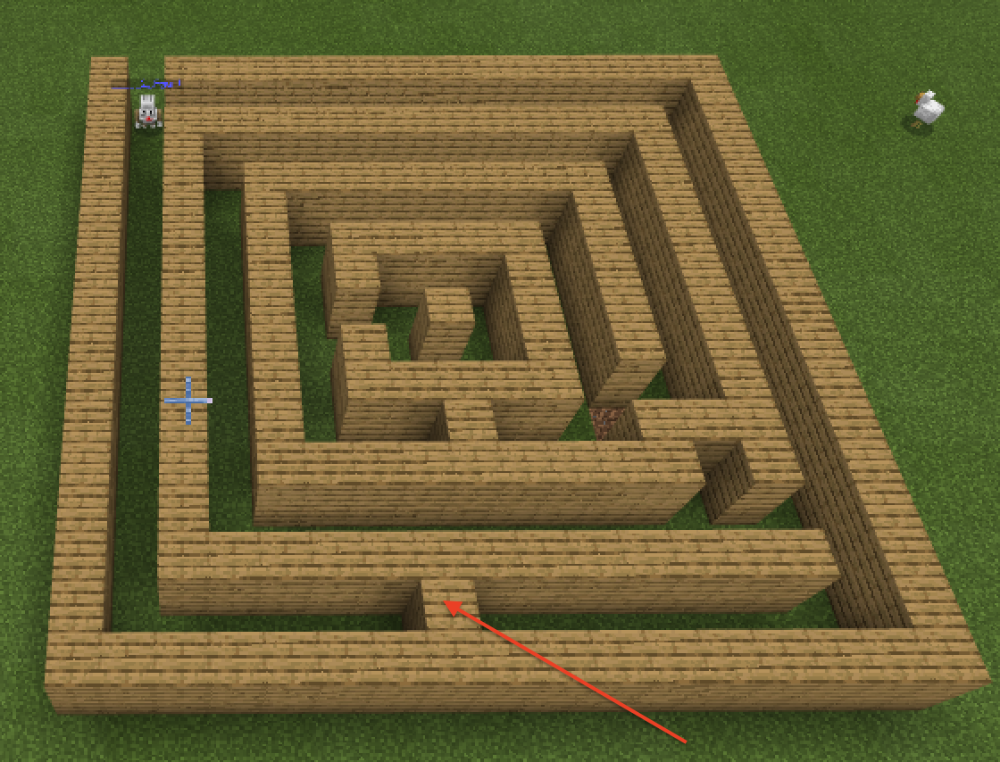

