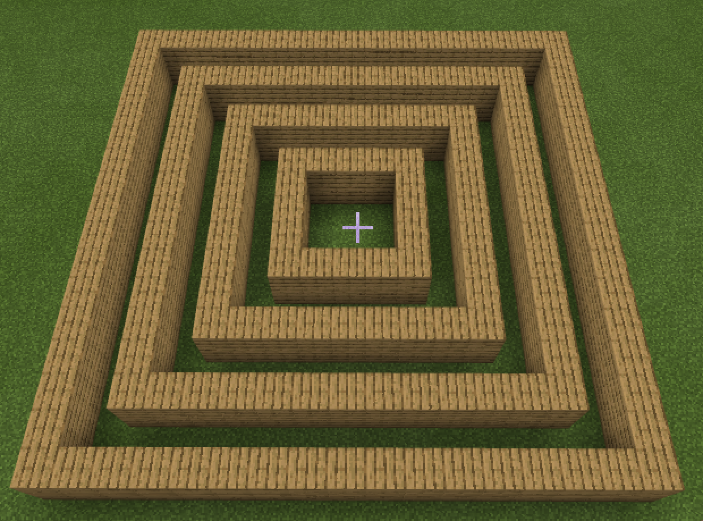

# Лабірінт
Сформуємо схему майбтнього лабіринту. Для цього використаємо файл Google документів (якщо ви не володієте навичками роботи із Google-документами пройдіть курс **IT-Independence**, безкоштовний для студентів GoITeens).  

## Основні коридори
### Внутрішній блок 1.
  
  

### Внутрішній блок 2.
  
  

### Внутрішній блок 3.
  
  

### Внутрішній блок 4.
  
  

### Творчі завдання
1. Зробіть заготовку для лабіринту із 4-х квадратів різними кольорами елементів:

2. Зробіть заготовку лабіринту із 4-х квадратів навколо точки (20;4;20)
3. Зробіть заготовку лабіринту із 5-и квадратів навколо точки (-20;4;-20)
