# Лабірінт
Сформуємо схему майбтнього лабіринту. Для цього використаємо файл Google документів (якщо ви не володієте навичками роботи із Google-документами пройдіть курс **IT-Independence**, безкоштовний для студентів GoITeens).  


## Основні коридори
### Внутрішній блок 1.
```js
player.onChat("labirint2", function () {
    blocks.fill(
    PLANKS_OAK,
    world(2, 4, 2),
    world(2, 5, -2),
    FillOperation.Replace
    )
    blocks.fill(
    PLANKS_OAK,
    world(2, 4, -2),
    world(-2, 5, -2),
    FillOperation.Replace
    )
    blocks.fill(
    PLANKS_OAK,
    world(-2, 4, -2),
    world(-2, 5, 2),
    FillOperation.Replace
    )
    blocks.fill(
    PLANKS_OAK,
    world(-2, 4, 2),
    world(2, 5, 2),
    FillOperation.Replace
    )
})


```
  


### Внутрішній блок 2.
```js
player.onChat("labirint4", function () {
    blocks.fill(
    PLANKS_OAK,
    world(4, 4, 4),
    world(4, 5, -4),
    FillOperation.Replace
    )
    blocks.fill(
    PLANKS_OAK,
    world(4, 4, -4),
    world(-4, 5, -4),
    FillOperation.Replace
    )
    blocks.fill(
    PLANKS_OAK,
    world(-4, 4, -4),
    world(-4, 5, 4),
    FillOperation.Replace
    )
    blocks.fill(
    PLANKS_OAK,
    world(-4, 4, 4),
    world(4, 5, 4),
    FillOperation.Replace
    )
})

```
  

### Внутрішній блок 3.
```js
player.onChat("labirint6", function () {
    blocks.fill(
    PLANKS_OAK,
    world(6, 4, 6),
    world(6, 5, -6),
    FillOperation.Replace
    )
    blocks.fill(
    PLANKS_OAK,
    world(6, 4, -6),
    world(-6, 5, -6),
    FillOperation.Replace
    )
    blocks.fill(
    PLANKS_OAK,
    world(-6, 4, -6),
    world(-6, 5, 6),
    FillOperation.Replace
    )
    blocks.fill(
    PLANKS_OAK,
    world(-6, 4, 6),
    world(6, 5, 6),
    FillOperation.Replace
    )
})

```

  


### Внутрішній блок 4.
```js
player.onChat("labirint8", function () {
    blocks.fill(
    PLANKS_OAK,
    world(8, 4, 8),
    world(8, 5, -8),
    FillOperation.Replace
    )
    blocks.fill(
    PLANKS_OAK,
    world(8, 4, -8),
    world(-8, 5, -8),
    FillOperation.Replace
    )
    blocks.fill(
    PLANKS_OAK,
    world(-8, 4, -8),
    world(-8, 5, 8),
    FillOperation.Replace
    )
    blocks.fill(
    PLANKS_OAK,
    world(-8, 4, 8),
    world(8, 5, 8),
    FillOperation.Replace
    )
})
```
  


### Творчі завдання
1. Зробіть заготовку для лабіринту із 4-х квадратів різними кольорами елементів:  


2. Зробіть заготовку лабіринту із 4-х квадратів навколо точки (20;4;20)
3. Зробіть заготовку лабіринту із 5-и квадратів навколо точки (-20;4;-20)

## Проходи і загородження. План
Намалюємо в створених контурах проходи між контурами (щоб можна було переходити з першого контура на другий, з другого на третій). А також поставим загородженні в кожному рівні.  
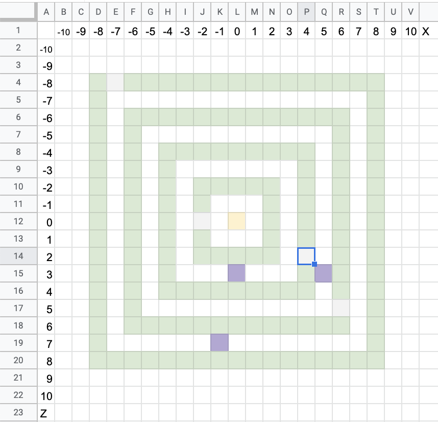

Реалізуємо дану карту за допомогою коду: створемо проходи між рівнями та загородження.

## Проходи між рівнями в лабірінті
### Прохід у 1-му контурі (внутрішньому)
```js
player.onChat("space2", function () {
    blocks.place(AIR, world(-2, 4, -1))
    blocks.place(AIR, world(-2, 5, -1))
})
```


### Прохід у 2-му контурі
```js
player.onChat("space4", function () {
    blocks.place(AIR, world(4, 4, 2))
    blocks.place(AIR, world(4, 5, 2))
})

```


### Прохід у 3-му контурі
```js
player.onChat("space6", function () {
    blocks.place(AIR, world(6, 4, 5))
    blocks.place(AIR, world(6, 5, 5))
})

```

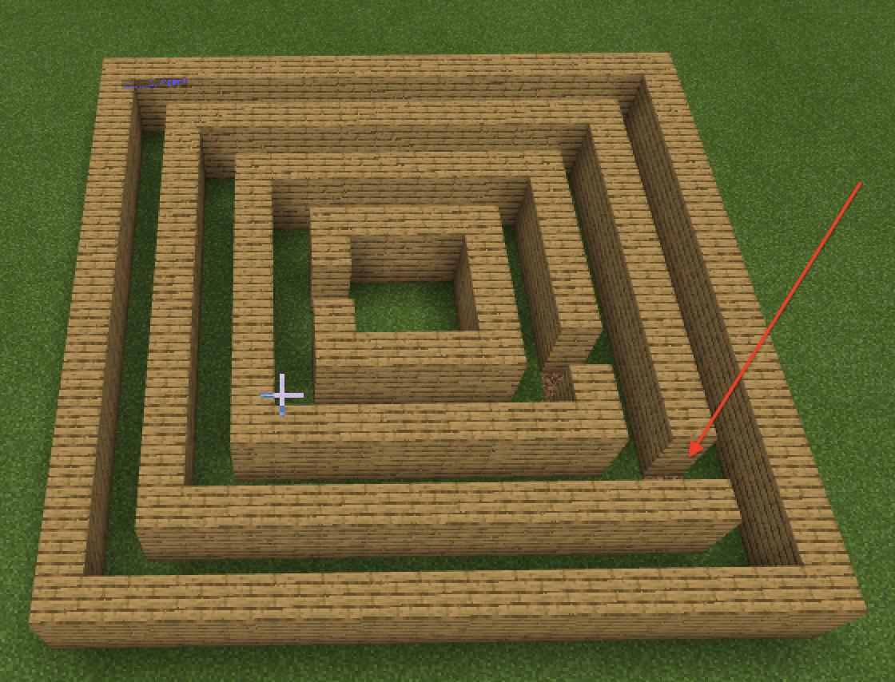

### Прохід у 4-му контурі (зовнішньому)
```js
player.onChat("space8", function () {
    blocks.place(AIR, world(-7, 4, -8))
    blocks.place(AIR, world(-7, 5, -8))
})

```


### Творчі завдання
1. Зробіть лабірінт з 4-х контурів навколо точки (20;4;20) та поставьте проходи між контурами за власним вибором
2. Зробіть лабірінт з 5-и контурів навколо точки (-20;4;-20) та поставьте проходи між контурами за власним вибором


## Загородження
Для того, щоб лабіринт був більш складним - закриємо наскрізний прохід по кожному з контурів.

### Загородження у 1-му контурі (внутрішньому)
```js
player.onChat("overlap2", function () {
    blocks.place(PLANKS_OAK, world(0, 4, 3))
    blocks.place(PLANKS_OAK, world(0, 5, 3))
})
```


### Загородження у 2-му контурі
```js
player.onChat("overlap4", function () {
    blocks.place(PLANKS_OAK, world(0, 4, 3))
    blocks.place(PLANKS_OAK, world(0, 5, 3))
})
```


### Загородження у 3-му контурі
```js
player.onChat("overlap6", function () {
    blocks.place(PLANKS_OAK, world(5, 4, 3))
    blocks.place(PLANKS_OAK, world(5, 5, 3))
})
```


### Загородження у 4-му контурі (зовнішньому)
```js
player.onChat("overlap8", function () {
    blocks.place(PLANKS_OAK, world(-1, 4, 7))
    blocks.place(PLANKS_OAK, world(-1, 5, 7))
})
```

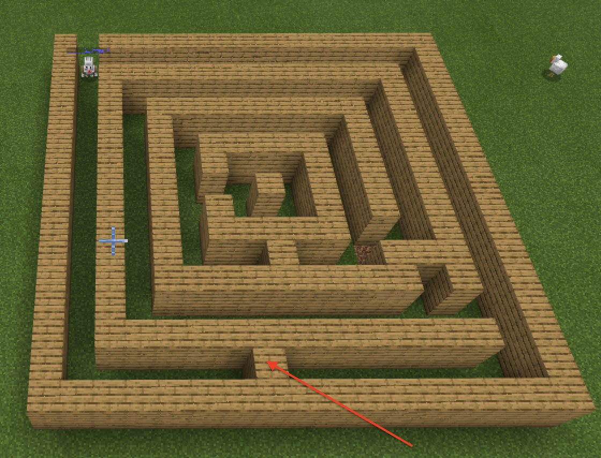


## Використання циклів
Попереднє завдання займає багато блоків. І якщо його переписати (на мові програмістів це називається *рефакторінг*) із використанням циклів, то можно значно скоротити кількість блоків.
```js
player.onChat("labirint_c2", function () {
    mat = PLANKS_OAK
    for (let індекс2 = 0; індекс2 <= 3; індекс2++) {
        n = 2 * (індекс2 + 1)
        blocks.fill(
        mat,
        world(n, 4, n),
        world(n, 5, 0 - n),
        FillOperation.Replace
        )
        blocks.fill(
        mat,
        world(n, 4, 0 - n),
        world(0 - n, 5, 0 - n),
        FillOperation.Replace
        )
        blocks.fill(
        mat,
        world(0 - n, 4, 0 - n),
        world(0 - n, 5, n),
        FillOperation.Replace
        )
        blocks.fill(
        mat,
        world(0 - n, 4, n),
        world(n, 5, n),
        FillOperation.Replace
        )
    }
})


```
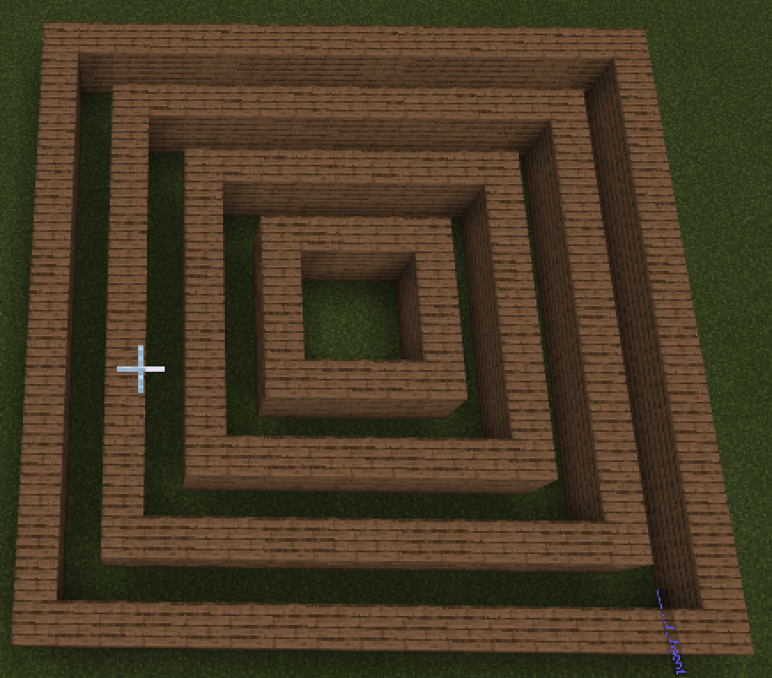  


### Додаткове завдання
* Запрограмуйте створення вкладених квадратів так, щоб в них чередувалися кольори:

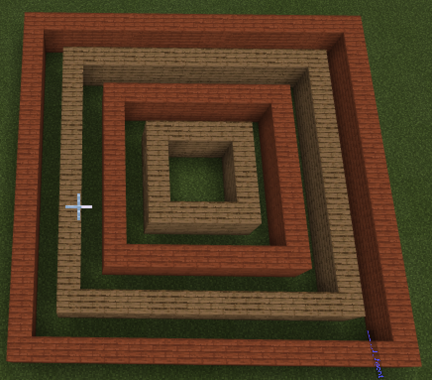 


### Творче завдання
Для стврення проекту власного лабіринту використайте заготовку за посиланням:  
[Заготовка лабіринту](https://docs.google.com/spreadsheets/d/1YTkfpzDfgZiIFWdcG07Nmok5ZMHS7TFatgf3W-VLPBY/edit#gid=1625087866)

Для цього скопіюйте документ собі (ви маєте бути авторизовані під обліковим записом Google, якщо ви підключені до Google.Meet зазвичай так і є):  
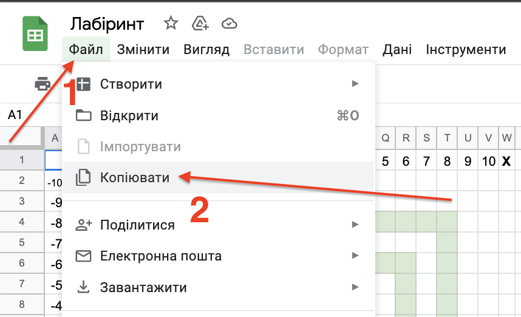
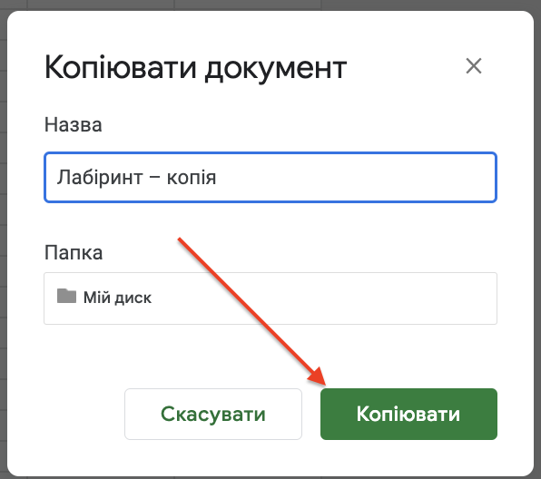

### Проходи
Проходи між рівнями позначте білим фоном ячійок  
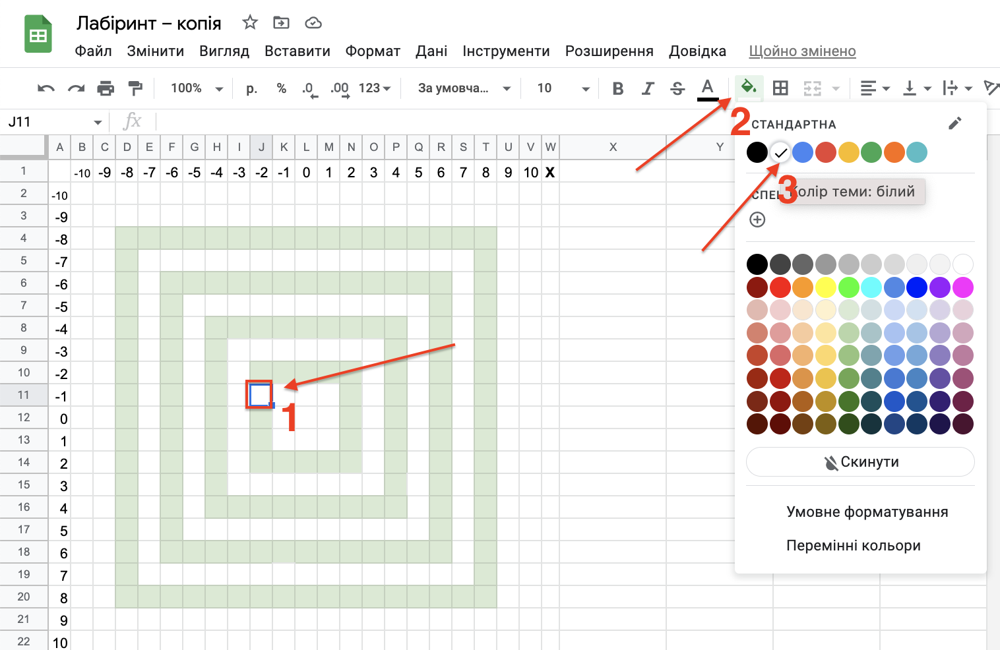  
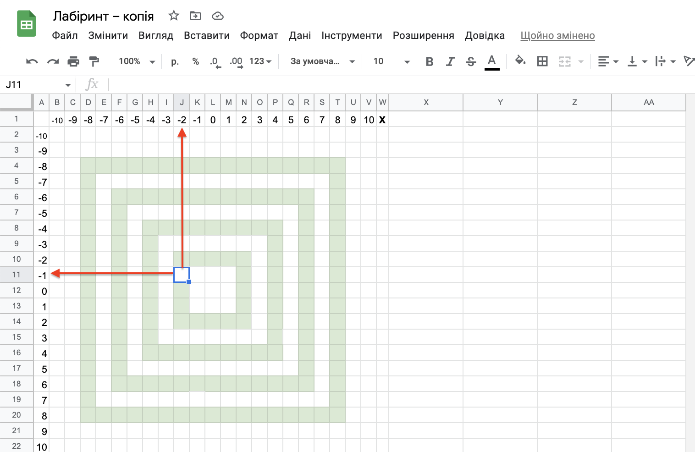  
Додайте відповідний блок команд для створення проходу в Майнкрафті:  
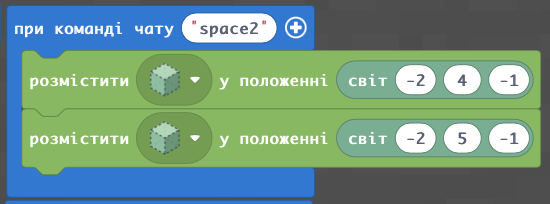
Загороження на рівнях позначте фіолетовим фоном ячійок
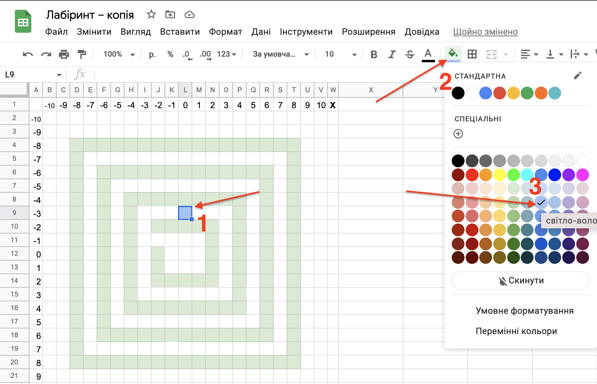
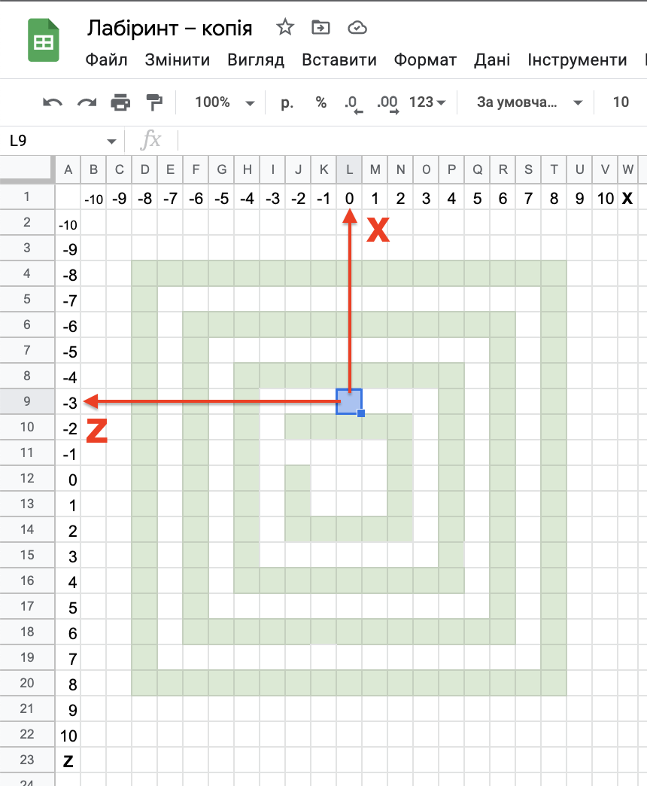
Додайте відповідний блок команд для створення проходу в Майнкрафті:  
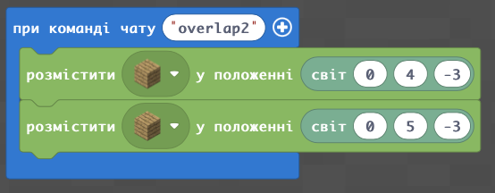


1. Сформуйте план лабіринту та ствооріть Лабірінт з 4-х контурів.
2. Сформуйте план лабіринту та ствооріть Лабірінт з 2-х контурів.
3. Сформуйте план лабіринту та ствооріть Лабірінт з 5-и контурів.

## Прохід лабіринту агентом
  
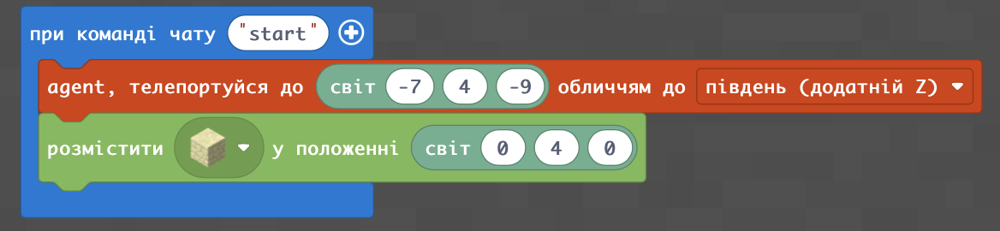