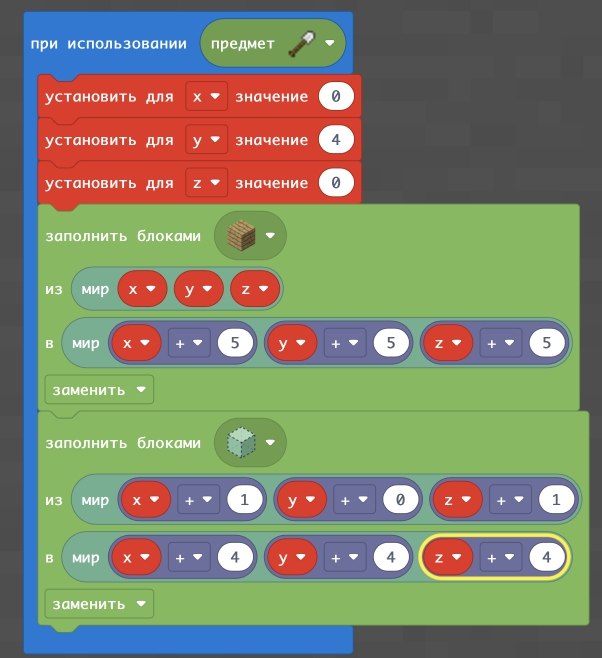
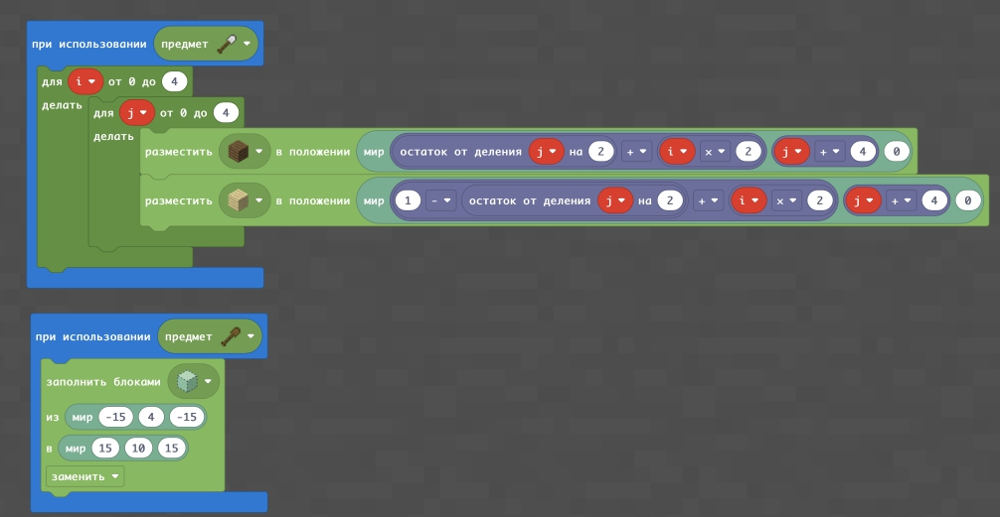
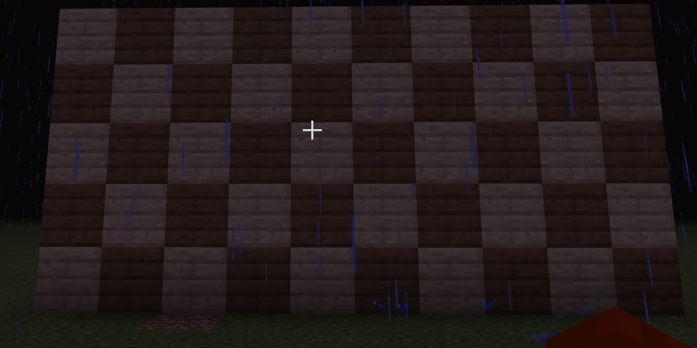

# Создаем здания заданных размеров
Для того, чтобы создавать здания заданных размеров - добавим к ним переменные

## Задания
1. Постройте здание из дерева 5х5х5
2. Постройте здание из бетона 15х5х5
3. Постройте "25-этажку" из алмазов у которой фундамент 10х10 (1 этаж = 1 блок)
4. Создайте котеджный поселок из 5 домов не выше 5 этажей

## Создаем узор
  
  
  

https://makecode.com/_P0aXmPY7v1Mv
