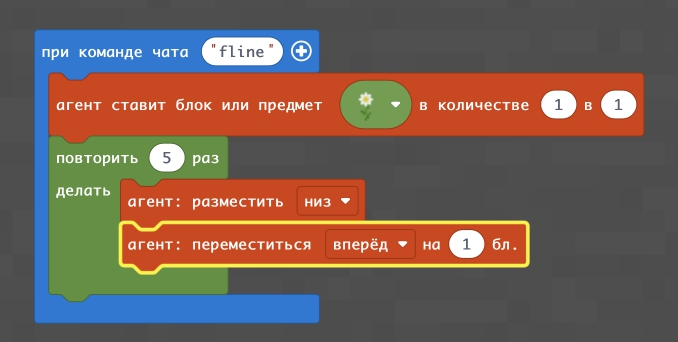
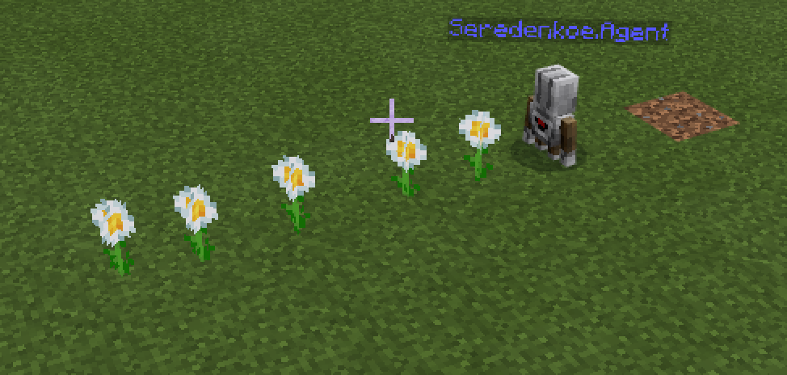
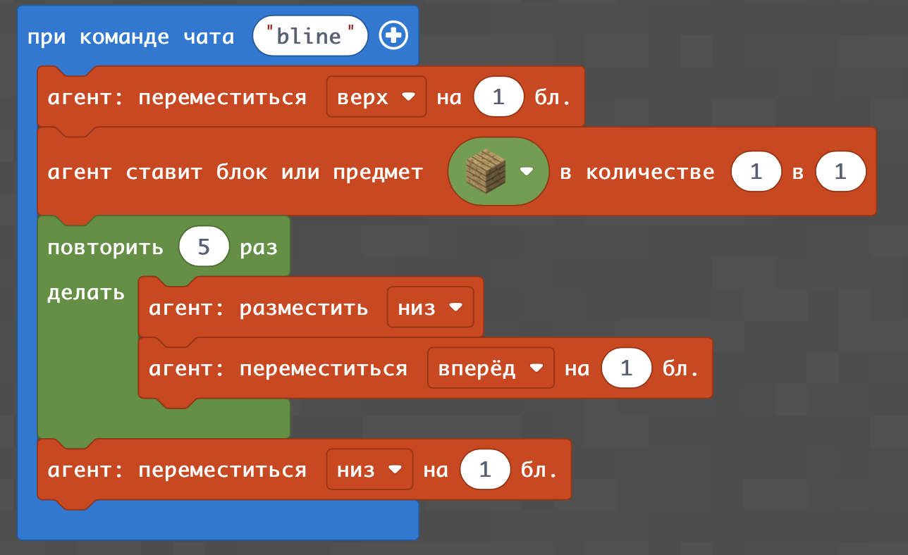
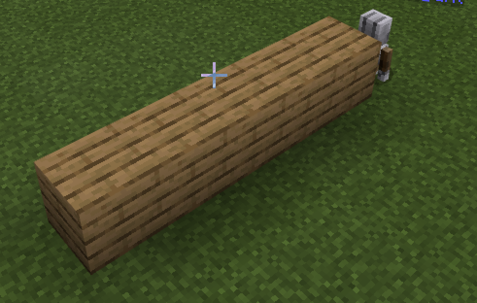
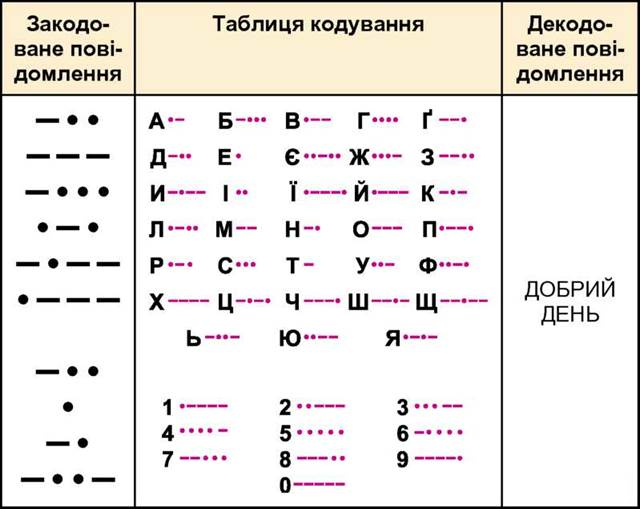

# Линии
|#|Название|Альтернативные задания|Код|Результат|
|---|---|---|---|---|
|1|Линия цветов| 1. 6 маков   2. 10 бамбуков   3. 4 саженцев дуба   4. 7 голубых васильков  5. 3 папоротника|||
|2|Линия блоков| 1. 6 блоков стекла   2. 10 блоков взрывчатки   3. 4 блоков тыквы   4. 7 блоков белого бетона  5. 3 кирпичных блока|||
## Специальное задание
С помощью азбуки морзе - написать свое имя.  
 
  
  
