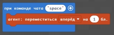
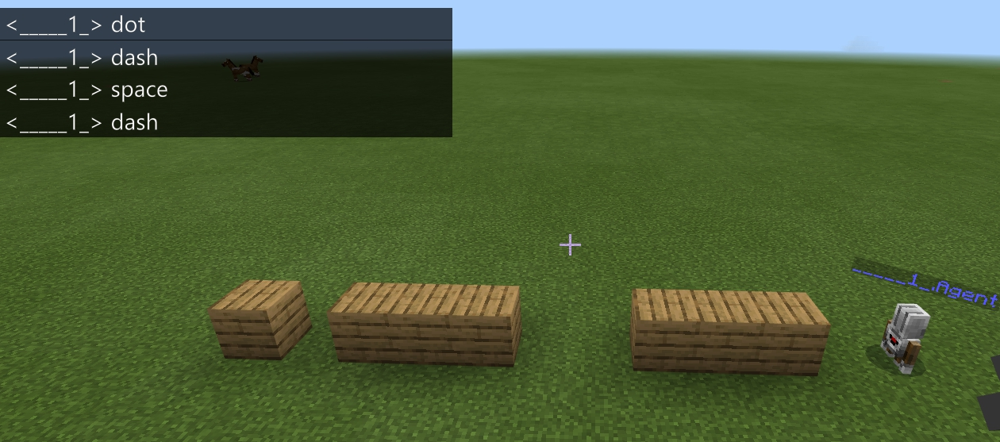
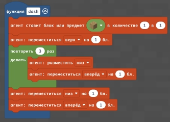
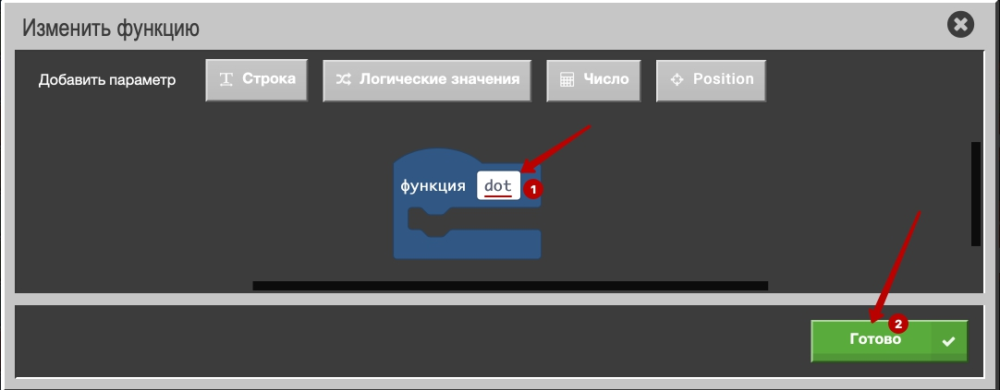
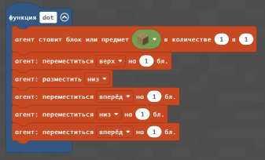
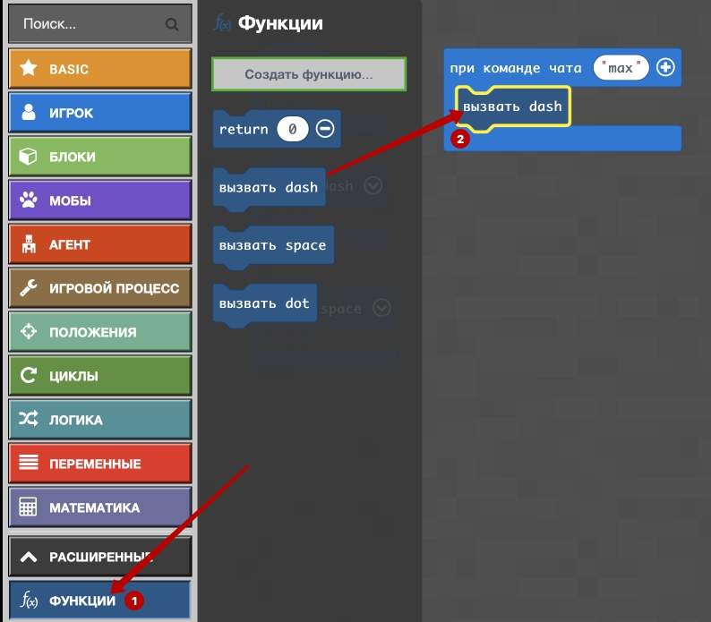
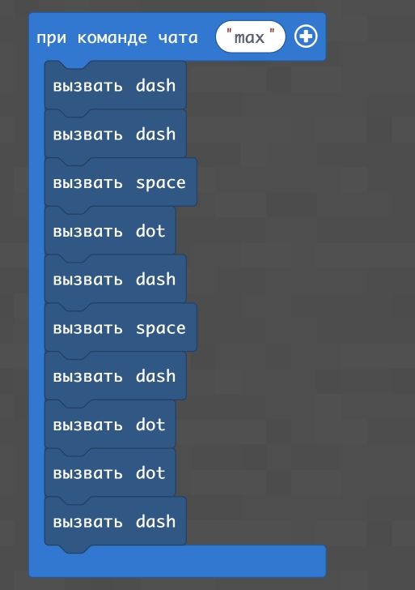
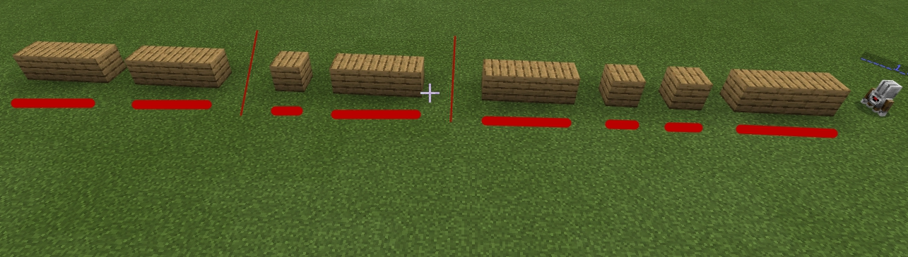

# Линии
|#|Название|Альтернативные задания|Код|Результат|
|---|---|---|---|---|
|1|Линия цветов| 1. 6 маков   2. 10 бамбуков   3. 4 саженцев дуба   4. 7 голубых васильков  5. 3 папоротника|||
|2|Линия блоков| 1. 6 блоков стекла   2. 10 блоков взрывчатки   3. 4 блоков тыквы   4. 7 блоков белого бетона  5. 3 кирпичных блока|||
## Специальное задание
С помощью азбуки морзе - написать свое имя.  
 
  
  

## Азбука Морзе
### Команды чата 
Точка  
  
Тире  
  
Пробел    
  
Написание букв командами в чате  
  

### Функции
Тире:  
Создаем функцию  
     
Даем название     
    
Задаем код  
   
   
Точка:   
Создаем функцию  
   
Даем название   
   
Задаем код   
   
Пробел:  
Создаем функцию  
   

Даем название   
   
Задаем код    
   

### Задание и выполнение команды
Создаем команду чата и переносим в нее блоки вызова функций   
   
Задаем требуемую последовательность вызова команд  
    
Вызываем созданную программу (команда чата max)    
    
