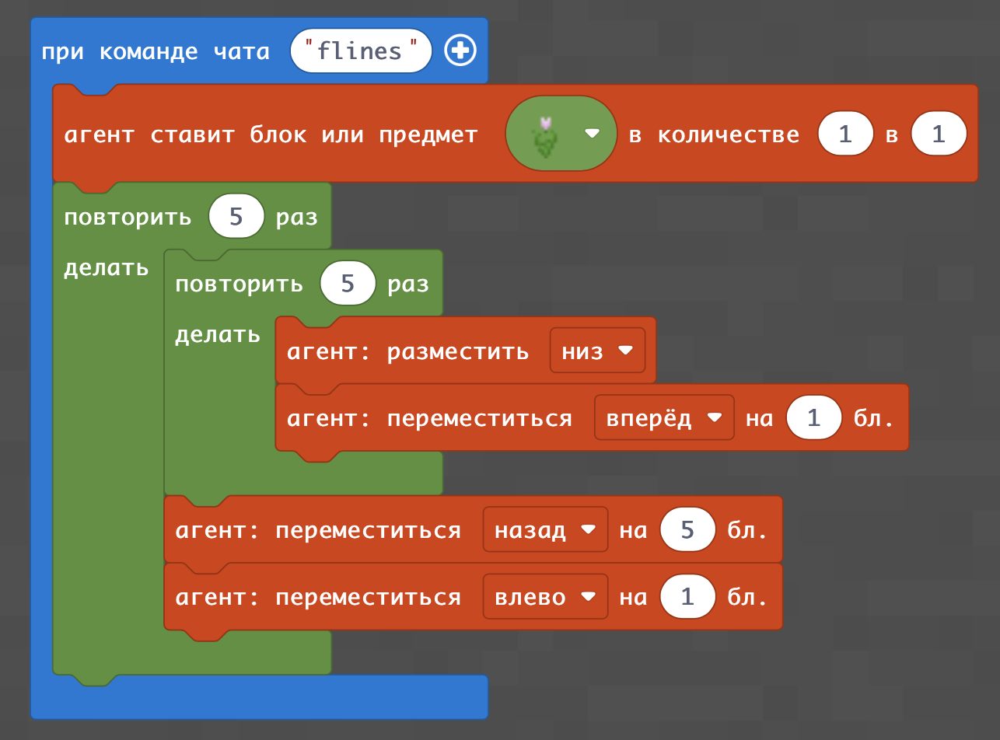
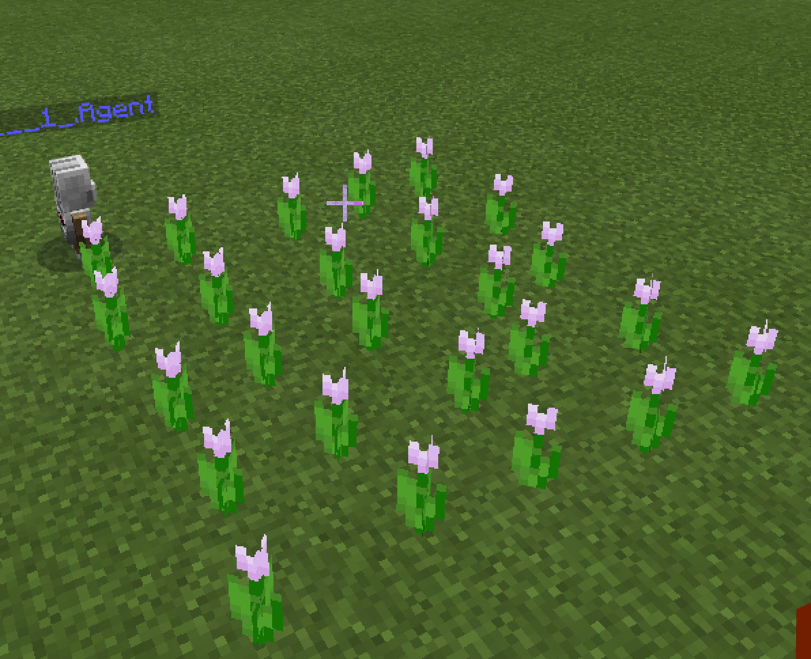
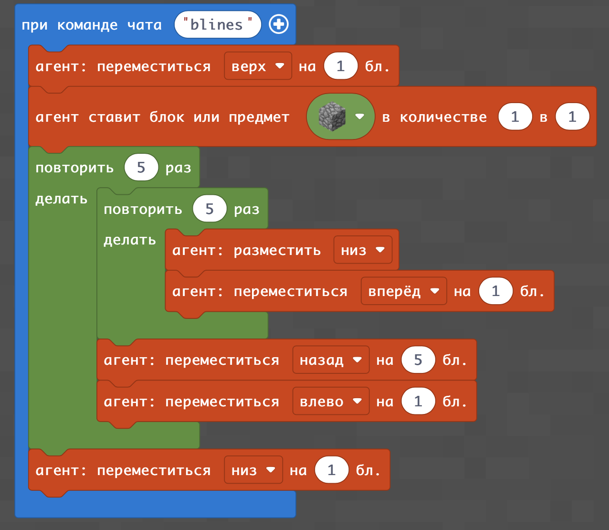
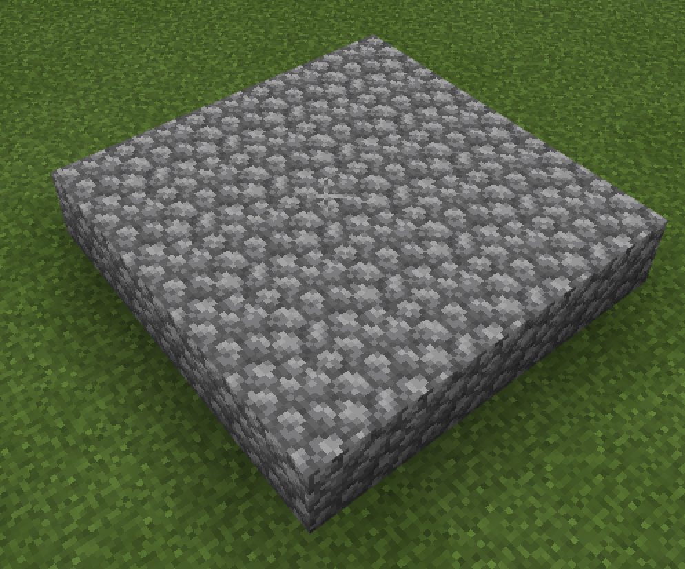
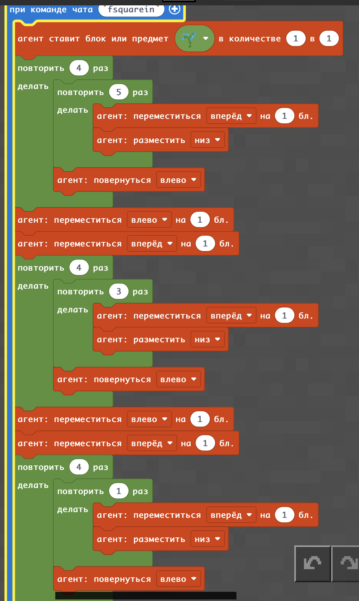
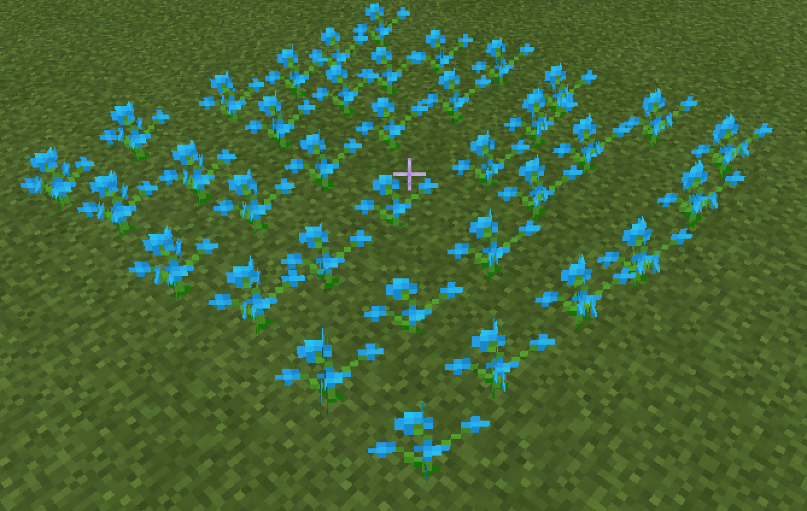
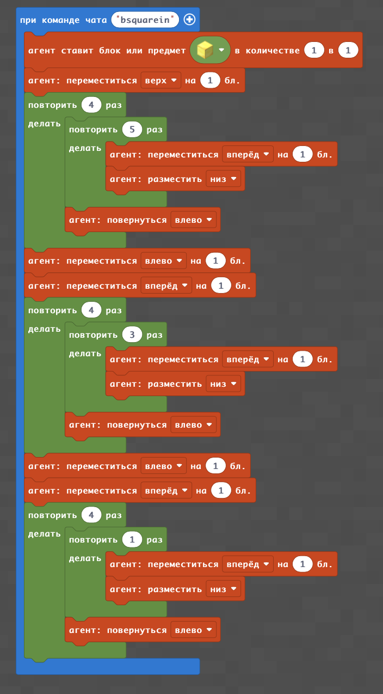
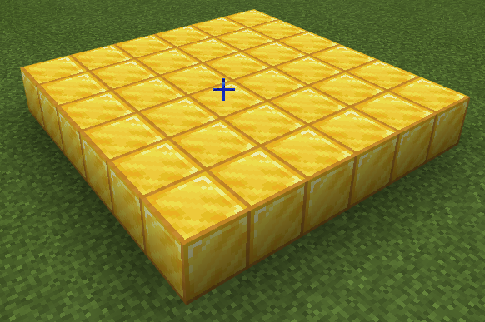
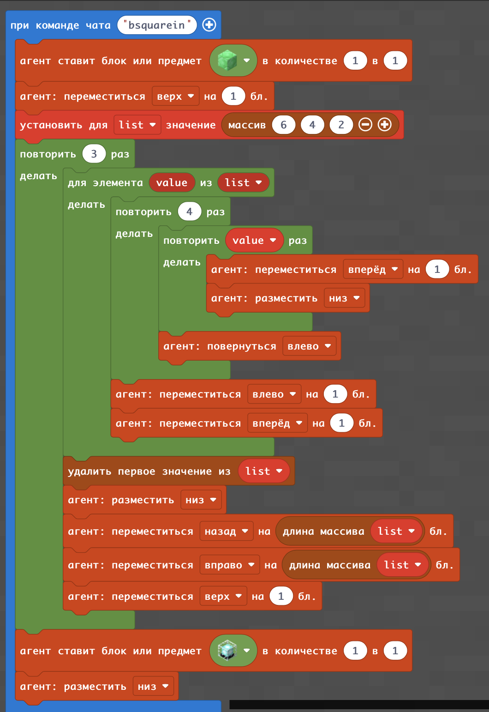
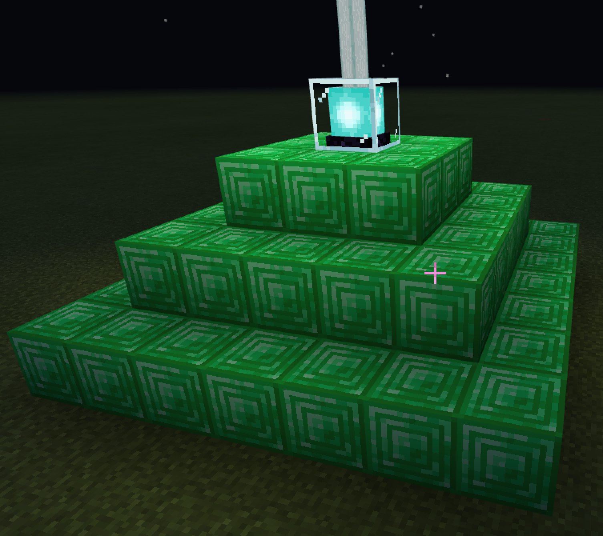

# Вложенные квадраты и пирамида
#|Название|Альтернативные задания|Код|Результат|
|---|---|---|---|---|
|1|5 линий цветов по 5||||
|2|5 линий блоков по 5||||
|3|Вложенные квадраты цветов||||
|4|Вложенные квадраты блоков||||
|5|Пирамида||||

