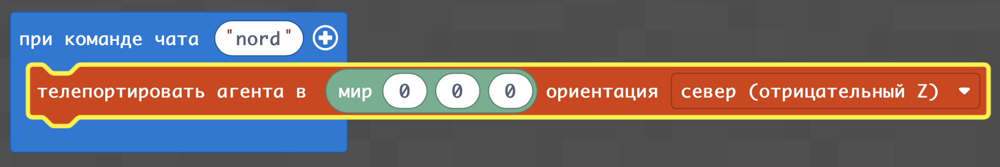
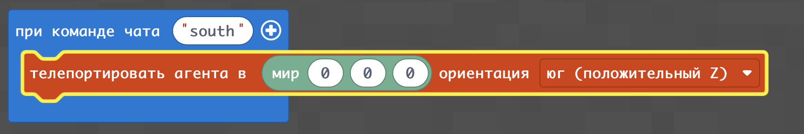
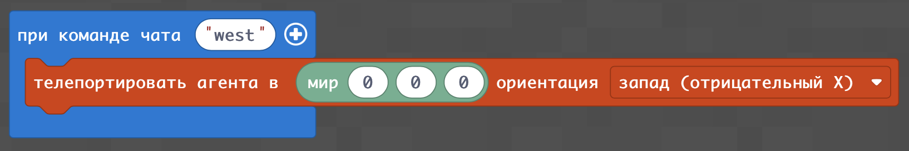
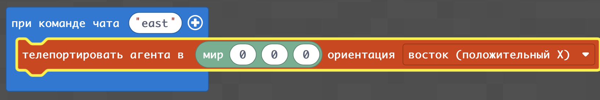

## Координаты и направления
В `Minecraft` есть направления на карте. Они связаны с координатами. Если игрок смотрит на север и идет вперед, то его координата z (третья по счету) уменьшается, если идет на юг - координата z ивеличивается, если игрок идет на запад координата x (первая по счету) уменьшается, а если идет на восток координата x увеличивается.  
Кроме перемещений координаты хорошо демонстрируются телепортацией агента с заданием направления: 
На север:  

На юг:  

На запад:  

На восток:   

