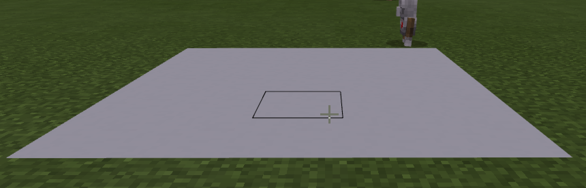
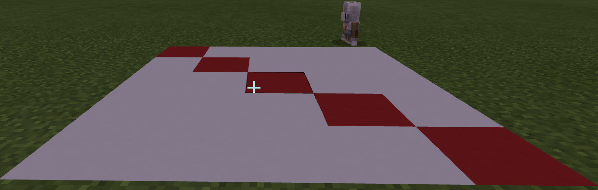
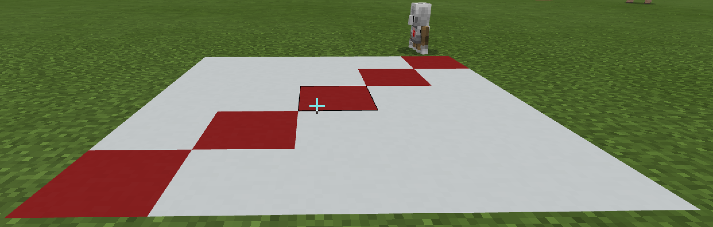
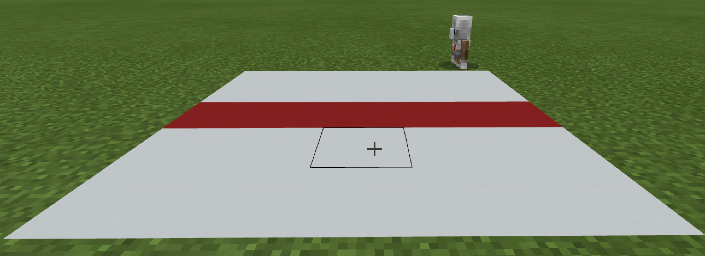
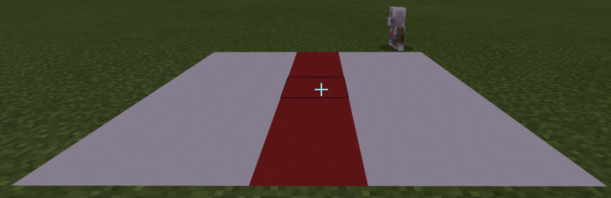
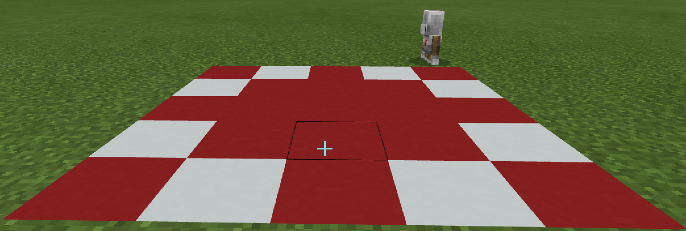

# Matrix
В даному занятті - ми будемо програмувати логічні узори. Для цього - ми навчимося програмувати елементи в квадраті.
Для початку - створимо квадрат 5х5 (цикл - від 0 до 4) з блоків білого бетону (WHITE_CONCRETE), при чому на старті агент має стояти в точці в абсолютних координатах (world) - (0,4,0) із орієнтацією на захід (WEST).



```js
player.onChat("q", function () {
    agent.setItem(WHITE_CONCRETE, 1, 1)
    agent.teleport(world(0, 4, 0), WEST)
    for (let i = 0; i <= 4; i++) {
        for (let j = 0; j <= 4; j++) {
            agent.destroy(DOWN)
            agent.collectAll()
            agent.place(DOWN)
            agent.move(FORWARD, 1)
        }
        agent.move(RIGHT, 1)
        agent.move(BACK, 5)
    }
})
```


|№|Завдання|Код|Результат|
|---|---|---|---|
|1|1. Створіть квадрат 5х5 (цикл - від 0 до 4) з блоків білого бетону (WHITE_CONCRETE), при чому на старті агент має стояти в точці в абсолютних координатах (world) - (0,4,0) із орієнтацією на захід (WEST).<br>2. Створіть квадрат 5х5 (цикл - від 0 до 4) з блоків червоного бетону (RED_CONCRETE), при чому на старті агент має стояти в точці в абсолютних координатах (world) - (0,4,0) із орієнтацією на схід (EAST).<br>3. Створіть квадрат 10х10 (цикл - від 0 до 9) з блоків білого бетону (WHITE_CONCRETE), при чому на старті агент має стояти в точці в абсолютних координатах (world) - (0,4,0) із орієнтацією на захід (WEST).<br>4. Створіть прямокутник 5х10 (цикл - від 0 до 4 та від 0 до 9) з блоків білого бетону (WHITE_CONCRETE), при чому на старті агент має стояти в точці в абсолютних координатах (world) - (10,4,0) із орієнтацією на захід (WEST).<br> 5. Створіть прямокутник 6х8 (цикл - від 0 до 5 та від 0 до 7) з блоків білого бетону (WHITE_CONCRETE), при чому на старті агент має стояти в точці в абсолютних координатах (world) - (10,4,10) із орієнтацією на захід (WEST).|приведено вище||
##  Головна діагональ
Що таке головна діагональ? Головна діагональ - це елементи в яких значення номерів стовпчиків та рядків дорівнює один одному.


```js
player.onChat("d", function () {
    agent.setItem(WHITE_CONCRETE, 1, 1)
    agent.setItem(RED_CONCRETE, 1, 2)
    agent.teleport(world(0, 4, 0), WEST)
    for (let i = 0; i <= 4; i++) {
        for (let j = 0; j <= 4; j++) {
            if (i == j) {
                agent.setSlot(2)
            } else {
                agent.setSlot(1)
            }
            agent.destroy(DOWN)
            agent.collectAll()
            agent.place(DOWN)
            agent.move(FORWARD, 1)
        }
        agent.move(RIGHT, 1)
        agent.move(BACK, 5)
    }
})
```
## Зворотня діагональ
Зворотня діагональ - це така діагональ, яка йде зворотньо від головної діагоналі. Координати обраховуються за формулою - норм рядків дорівнює різниці числа 4 та номеру стовпців.



```js
player.onChat("b", function () {
    agent.setItem(WHITE_CONCRETE, 1, 1)
    agent.setItem(RED_CONCRETE, 1, 2)
    agent.teleport(world(0, 4, 0), WEST)
    for (let k = 0; k <= 4; k++) {
        for (let l = 0; l <= 4; l++) {
            if (k == 4 - l) {
                agent.setSlot(2)
            } else {
                agent.setSlot(1)
            }
            agent.destroy(DOWN)
            agent.collectAll()
            agent.place(DOWN)
            agent.move(FORWARD, 1)
        }
        agent.move(RIGHT, 1)
        agent.move(BACK, 5)
    }
})

```

## Стовпці
За формулою можна також визначати стовпці. Для цього необхідно зафіксувати номер відповідного стовпця.


```js
player.onChat("col", function () {
    agent.setItem(WHITE_CONCRETE, 1, 1)
    agent.setItem(RED_CONCRETE, 1, 2)
    agent.teleport(world(0, 4, 0), WEST)
    for (let k = 0; k <= 4; k++) {
        for (let l = 0; l <= 4; l++) {
            if (l == 2) {
                agent.setSlot(2)
            } else {
                agent.setSlot(1)
            }
            agent.destroy(DOWN)
            agent.collectAll()
            agent.place(DOWN)
            agent.move(FORWARD, 1)
        }
        agent.move(RIGHT, 1)
        agent.move(BACK, 5)
    }
})
```
## Рядки
Аналогічно до стовпчиків можна визначити рядки. 


```js
player.onChat("row", function () {
    agent.setItem(WHITE_CONCRETE, 1, 1)
    agent.setItem(RED_CONCRETE, 1, 2)
    agent.teleport(world(0, 4, 0), WEST)
    for (let k = 0; k <= 4; k++) {
        for (let l = 0; l <= 4; l++) {
            if (k == 2) {
                agent.setSlot(2)
            } else {
                agent.setSlot(1)
            }
            agent.destroy(DOWN)
            agent.collectAll()
            agent.place(DOWN)
            agent.move(FORWARD, 1)
        }
        agent.move(RIGHT, 1)
        agent.move(BACK, 5)
    }
})

```
## Об'єднання
Можна перебудувати код так, щоб він відтворював всі умови, що описани вище.




```js
let n = 0
let active = 0
player.onChat("els", function () {
    start()
    n = 9
    for (let col = 0; col <= n; col++) {
        for (let row = 0; row <= n; row++) {
            active = 1
            if (col == n - row) {
                active = 2
            }
            if (col == row) {
                active = 2
            }
            if (col == 4) {
                active = 2
            }
            if (row == 4) {
                active = 2
            }
            _type(active)
            step()
        }
        agent.move(RIGHT, 1)
        agent.move(BACK, 1 + n)
    }
})
function _type (n: number) {
    agent.setSlot(n)
}
function step () {
    agent.destroy(DOWN)
    agent.collectAll()
    agent.place(DOWN)
    agent.move(FORWARD, 1)
}
function start () {
    agent.setItem(WHITE_CONCRETE, 1, 1)
    agent.setItem(RED_CONCRETE, 1, 2)
    agent.teleport(world(0, 4, 0), WEST)
}
```


