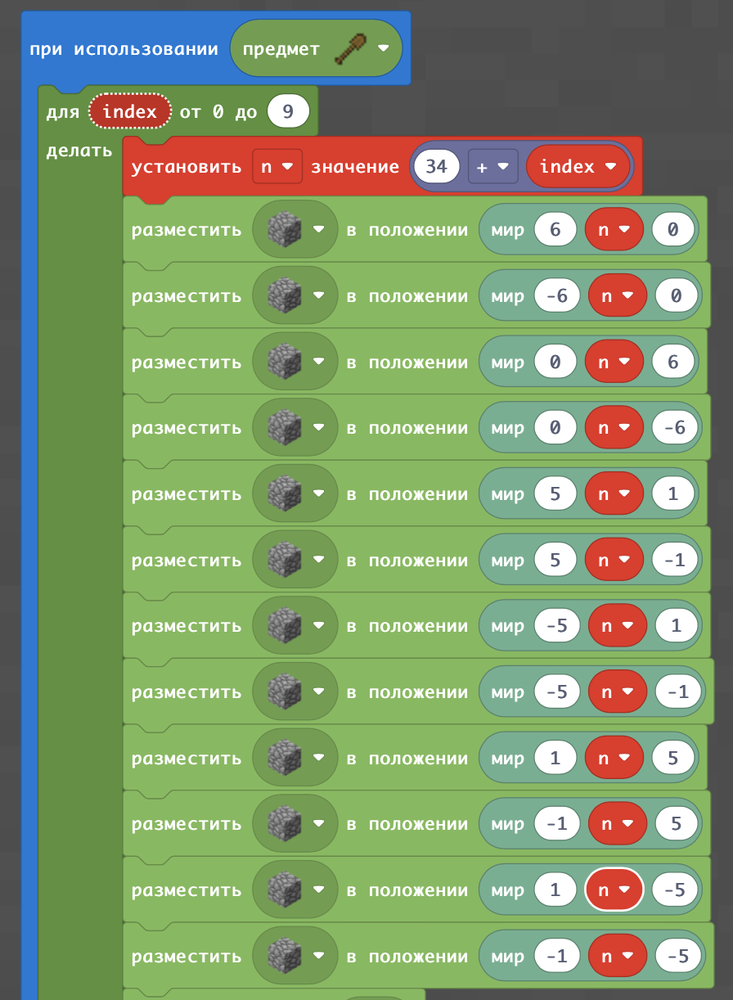

# Александрийский маяк
## Куб
В Майнкрафте - можно в трехмерных координатах строить кубы. Кубы являются хорошей заготовкой для дома. Для того, чтобы создать куб можно, с одной стороны, сдеать его на угад, по размерам.
### Куб по размерам.

А с другой стороны - сделать по абсолютным координатам
### Куб по координатам.

## Море и канал

## Стороны света.
Компас - направления ветров.

## Роза ветров
(увеличить в 2 раза).

  
  
  

## Роза на кубе

## Роза вверх
  

  
  
  

## Маяк