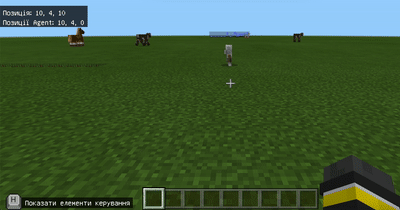
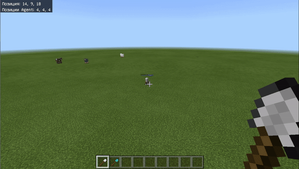

# Постройка куба из дерева
## Координаты
Для того, чтобы строить сложные здания в определенной точке мира нам понадобится работать с абсолютными координатами (т.е. координатами, которые привязаны к миру, а не к игроку).    
Для этого необходимо при создании мира включить отображение координат:

Соответвтенно, при запуске мира игрок появится в точке с координатой (0;4;0).

Это означает, что по по ширине и длинне в мире находимся в центре (первая и третья цифра, которые равны 0). А высота (вторая цифра) - 4. Потому что под ноками есть 3 блока земли и 1 бедрока.

  
  

|№|Завданне|Код|Результат|
|---|---|---|---|
|1|1. Переместитесь в точку (0;1;0) 2. Переместитесь в точку (10;4;0)  3. Переместитесь в точку (10;4;10) 4. Переместитесь в точку (-5;4;5)  5. Переместитесь в точку (0;10;0)|Перейти с учетом координат|  |

## Перемещение агента в точку
С помощью команды "Агент - телепортироваться к игроку" вы можете "позвать" агента к себе - он переметится в ту же точку, в которой находится игрок.

|№|Завданне|Код|Результат|
|---|---|---|---|
|2|1. Переместите агента в точку (0;1;0) 2. Переместите агента в точку (10;4;0)  3. Переместите агента в точку (10;4;10) 4. Переместите агента в точку (-5;4;5)  5. Переместите агента в точку (0;10;0)|Перейти с учетом координат|  |
## Прокладывание линий по координатам
С помощью команды "Блоки" можно программировать прокладывание блоков между определенными координатами.  
Например, проложим блоки от точки (10;4;0) до точки (10;4;10).
Для этого в разделе "Блоки" возьмем блок "Заполнить блоками с до " и добавим внутрь блока "При команде чата l".  
    
Изменим тип блоков на "Доски из дуба".   
  
В разделе "Позиции" возьмем блоки с указанием "мир" (именно с помощью этих блоков можно задавать абсолютные координаты)   
   
И проставим соответствующие значения  
  
В результет - получим линию из блоков дубовой древисины  
  

|№|Завданне|Код|Результат|
|---|---|---|---|
|3|1. Проложите блоки из точки (10;4;0) до  точки (10;4;10) 2. Проложите блоки из точки (10;4;10) до  точки (10;4;20)  3. Проложите блоки из точки (10;4;20) до  точки (0;4;20) 4. Проложите блоки из точки (5;4;10) до  точки (5;4;20)  | |   |

## Использование агента для обозначения координат.
Для того, чтобы сориентироваться в мире используются координаты игрока. Также игрок видит координаты агента, если находится на расстоянии меньшем 80 блоков по одному из измерений.
То, что игрок видит координаты агента удобно использовать для постройки кубов из блоков. В одной точке - ставится агент, в другую перемещается игрок. Эти координаты переписываются в команду, который заполняет блоками пространство между заданными точками.  

При использовании лопаты - будет создан куб.  

## Определение координат для куба из дерева.
Для того, чтобы определить координаты создаваемого нами куба из дерева поставим в нижнюю точку агента, а сами - перелетим в точку, в которой куб должен заканчиваться.  
Далее, на использование определенного предмета (в нашем случае - это железная лопата), поставим заполнение блоками из координат, в которых находится игрок в координаты, в которых находится агент.

Для того, чтобы заполнить данное пространство блоками используем железную лопату.  

## Пустой куб
Для того, чтобы внутри куба было пустое пространство необходимо в выпадающем списке необходимо выбрать пункт **"пустота"**  

При таком блоке - у нас внутри блока будет нижняя часть куба на 1 блок выше уровня травы.  

## Пустой куб "в пол"
Для того, чтобы нижняя часть куба была в уровень земли, необходимо поставить значение **y** на 1 ниже чем стоит агент.  

  

# Дополнительные задания
## Рассчеты ширины и высоты
Зная координаты точек отсчета мы можем вычислить размеры той фигуры, которая у нас получится.  
В Minecraft есть 3 координаты, они идут последовательно: x, y, z
Если координаты первой точки отметить x1, y1, z1, а координаты второй точки соответственно x2, y2, z2 - то высота (**h**) этой фигуры будет равна h = y2 - y1, длина (**l**) равна l = x2 - x1, ширина (**b**) равна b = z2 - z1  
  

В данном примере:
* Высота: h = y2 - y1 = 9 - 4 = 5
* Длинна: l = x2 - x1 = 14 - 4 = 10
* Ширина: b = z2 - z1 = 18 - 4 = 14

Мы создали фигуру высотой 5 блоков, длинной 10 и шириной 14 блоков.
Если высота, ширина и длинна будут равны, то такая фигура - **куб**. Во всех остальных случаях - **параллелепипед**.

## Создание блоков по размерам
|№|Завданне|Код|Результат|
|---|---|---|---|
|1|1. Сделайте куб размером 10х10х10 из досок дуба с позицией нижнего края куба на уровне земли. 2. Сделайте куб размером 5х5х5 из досок дуба с позицией нижнего края куба на уровне земли. 3. Сделайте куб размером 5х20х10 из досок дуба с позицией нижнего края куба на уровне земли.|||

## Внутреннее пространство.
Созданный в предыдущем блоке параллелепипед можно использовать для создания собственного дома. Но из-за того что внутри он полностью заполнен это сделать будет сложно. Для того, чтобы его можно было использовать внутреннюю часть заполним воздухом, оставив по 1 блоку на стены.  
Рассчитаем координаты вложенного параллелепипеда из воздуха:
* x3 = x1 + 1
* y3 = y
* z3 = z1 + 1
* x4 = z2 - 1
* y4 = y2 - 1
* z4 = z2 - 1
> y3 = y1, так как пол мы оставляем из того же материала, что и был до установки блоков.
  

  

https://makecode.com/_bxA29fUkwP1K

## Куб с внутренней пустотой
Куб из досок (или другого материала) является хорошей основой для строений, в том числе и для дома. Но для дома хорош не сплошной блок, а блок, в котором есть пустота (воздух).

<a href = "https://makecode.com/_CiU5jLacYf0r">https://makecode.com/_CiU5jLacYf0r</a>

## Задание
1. Сделать заготовку для дома и кирпича. Оформить внутренности дома по желанию.
2.  Сделать двор для дома в котором посадить полисадник (из цветов на ваш выбор), провести дорожку к дому.
3. `*` Сделать пристойку к дому (должна быть ниже и меньше) с толщиной стен в 2 блока.
4. `*` Сделать погреб (выемка в земле, которая закрывается люком), который находится за домом.
5. `**` поставить дом, который одним краем касается координат (1,0,1), имеет ширину 16 блоков, длинну 14 блоков и высоту 15 блоков.

