# Остров и стороны света
С помощью блоков воды мы можем создавать море. Например, создадим море от точки (10;3;10) до точки (-10;3;-10)
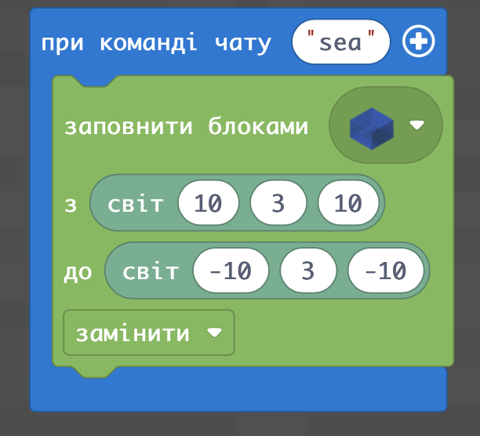  
Получим небольшой квадратный водоем:  
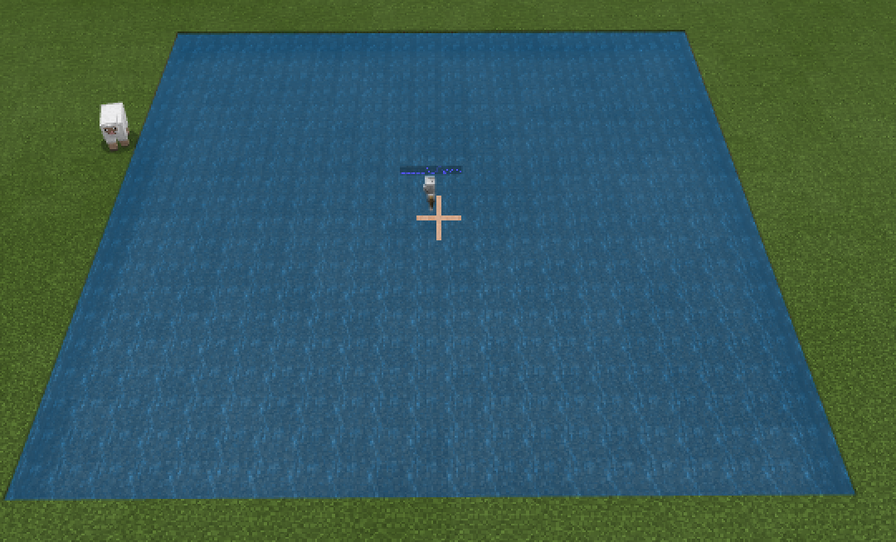   
  
|№|Задание|Код|Вид|
|---|---|---|---|
|1|1. Создайте море от точки (10;3;10) до точки (-10;3;-10). 2. Создайте море от точки (-30;3;-30) до точки (-50;3;-50). 3. Создайте море от точки (50;3;50) до точки (100;3;100).| | |

## Осущение моря
Если вы создали море, а далее - хотите его "осушить", необходимо пространство, которое занимала вода заполнить воздухом.
  
В результате - получим соответствующее углубление

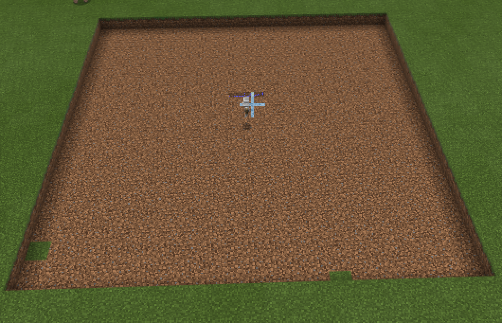

|№|Задание|Код|Вид|
|---|---|---|---|
|1|1. При команде чата sea создайте море от точки (10;3;10) до точки (-10;3;-10). При команде чата nosea - "осушите" море (заполните пространство для воды блоками воздуха) 2. При команде чата sea2 создайте море от точки (-30;3;-30) до точки (-50;3;-50). При команде чата nosea2 - "осушите" море (заполните пространство для воды блоками воздуха) 3. При команде чата sea3 создайте море от точки (50;3;50) до точки (100;3;100). При команде чата nosea3 - "осушите" море (заполните пространство для воды блоками воздуха)|  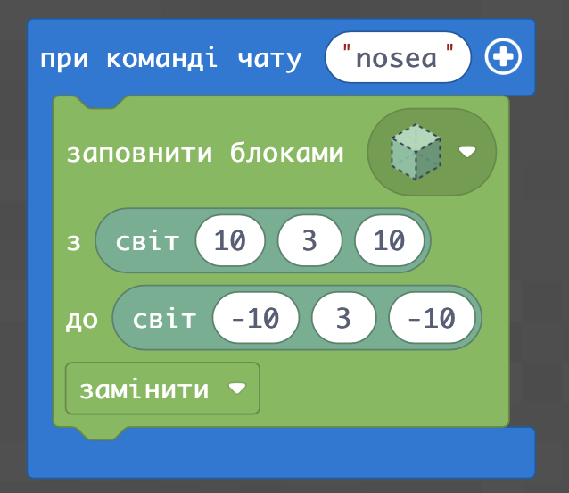|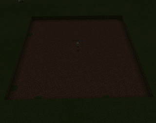 |

Также можно не просто "убирать воду", а заполнять это поле травой:  
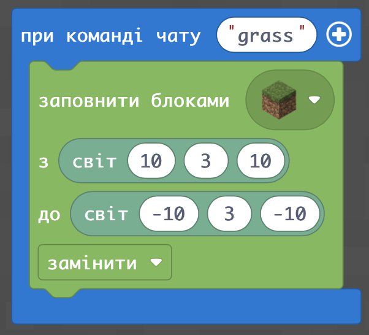  
  

Если заполните пространство не полностью, то получится остров:  
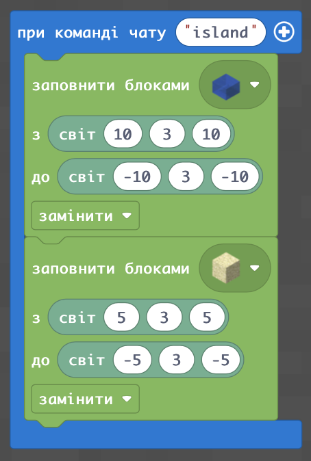   
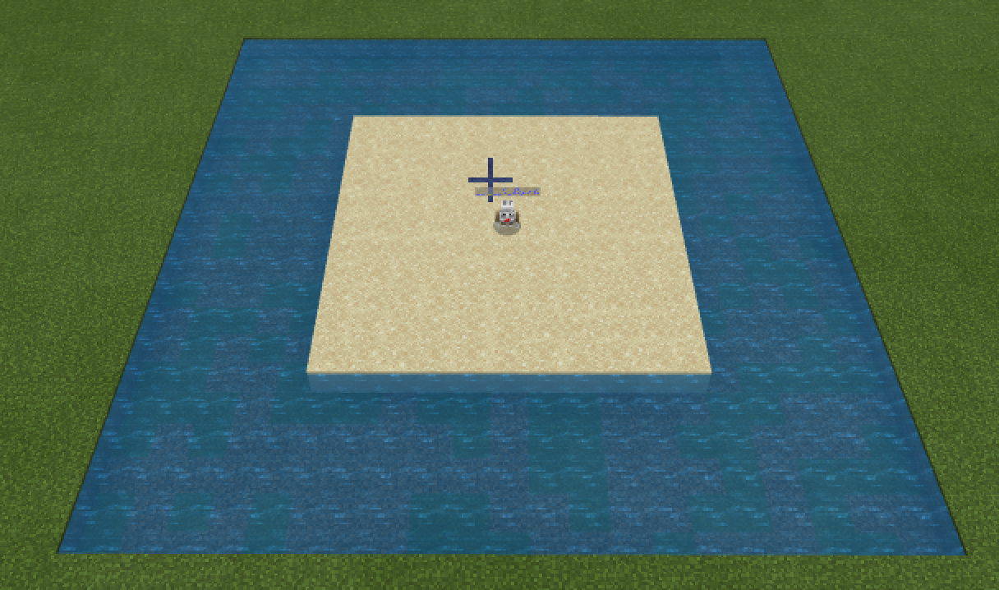   

## Стороны света
В Minecraft - существуют стороны света. Определить стороны света в самой игре можно также как и в реальном мире: Солнце сходит на востоке.  
Если стать лицом на восток, то сзади будет запад, слева - север, справа - юг.
Но также - в Minecraft можно ориентироваться по координатам:  
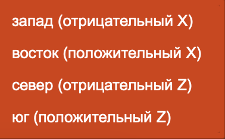  
Положительное направление оси X (певрой координаты) - это восток. А отрицательное - запад.
Положительное направление оси Z (третьей координаты) - это юг. А отрицательное - это север.
|№|Задание|Код|Вид|
|---|---|---|---|
|1|1. Поставьте агента в точку (0;4;0) ориентацией на восток и установите время "Утро". 2.  Поставьте агента в точку (10;4;10) ориентацией на запад и установите время "Закат". 3.  Поставьте агента в точку (30;4;30) ориентацией на север и установите время "Полдень". 4.  Поставьте агента в точку (0;4;-10) ориентацией на юг и установите время "Полночь". 5. Поставьте агента на 10 блоков южнее и на 5 восточнее координаты  (0;4;0) |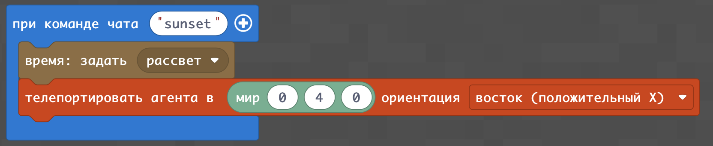|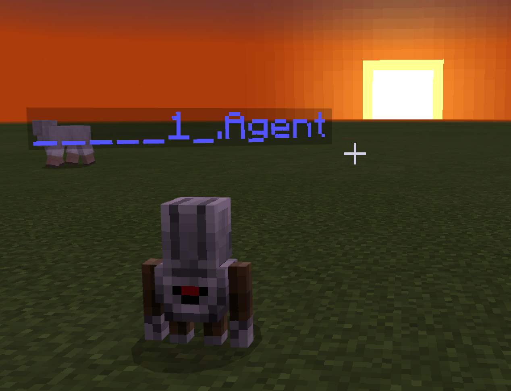|

## Компас
Давайте сделаем ориентацию по сторонам света на земле:  
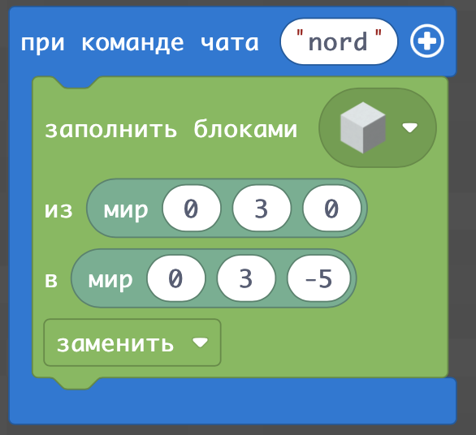   
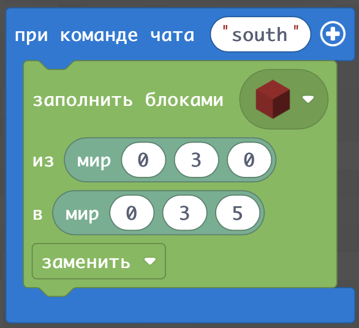  
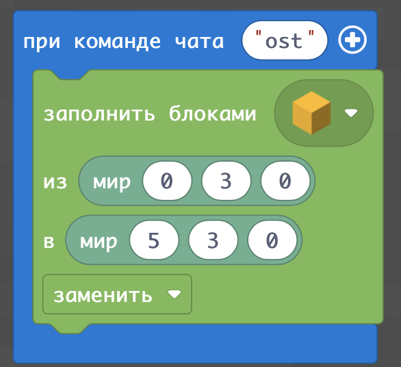  
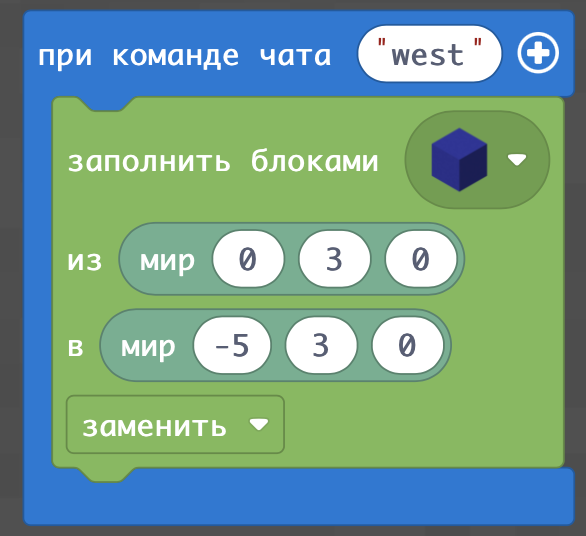  

|№|Задание|Код|Вид|
|---|---|---|---|
|2|1. Создайте компасс с направлениями длинной в 5 блоков с точкой из алмазного блока в точке (0;3;0) 2. Создайте компасс с направлениями длинной в 5 блоков с точкой из золотого блока в точке (10;3;10) 3. Создайте компасс с направлениями длинной в 3 блока с точкой из блока булыжника в точке (20;3;0)|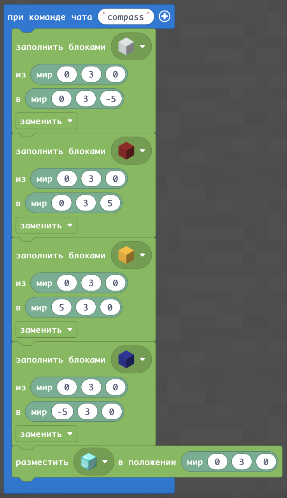|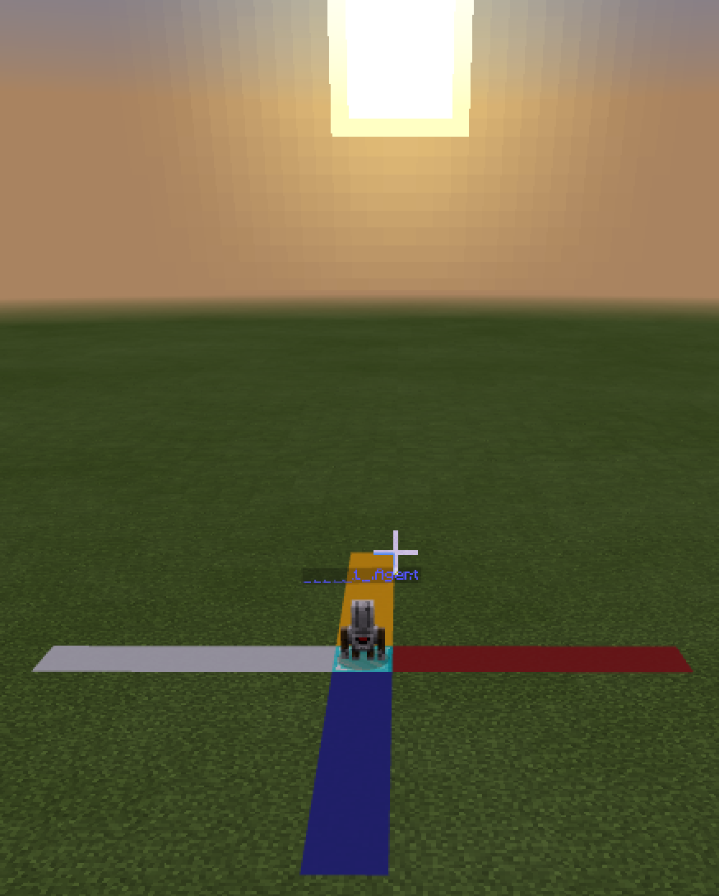|

## Компас на острове из песка 

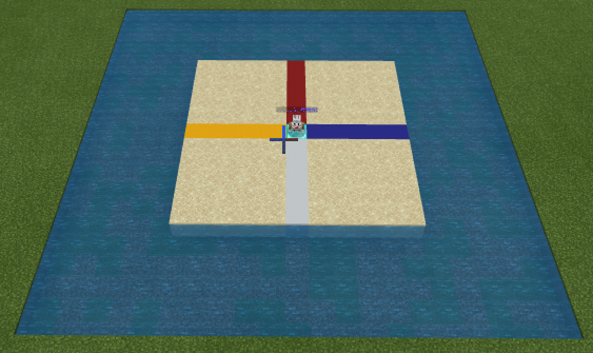   

## Компас на острове из земли с травой

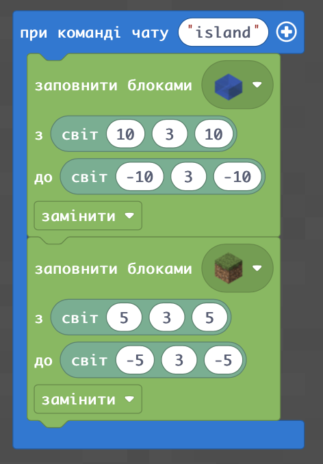   
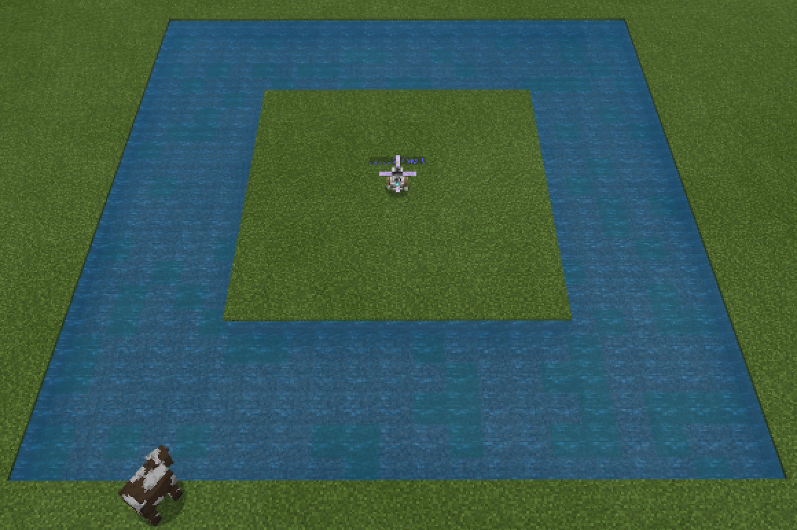   
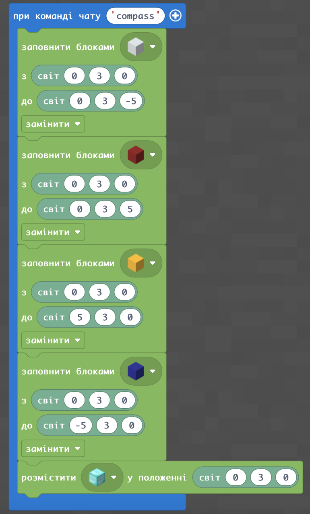   
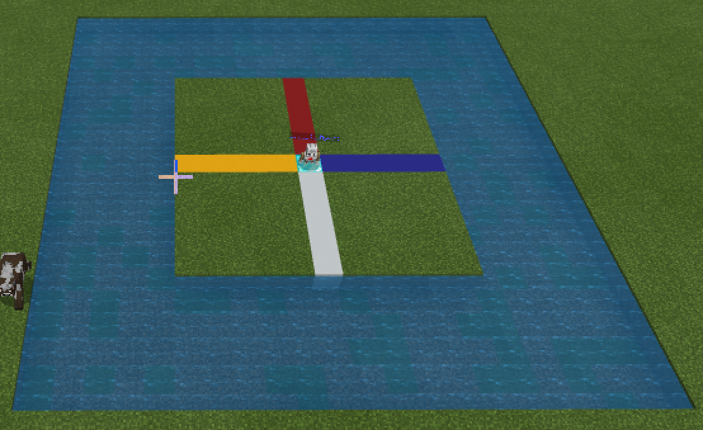   

