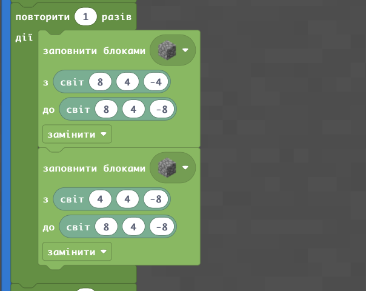

  

   
   -
   
   -
   

## Роза ветров. Основа

|Роза ветров|
|---|
|Зробимо 4 діагоналі:     А також 4 лінії, що з'єднуються під прямим кутом:      |
  
В результаті - отримаємо такий елемент в якості рози вітрів:  

## Роза ветров. Цикл
Для того, щоб дану форму мала не лише лінія висотою в 1 блок, а ціла стіна додамо змінні та ціикли до нашого коду.
Здуюлюємо попередній код. Замінемо повідомлення чату, при якому код буде виконуватися (на **rose-up**). А також додамо елементи, що дозволять нам повторювати відповідний код по елементам, при цьому кожен наступний крок буде піднімати лінію на 1 блок.  
Розберемо основні рішення такої можливості:  
  

**1** - Зробимо можливість змінювати матеріал для побудови.
**2** - Повторимо стільки разів, яку висоту хочемо отримати.
**3, 6** - додамо можливість будувати не тільки починаючи від висоти 0 , але й від будь-якої висоти.
**4, 5** - додамо визначні змінні до вже створених елементів (**material** - в позицію, де визначається тим блоків, **n** - де визначається y-координата),

В результаті - отмаємо код, що будує стіну, яка за формою відповідає розі вітрів:
  
  
  
  
  
  
  
  
  
Отримаємо результат:  

## Очищення поля
Дуже часто необхідно очистити поле, на якому вже побудовано елемент. Наприклад, ви хочете змінити висоту, або матеріал для будівництва. Для цього зручно використовувати розміщення **блоків повітря** на тому місці, яке вже займають блоки побудовної конструкції.

  
 

## Творчі завдання:
1. Намалюйте за допомогою блоків першу букву вашого імені.
2. Зробіть стіну заввишки 15 блоків яка за формою відповідає першій літері вашго імені.
3. Створіть "приюирач" - набор команд, які витирають створену ваму стіну, що відповідає формі першої літери вашого імені.
4. В центр створеної на занятті розви вітрів розмістіть компас, що його ви створили на попередньому занятті.
  

5. Побудуйте "Розу вітрів" з пісчаніка. Проте висоту задайте - 10.  
6. Збудуйте аналогічну "Розу вітрів", проте розмір діагональних та прямих елементів зробіть **3** (в той час як в прикладі такий розмір - **4**). Матеріал задайте самостійно.
Наприклад:  

Тепер, запрограмуємо створення відповідної літери:

