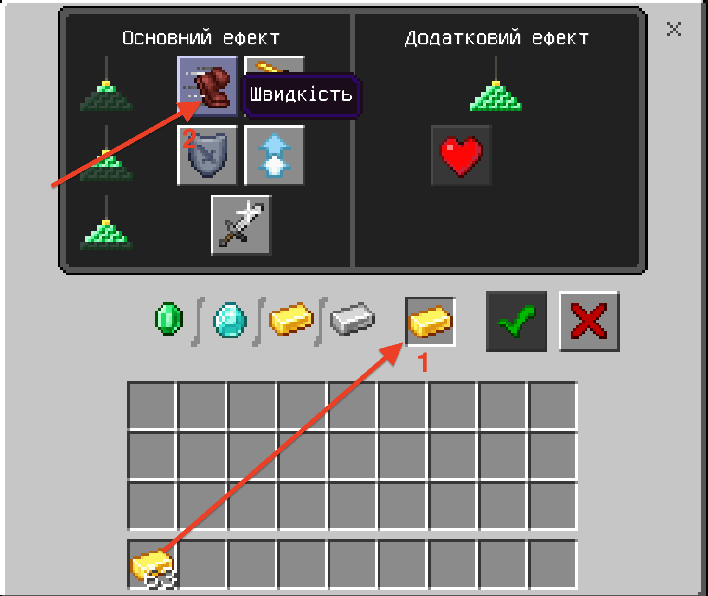

# Маяк
Ми вже познайомилися на попередніх заняттях з елементами:
* Море
* Острів
* Куб
* Роза вітрів

На даному занятті ми додамо до цього піраміду із освітренням та об'єднаємо всі елементи в єдине ціле.
## Піраміда
В майнкрафті існує можливість побудови піраміди та маяку зверху. 
|#|Завдання|Код|Вид|
|---|---|---|---|
|1|1. Побудувати піраміду з золотих блоків з центром в точці (0;4;0) шириною основи в 11 блоків та висотою в 5 блоків, згори такої піраміди поставьте маяк. 2. Побудувати піраміду з алмазних блоків з центром в точці (0;4;20) шириною основи в 9 блоків та висотою в 4 блока, згори такої піраміди поставьте маяк. 3. Побудувати піраміду з центром в точці (20;4;0) шириною основи в 7 блоків та висотою в 3 блока, зверху такої піраміди поставьте маяк.|   ||
### Магія від маяка
Маяки в Майнкрафті дозволяють використовувати магію. Для цього треба натиснити правою клавішею миші на сам маяк та надати золотий злиток/алмаз/ізумруд в обмін на початок дії певного магічного впливу (сила, швидкіть, стрибок, тощо).

 
 
 
 
 

### Очищення створених об'єктів
Для того, щоб очистити обїєкт необхідно замість його блоків розмістити блоки повітря.

|#|Завдання|Код|Вид|
|---|---|---|---|
|2|1. Заменіть блоки збудованої піраміди блоками повітря.| ||

### Використання циклу
Ми бачимо, що при побудові піраміди ми використовуємо однакові блоки і ми також бачимо, що спостерігається тенденція в зміні координат:  
  
Для того, щоб значно скоротити кількість блоків, що ми їх використовуємо додамо до конструкції цикл. Цикл із параметром повторюється 5 разів і на кожному кроці виконання циклу значення лічільника змінюється від 0 до 4 (0,1,2,3,4).  
|Код|Результат|
|---|---|
|||

Тепер створимо та вирахуємо змінну **i**, що буде залежати від змінної-лічільника **index**.
|Код|Результат|
|---|---|
|||

В результаті - зробимо такі самі піраміди, тільки із використанням циклів:  
|#|Завдання|Код|Вид|
|---|---|---|---|
|1|1. Використовуючи цикли побудувати піраміду з золотих блоків з центром в точці (0;4;0) шириною основи в 11 блоків та висотою в 4 блока, згори такої піраміди поставьте маяк. 2. Використовуючи цикли побудувати піраміду з алмазних блоків з центром в точці (0;4;20) шириною основи в 9 блоків та висотою в 3 блока, згори такої піраміди поставьте маяк. 3. Використовуючи цикли побудувати піраміду з центром в точці (20;4;0) шириною основи в 7 блоків та висотою в 2 блока, зверху такої піраміди поставьте маяк.|  ||

## Основа
Давайте піднімемо наш маяк над землею та поставим його на постамент з морських ліхтарів:

|Код|Результат|
|---|---|
|||

## Піраміда на основі

|#|Завдання|Код|Вид|
|---|---|---|---|
|1|1. Використовуючи цикли побудувати піраміду з золотих блоків з центром в точці (0;10;0) шириною основи в 11 блоків та висотою в 5 блоків, згори такої піраміди поставьте маяк. Під піраміду поставьте блоки 11х11 та висотою 6 блоків з морських ліхтарів. 2. Використовуючи цикли побудувати піраміду з алмазних блоків з центром в точці (0;4;20) шириною основи в 9 блоків та висотою в 4 блока, згори такої піраміди поставьте маяк. Під піраміду поставьте блоки 9х9 та висотою 5 блоків з морських ліхтарів. 3. Використовуючи цикли побудувати піраміду з центром в точці (20;4;0) шириною основи в 7 блоків та висотою в 3 блока, зверху такої піраміди поставьте маяк. Під піраміду поставьте блоки 7х7 та висотою 4 блока з морських ліхтарів.|  ||

