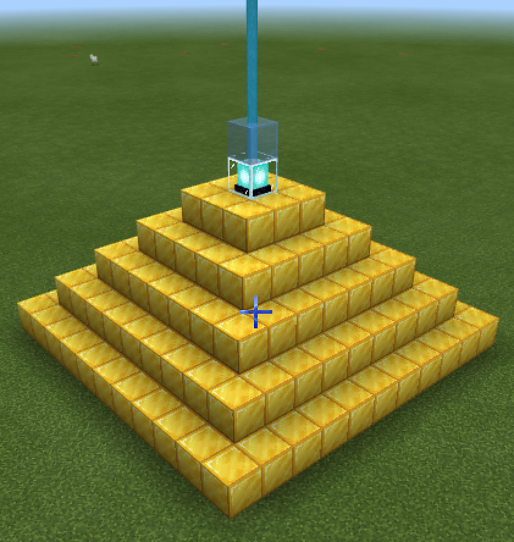
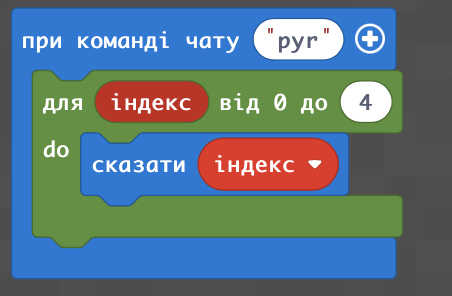

# Маяк
Ми вже познайомилися на попередніх заняттях з елементами:
* Море
* Острів
* Куб
* Роза вітрів

На даному занятті ми додамо до цього піраміду із освітренням та об'єднаємо всі елементи в єдине ціле.
## Піраміда
В майнкрафті існує можливість побудови піраміди та маяку зверху. 
|#|Завдання|Код|Вид|
|---|---|---|---|
|1|1. Побудувати піраміду з золотих блоків з центром в точці (0;4;0) шириною основи в 11 блоків та висотою в 5 блоків, згори такої піраміди поставьте маяк. 2. Побудувати піраміду з алмазних блоків з центром в точці (0;4;20) шириною основи в 9 блоків та висотою в 4 блока, згори такої піраміди поставьте маяк.  3. Побудувати піраміду з центром в точці (20;4;0) шириною основи в 7 блоків та висотою в 3 блока, зверху такої піраміди поставьте маяк.|   ||
### Магія від маяка
Маяки в Майнкрафті дозволяють використовувати магію. Для цього треба натиснити правою клавішею миші на сам маяк та надати золотий злиток/алмаз/ізумруд в обмін на початок дії певного магічного впливу (сила, швидкіть, стрибок, тощо).

 
 
 
 
 

### Очищення створених об'єктів
Для того, щоб очистити обїєкт необхідно замість його блоків розмістити блоки повітря.

|#|Завдання|Код|Вид|
|---|---|---|---|
|2|1. Заменіть блоки збудованої піраміди блоками повітря.| ||

### Використання циклу
Ми бачимо, що при побудові піраміди ми використовуємо однакові блоки і ми також бачимо, що спостерігається тенденція в зміні координат:  
  
Для того, щоб значно скоротити кількість блоків, що ми їх використовуємо додамо до конструкції цикл. Цикл із параметром повторюється 5 разів і на кожному кроці виконання циклу значення лічільника змінюється від 0 до 4 (0,1,2,3,4).  
|Код|Результат|
|---|---|
|||

Тепер створимо та вирахуємо змінну **i**, що буде залежати від змінної-лічільника **index**.
|Код|Результат|
|---|---|
|||

В результаті - зробимо такі самі піраміди, тільки із використанням циклів:  
|#|Завдання|Код|Вид|
|---|---|---|---|
|1|1. Використовуючи цикли побудувати піраміду з золотих блоків з центром в точці (0;4;0) шириною основи в 11 блоків та висотою в 4 блока, згори такої піраміди поставьте маяк. 2. Використовуючи цикли побудувати піраміду з алмазних блоків з центром в точці (0;4;20) шириною основи в 9 блоків та висотою в 3 блока, згори такої піраміди поставьте маяк.   3. Використовуючи цикли побудувати піраміду з центром в точці (20;4;0) шириною основи в 7 блоків та висотою в 2 блока, зверху такої піраміди поставьте маяк.|  ||

## Основа
Давайте піднімемо наш маяк над землею та поставим його на постамент з морських ліхтарів:

|Код|Результат|
|---|---|
|||

## Піраміда на основі

|#|Завдання|Код|Вид|
|---|---|---|---|
|1|1. Використовуючи цикли побудувати піраміду з золотих блоків з центром в точці (0;10;0) шириною основи в 11 блоків та висотою в 5 блоків, згори такої піраміди поставьте маяк. Під піраміду поставьте блоки 11х11 та висотою 6 блоків з морських ліхтарів. 2. Використовуючи цикли побудувати піраміду з алмазних блоків з центром в точці (0;4;20) шириною основи в 9 блоків та висотою в 4 блока, згори такої піраміди поставьте маяк. Під піраміду поставьте блоки 9х9 та висотою 5 блоків з морських ліхтарів.  3. Використовуючи цикли побудувати піраміду з центром в точці (20;4;0) шириною основи в 7 блоків та висотою в 3 блока, зверху такої піраміди поставьте маяк. Під піраміду поставьте блоки 7х7 та висотою 4 блока з морських ліхтарів.|  ||

## Функції
### Фнукція без параметрів
Для того, щоб використовувати декілька елементів в рамках певного цілого зручно використовувати такій інстурмент як функції.   
Для цього можемо створити функцію в меню "Функції".  
  
Найпростіший варіант функції - тільки із назвою:  
  
Для того, щоб функція запускала код - необхідно такий код додати в середину блоку функції.
  
Для використання необхідно взяти блок функції та перетягнути в те місце, де ви бажаєте запустити відповідну функцію  
  

### Функція із параметром
Більш складний варіант - це використання параметрів.  Коли ми можемо передавати до функції певні параметри (в нашому прикладі із Олександрійським маяком - рівень на якому починається кожен елемент).

  

Тоді змінні-параметри можна використовувати в середині функції.
  

## Маяк
Поєднаємо всі елементи маяка в одному коді за допомогою функцій:

### Море

### Основна будівля

### Напрямки сторін світу (компас)

### Роза вітрів

### Майданчик-рівень

### Піраміда із ліхтарем

### Виклик всіх блоків разом

### Результат

## Творчі завдання
1. Змініть пропорції маяку (так, щоб, наприклад, базова частина була не 20, а 25 блоків; роза вітрів - 15 блоків, тощо).
2. Додайте до острову, на якому стоїть маяк піщане узбережжя.
3. Побудуйте на узбережжі причал, до якого зручно підливти на лодці.
4. В маяку додайте двері, та зробіть внутрішнє оснащення (на власний розсуд). Прикрасьте мая ззовні.  

## Супер-творчі завдання
1. Зробіть відеоогляд отриманого маяка, сприаючись на історичні відомості, до яких можете додати дещо фантазії та пригод.
2. Відоогляд - залийте на власний YouTube, а в коментарях додайте посилання на ваш код та посилання на файли світу (попередньо, завантажив файли світу в документи на Google.Drive).
