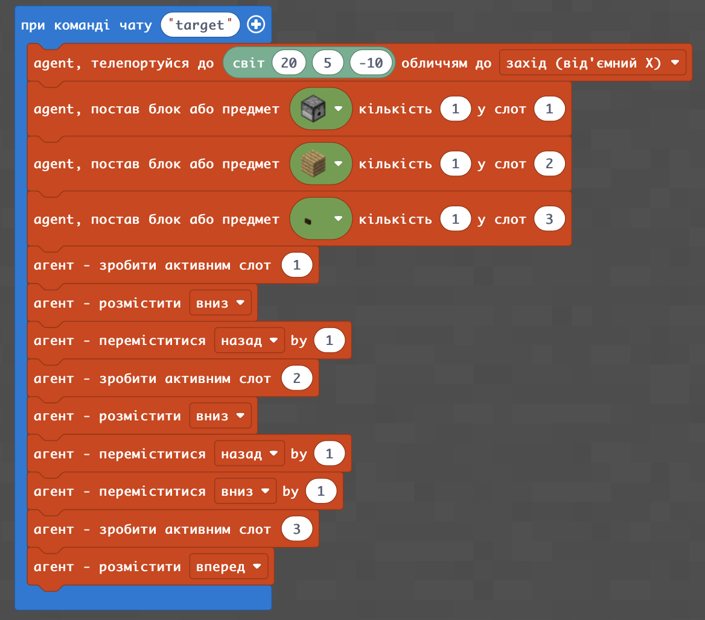
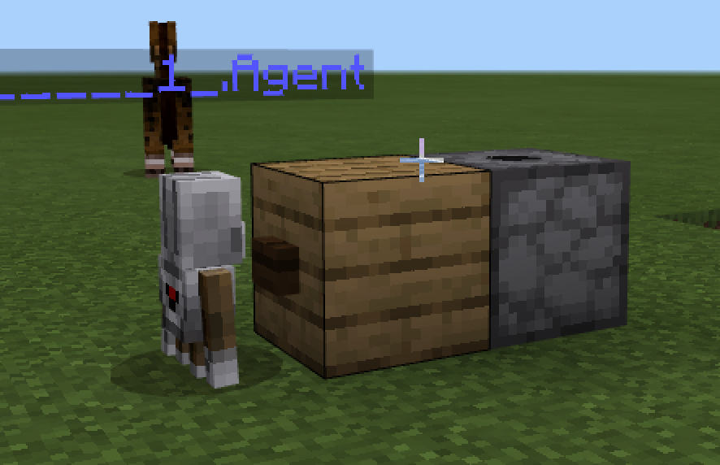
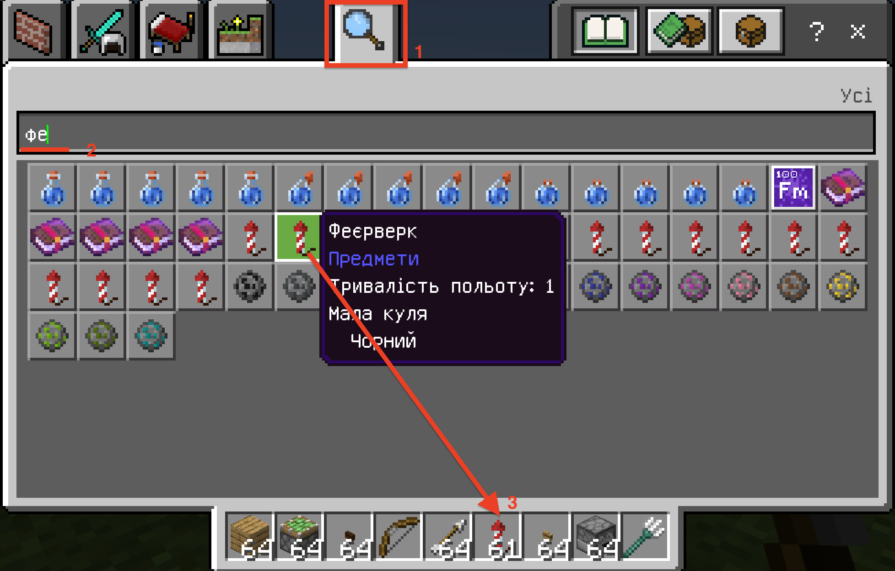
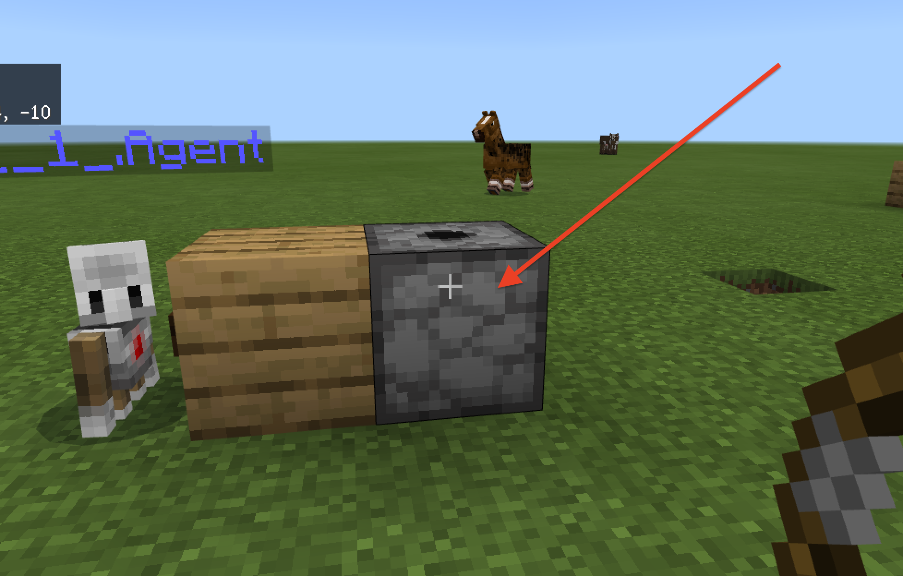
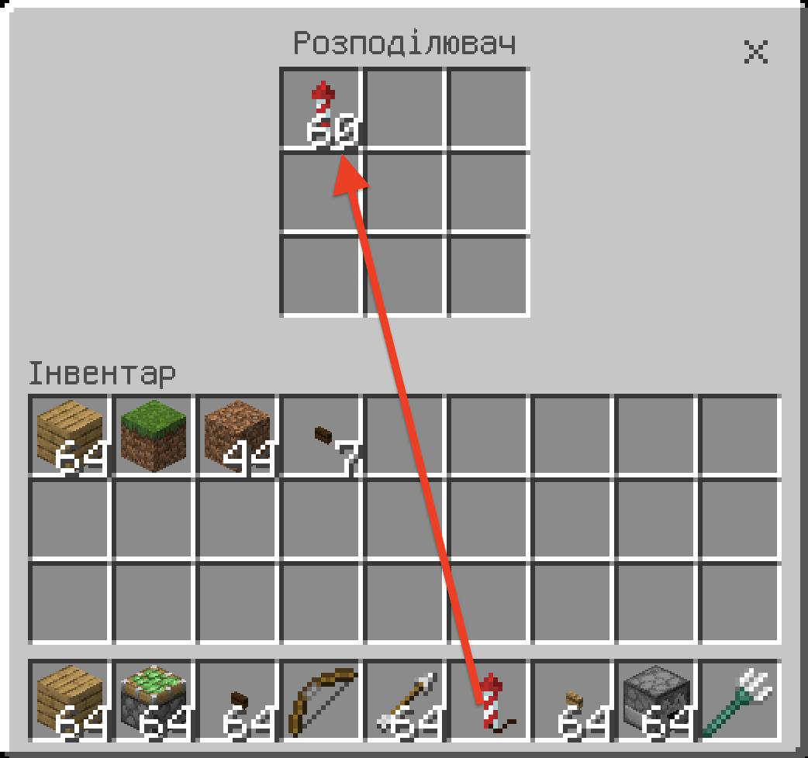
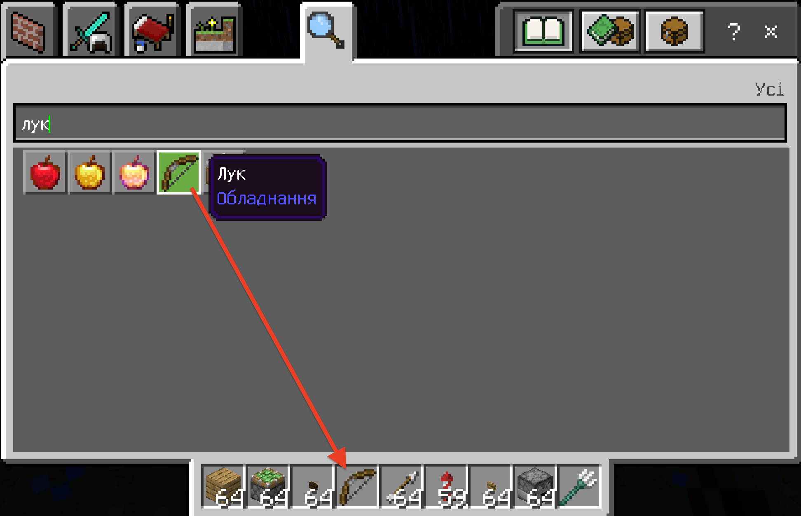
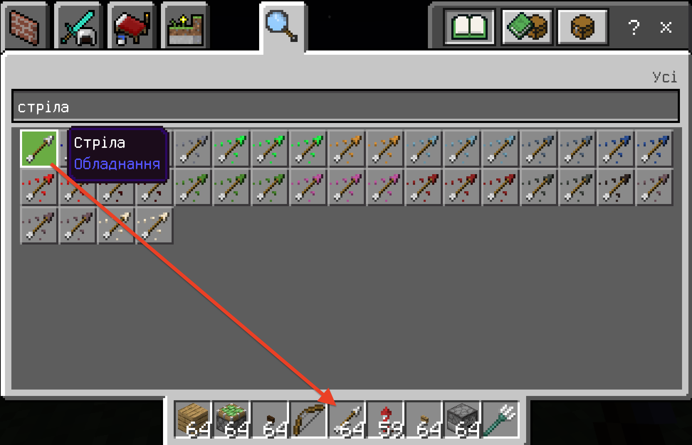
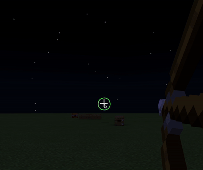
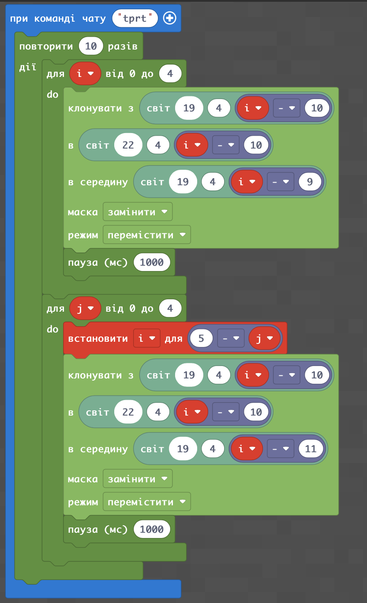
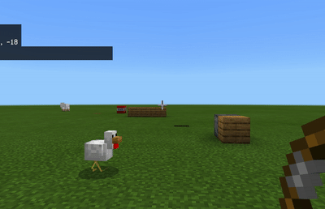

# Пересування мішені
## Створимо установку з фейерверків!

## Завантажимо фейерверки
Для цього зайдемо до інвентаря (клавіша **E**). Знайдемо фейерверки. Та переведимо фейерверки до ячійок гравця.

Задйемо до вже створеного росподілювача. Для цього - клікнемо на росподілювач правою клавішею миші.

Перенесемо фейерверки з ячійок гравця в якійки розподілювача.

Візьміть в інструментах лук зі стрілами.
  

  

Відійдіть на значну дистанцію та влучте в існуючу кнопку.  
  

## Мішень, що рухається
Запустимо пересування створеної мішені

Для зміни швикості: змініть значення команди **loops.pause(1000)**

## Творче завдання
Створіть 3-4 мішені, що рухаються в різних місцях карти. Потренуйтеся влучати в такі мішені на швидкість.

 

