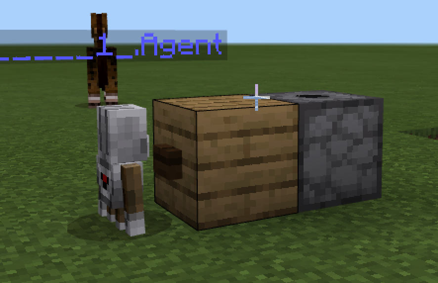
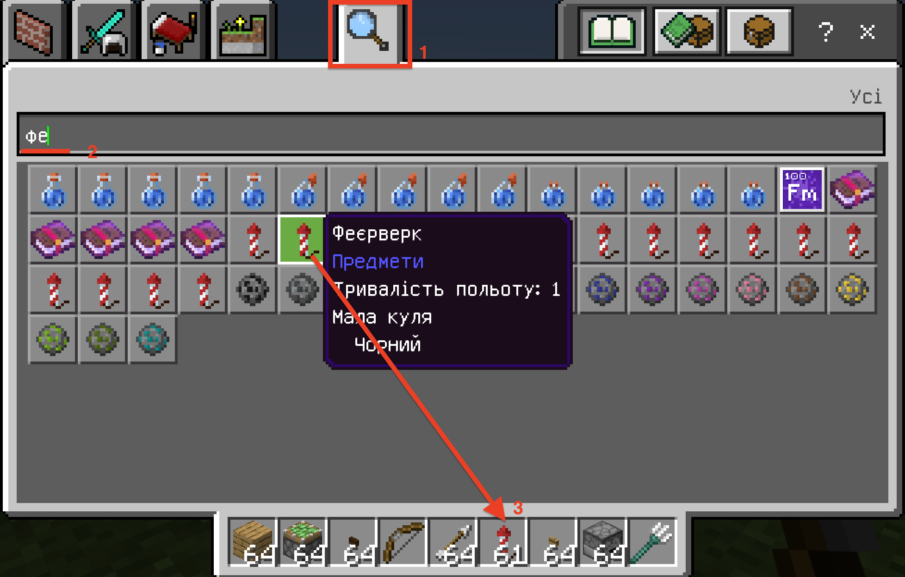
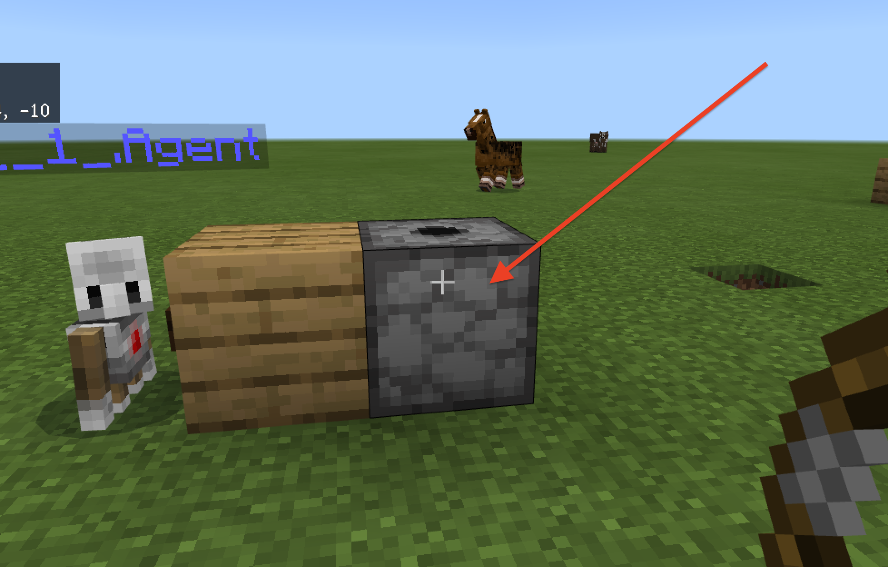
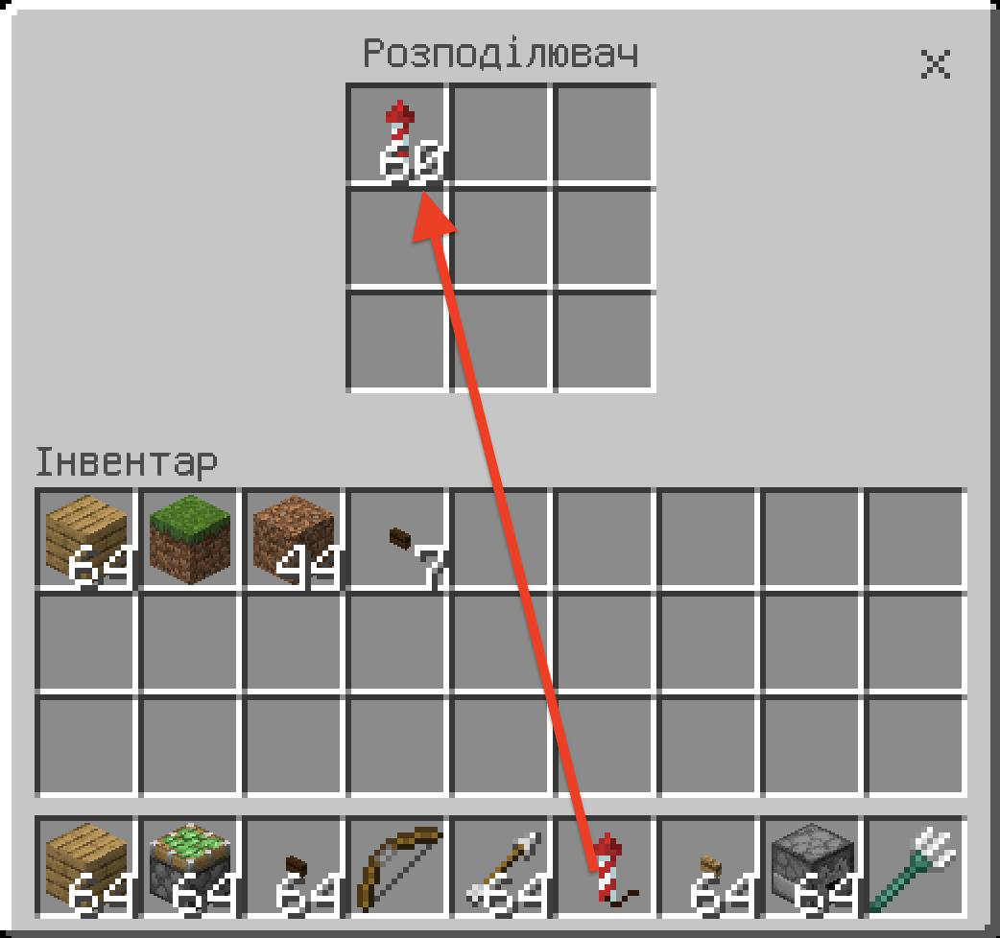
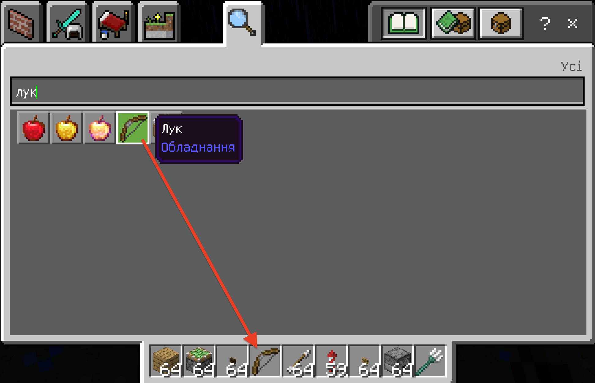
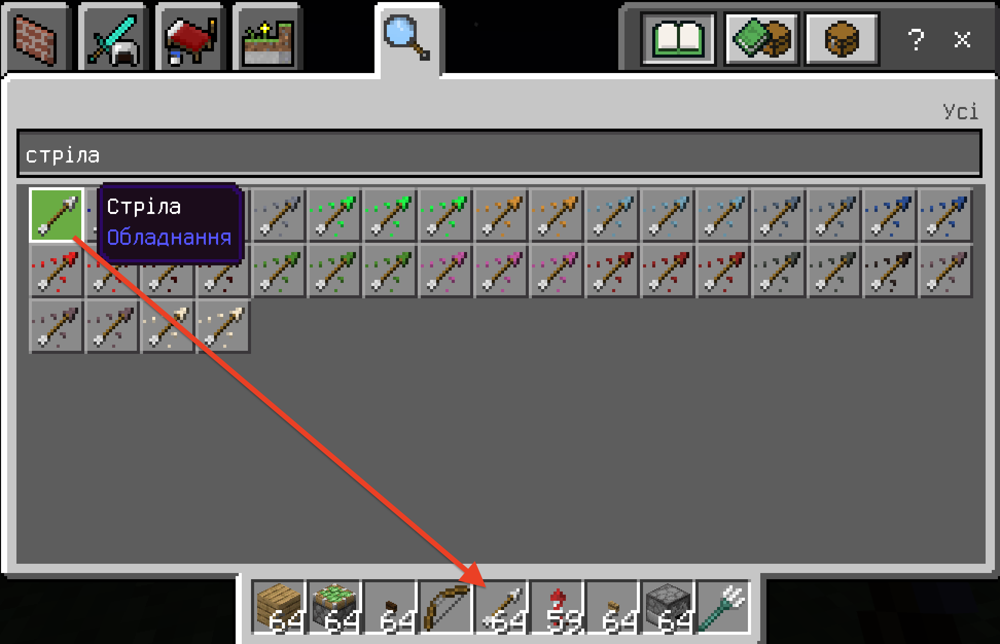
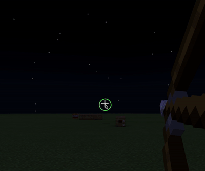

# Пересування мішені
## Створимо установку з фейерверків!
```js
player.onChat("target", function () {
    agent.teleport(world(20, 5, -10), WEST)
    agent.setItem(DISPENSER, 1, 1)
    agent.setItem(PLANKS_OAK, 1, 2)
    agent.setItem(DARK_OAK_BUTTON, 1, 3)
    agent.setSlot(1)
    agent.place(DOWN)
    agent.move(BACK, 1)
    agent.setSlot(2)
    agent.place(DOWN)
    agent.move(BACK, 1)
    agent.move(DOWN, 1)
    agent.setSlot(3)
    agent.place(FORWARD)
})
```



## Завантажимо фейерверки
Для цього зайдемо до інвентаря (клавіша **E**). Знайдемо фейерверки. Та переведимо фейерверки до ячійок гравця.

Задйемо до вже створеного росподілювача. Для цього - клікнемо на росподілювач правою клавішею миші.



Перенесемо фейерверки з ячійок гравця в якійки розподілювача.


Візьміть в інструментах лук зі стрілами.
  

  

Відійдіть на значну дистанцію та влучте в існуючу кнопку.  
  


2. З