# Рух блоків по світу
В Minecraft Education є можливість переносити блоки з однієї частини світу в іншу. При цьому, якщо це робити певним циклом - відбувається аналог руху.
## Копіювання
Для розуміння роботи копіювання блоків зробимо переніс простого блока з одного місця на інше:  

**Code01**
```js
player.onChat("bl", function () {
    blocks.place(GOLD_BLOCK, world(0, 4, 0))
})
```
**Code02**
```js
player.onChat("mv", function () {
    blocks.clone(
    world(0, 4, 0),
    world(0, 4, 0),
    world(5, 4, 0),
    CloneMask.Replace,
    CloneMode.Move
    )
})
```

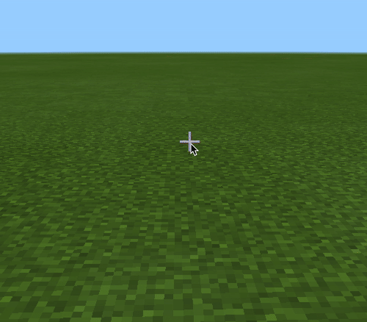  
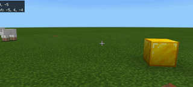  

|№|Завдання|Код|Результат|
|---|---|---|---|
|1.|1. Створіть золотий блок в точці (0;4;0) та перемістіть його до точки (5;4;0). <br>2. Створіть блок морського ліхтаря в точці (10;4;0) та перемістіть його до точки (0;4;10). <br>3. Створіть блок динаміту в точці (10;4;10) та перемістіть його до точки (-10;4;-10).| **Code01** **Code02**  | 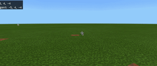 |

## Телепортація із результатом

**Code 03**
```js
player.onChat("m", function () {
    blocks.clone(
    world(0, 4, 0),
    world(0, 4, 0),
    world(1, 4, 0),
    CloneMask.Replace,
    CloneMode.Move
    )
})
```

**Code04**
```js
player.onChat("bt", function () {
    blocks.place(REDSTONE_TORCH, world(0, 4, 0))
    blocks.place(TNT, world(5, 4, 0))
})
```


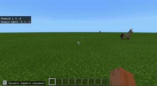  

### Творче завдання:
- зробіть створення смолоскипу та дінаміту та за допомогою команди перемістіть смолоскип до дінаміту.

## Рух
В минулому завданні ми з вами телепортували смолоскип. Проте, якщо запровадити цикл, то буде відбуватися не просто переміщення, а рух.

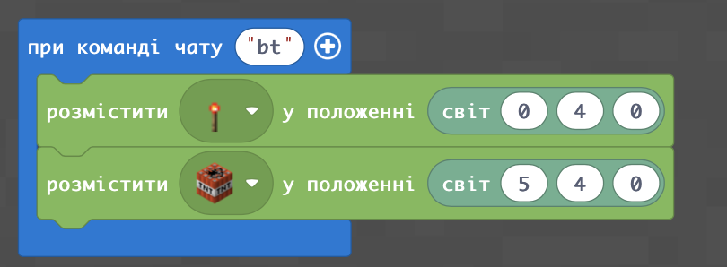    <br>

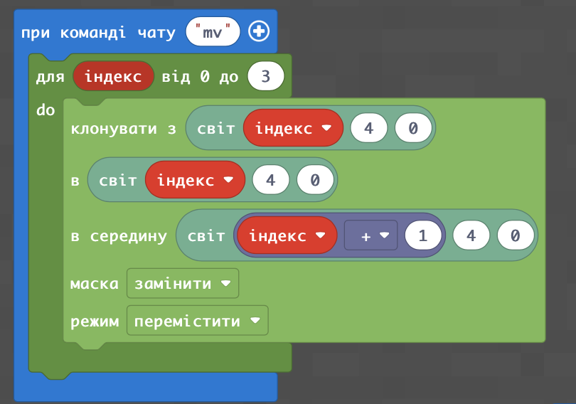   <br>


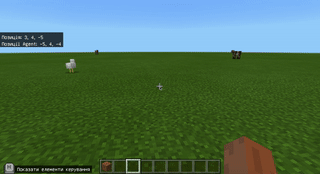 

Для очищення від результатів вибуху можна заповнити блоками із травою протір, на якому стався вибух:

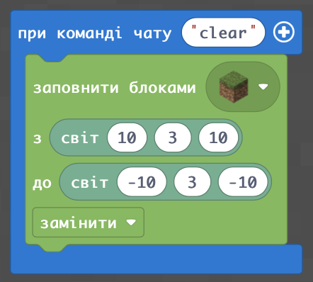  <br>
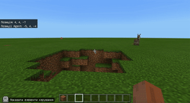 

Ми запрограмували рух, але він відбувся настільки швидко, що ми його не помітили. Для того, щоб сповільнити рух використаємо блок "**Пауза**" з меню "**Блоки**". <br>
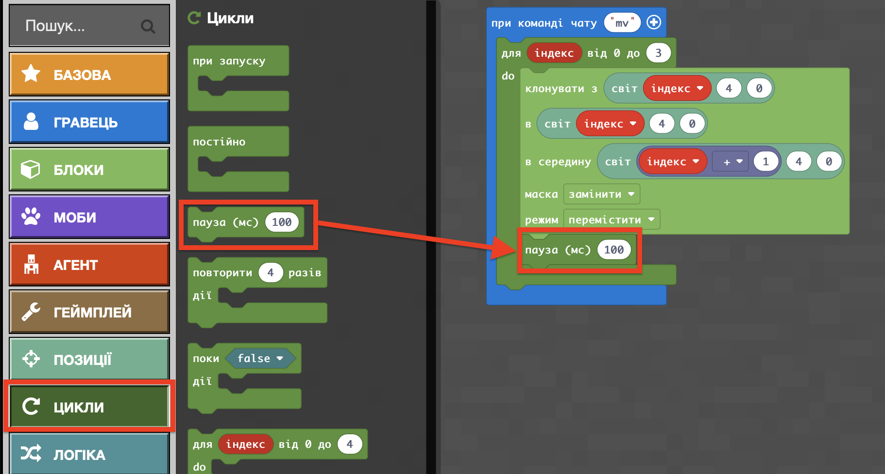 <br>
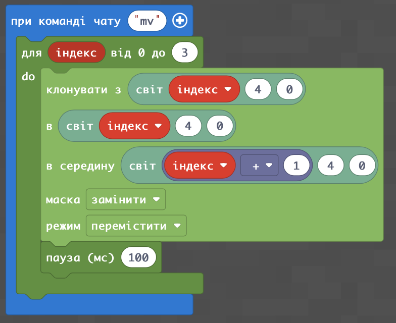 <br>
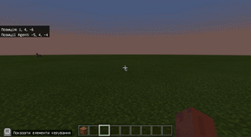 
