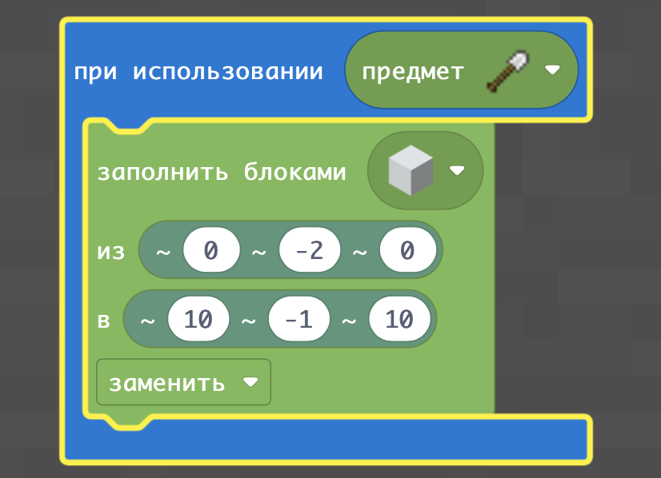
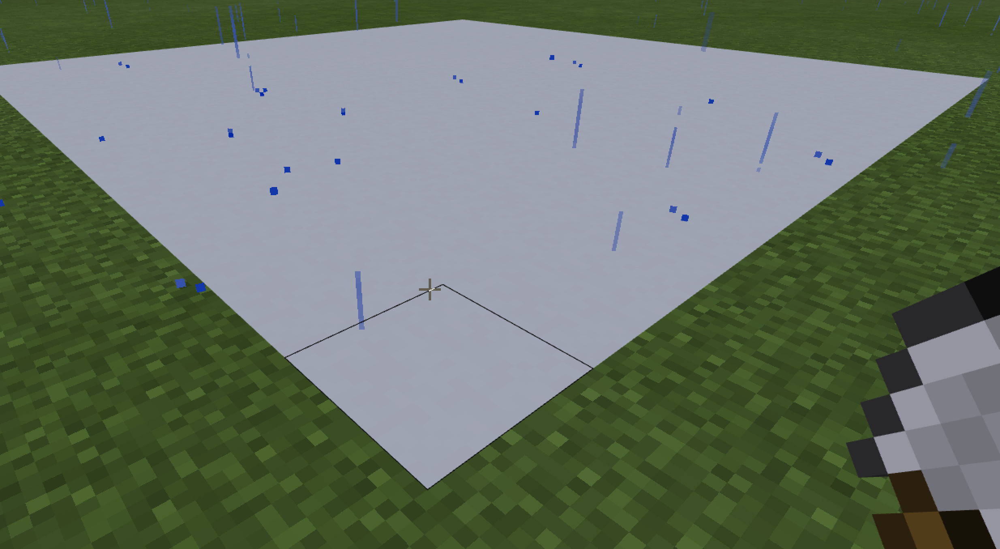
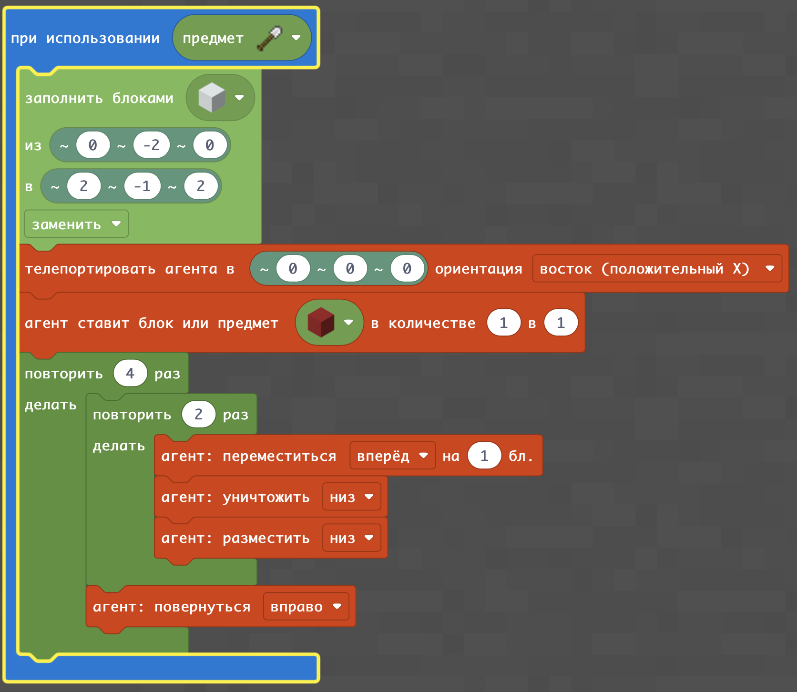
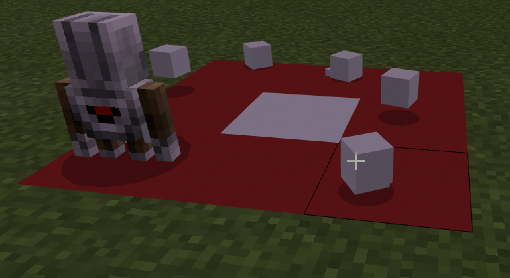
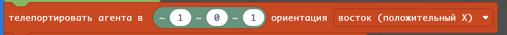
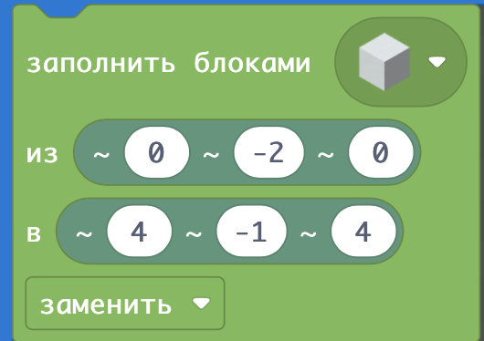
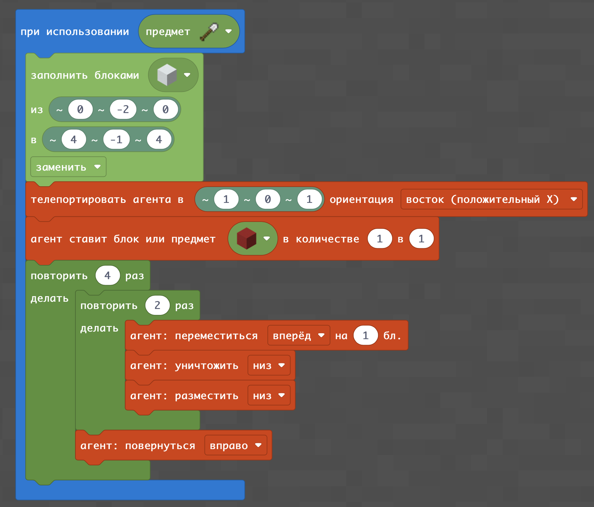
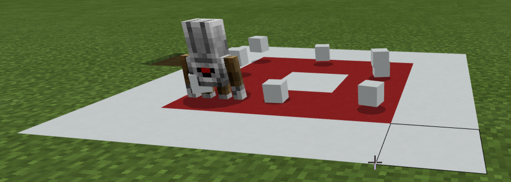

# Узоры
В этом занятии мы объединим возможности создания блоков по команде и установке блоков агентом и определим в каком случае какой способ лучше.

|Номер|Дополнительное задание|Код|Изображение|
|---|---|---|---|
|1|1. Поставить на уровне земли блоки из белого бетона размером 10 x 10 2. Поставить на уровне земли блоки из красного бетона размером 5х5 3. Поставить на уровне земли блоки из черного бетона размером 3х3. 4. Провести линию на уровне земли из 10 блоков из желтого бетона вперед от игрока (направление подобрать эксперементально) 5.  Провести линию на уровне земли из 10 блоков из синего бетона в сторону от игрока (направление подобрать эксперементально)|||  
**Творческое задание:**
* Поставить линию динамита размером 5 блоков
* Подорвать ее
* Устранить результаты подрыва заменяя взорванные блоки блоками земли.

## Объединение блоков и работы агента
Для того, чтобы свести блоки и работу агента - необходимо телепортировать агента в нужную точку созданных блоков.

|Номер|Дополнительное задание|Код|Изображение|
|---|---|---|---|
|2|1. Сделать квадрат 3х3 из блоков красного бетона на фоне из белых блоков   2. Сделать квадарт 5х5 из желтых блоков на фоне из синих блоков.   3. Сделать прямоугольник 5х3 из зеленых блоков на фоне из белых блоков|||
## Агент стоит не с краю поля из блоков
Для того, чтобы начинать не с краю поля необходимо сместить агента (телепортировать не в точку, где находится игрок, а рядом: на расстоянии 1 по координате x и 1 по координате z).  
  
Соответственно и поле должно быть больше на 2 блока для полей (1 блок с одного края и 1 - с другого).
  
|Номер|Дополнительное задание|Код|Изображение|
|---|---|---|---|
|3|1. Сделать квадрат 3х3 из блоков красного бетона на фоне из белых блоков, с размером поля 1 с каждой стороны   2. Сделать квадарт 5х5 из желтых блоков на фоне из синих блоков, с размером поля 2 с каждой стороны   3. Сделать прямоугольник 5х3 из зеленых блоков на фоне из белых блоков, с размером поля 3 с каждой стороны|||

