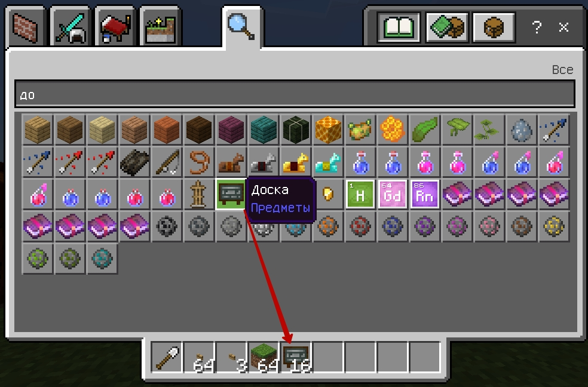
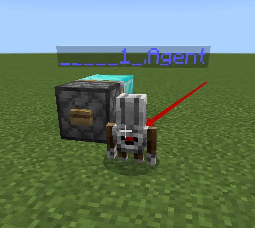
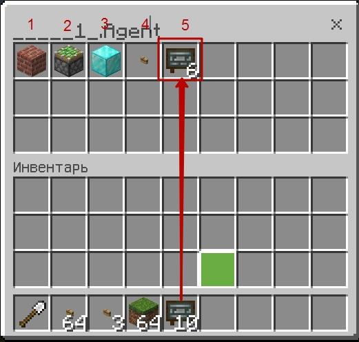
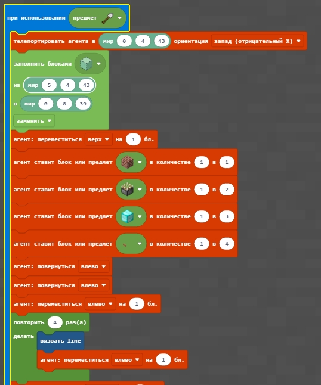
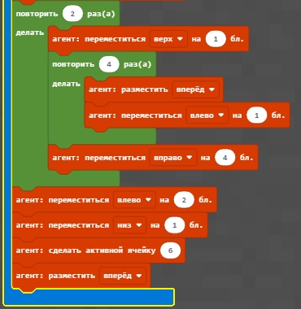
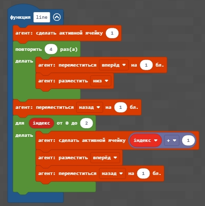
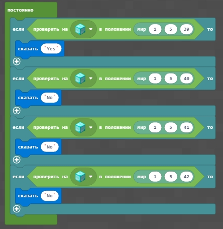

# Создание квестов
В Minecraft можно проверять наличие определенных блоков в определенном месте. В помощью такого функционала можно проверить правильность постройки по коду, а также реализовать функционал проверки - на какую кнопку нажал игрок (и, в зависимости от этого - применять к нему определенные действия). Для реализации такого функционала можно применить липкий поршень с определенных блоком (будем проверять наличие блока в определенной точке).

|#|Описание|Код|Скриншот|
|---|---|---|---|
|1|1. Создайте конструкцию с липким поршнем и алмазным блоком, начиная из координаты (0;4;30) 2. Создайте конструкцию с липким поршнем и золотым блоком, начиная из координаты (0;4;40) 3. Создайте конструкцию с обычным поршнем и изумрудным блоком, начиная из координаты (0;4;50)||---|
  
При постройке элементов, особенно при оталдке определенных алгоритмов очень удобно удалять то, что было построено (чтобы строить на пустом месте). Для этого удобно использовать команду заполнения блоками воздуха.  
Например, удалить 
|#|Описание|Код|Скриншот|
|---|---|---|---|
|2|1. Очистите результат выполнения первого пункта первого задания.  2. Очистите результат выполнения второго пункта первого задания.   2. Очистите результат выполнения третьего пункта первого задания.||---|

### Творческое задание
Создайте с помощью кода любую конструкцию (дом, дорога, забор).

## Проверка размещения блока
|#|Описание|Код|Скриншот|
|---|---|---|---|
|3|1. Проверьте положение блока после активации липкого поршня в первом пункте первого задания  2. Проверьте положение блока после активации липкого поршня во втором пункте первого задания 3. Проверьте положение блока после активации поршня в третьем пункте первого задания ||---|

### Техническое задание
Сделайте скриншоты и скринкасты выполнения каждого из заданий.

## Типовой проект
Для выполнения данного проекта нам необходимо передать агенту в ячейку №5 доски (на которых можно писать).  
Для этого возьмем доску в инвентаре:  
  
После этого - зайдем в агента (нажмем на него правой клавишей):
  
И передадим агенту в пятую ячейку несколько досок:  
  
Далее - запрограммируем создание опроса:  
  
  
  
  
  
   
Напишите на досках вопрос и варианты ответа.  

