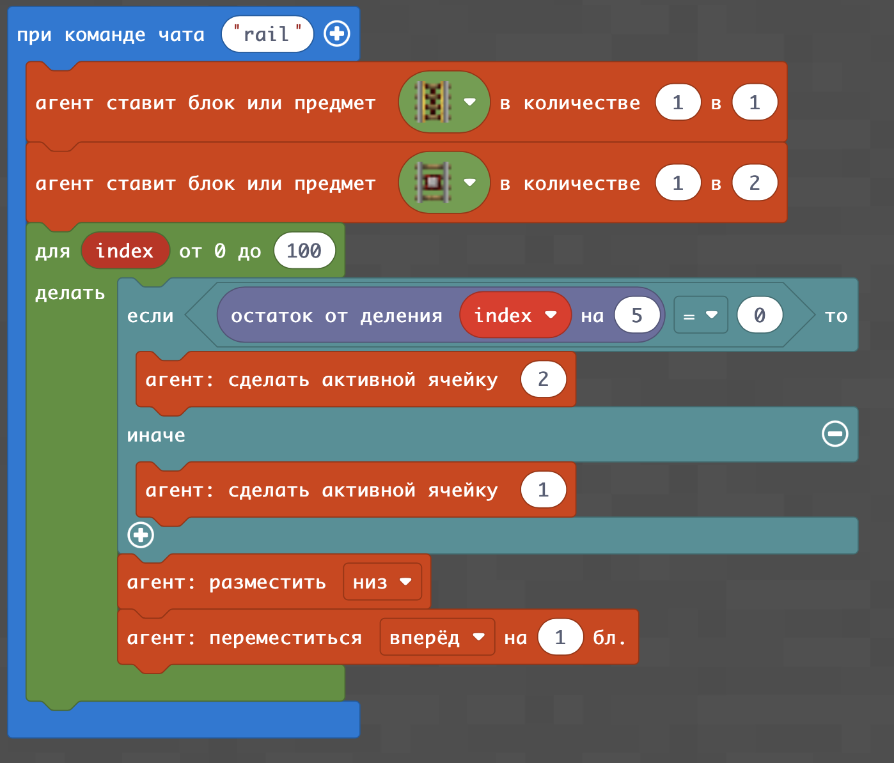
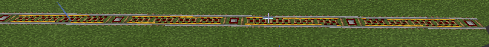
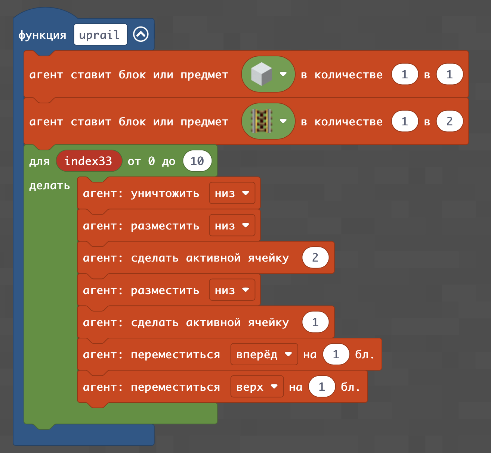
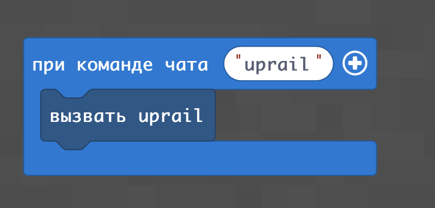
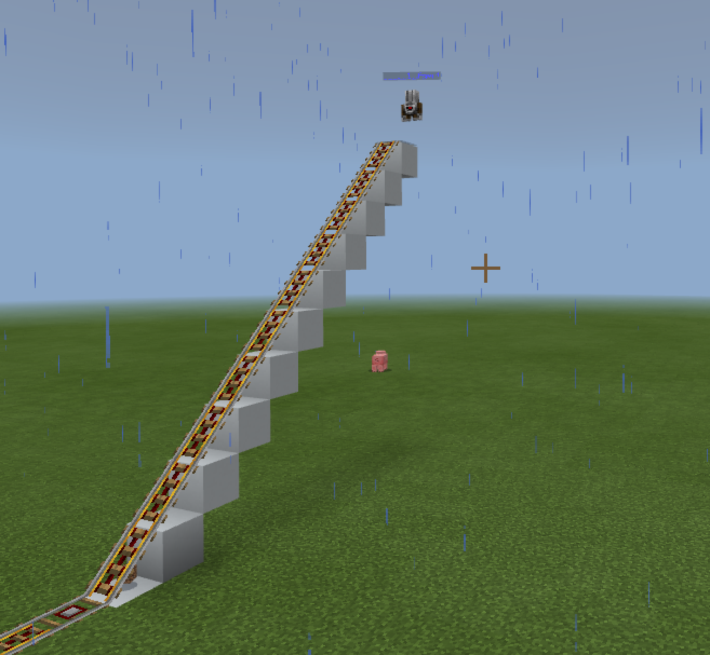
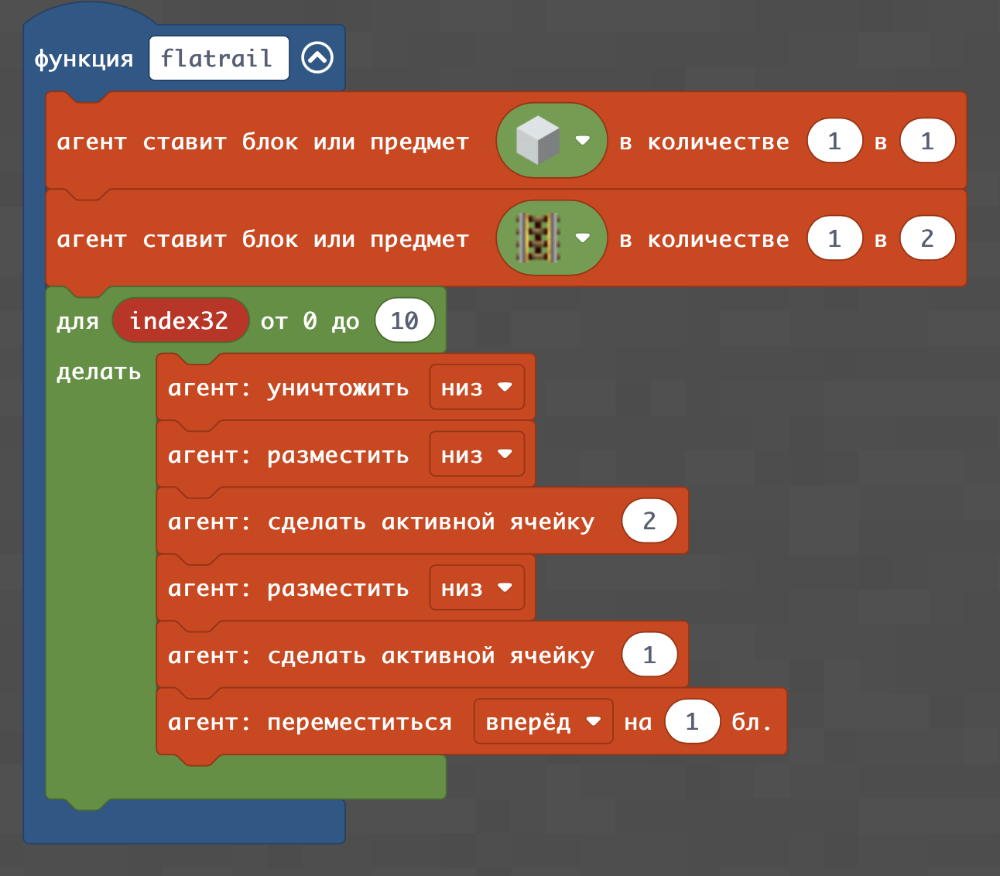
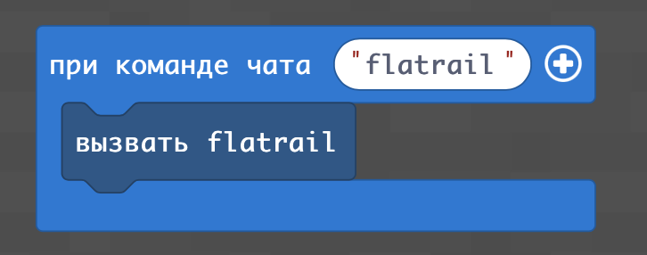
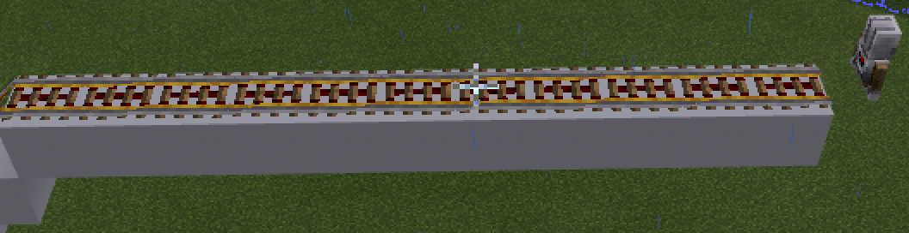
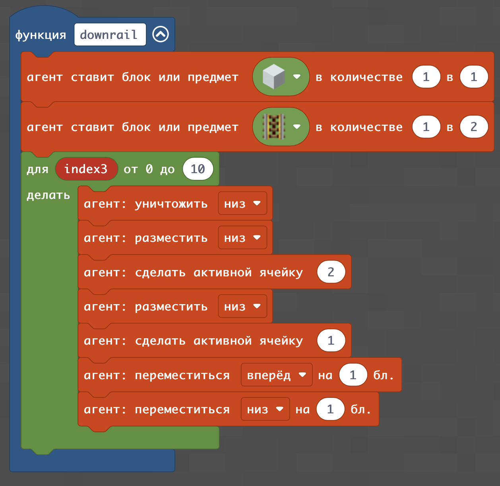

# Железная дорога
## Простая железная дорога
|#|Задания|Код|Результат|
|---|---|---|---|
|1|Постройте железную дорогу|||

**Творческое задание:**
Постройте 2 здания, проведите между ними железную дорогу и проедьтесь на ней на вагонетке.

## Построить мост 1
|#|Задания|Код|Результат|
|---|---|---|---|
|2|Постройте рельсы, ведущие вверх| ||

## Построить мост 2
|#|Задания|Код|Результат|
|---|---|---|---|
|2|Постройте рельсы, идущие ровно над землей| ||

## Построить мост 3
|#|Задания|Код|Результат|
|---|---|---|---|
|3|Постройте рельсы, идущие ровно над землей| ||