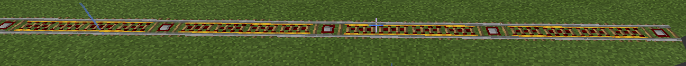
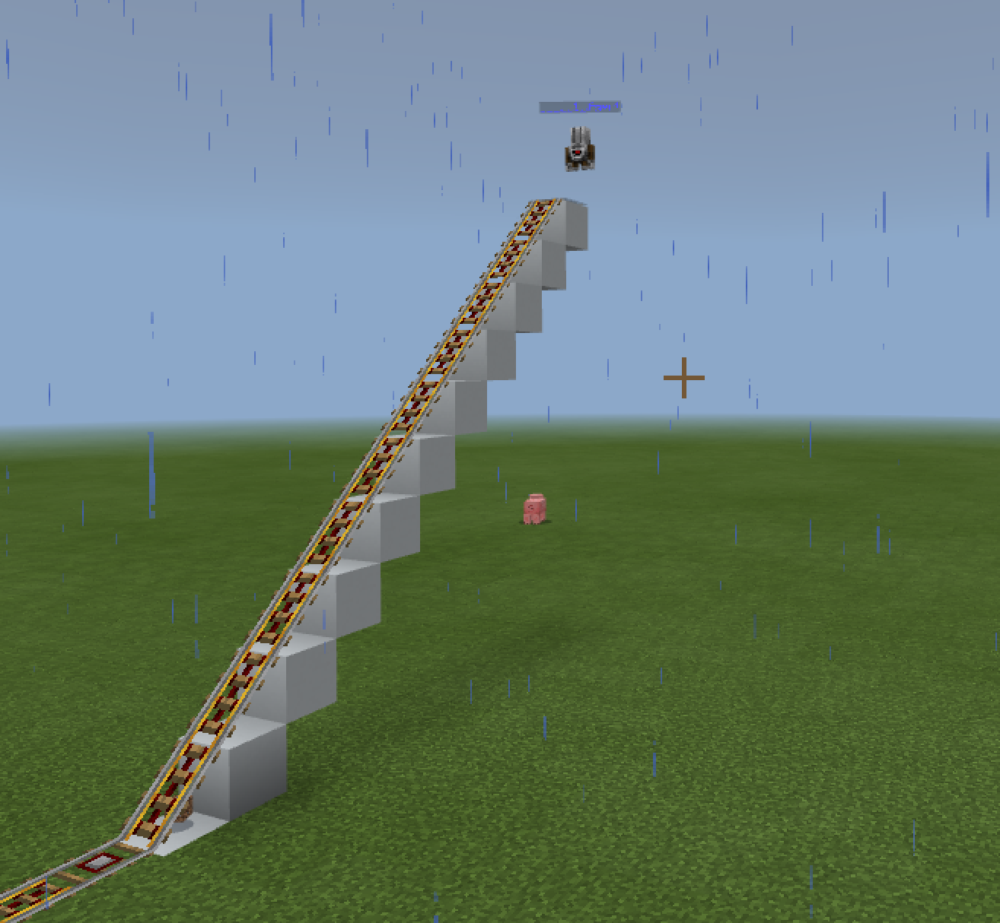
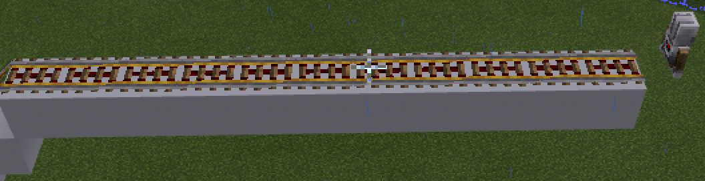
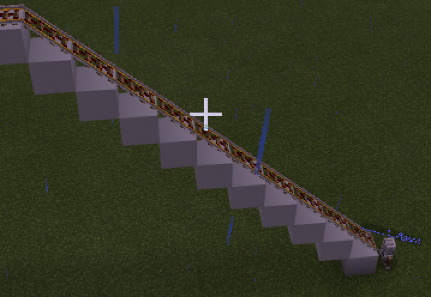
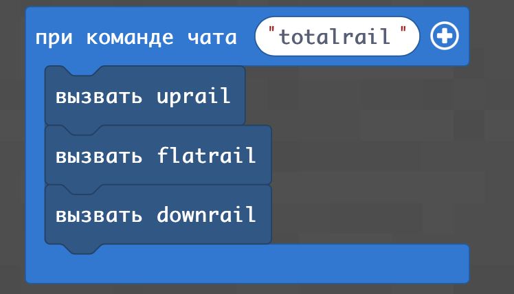
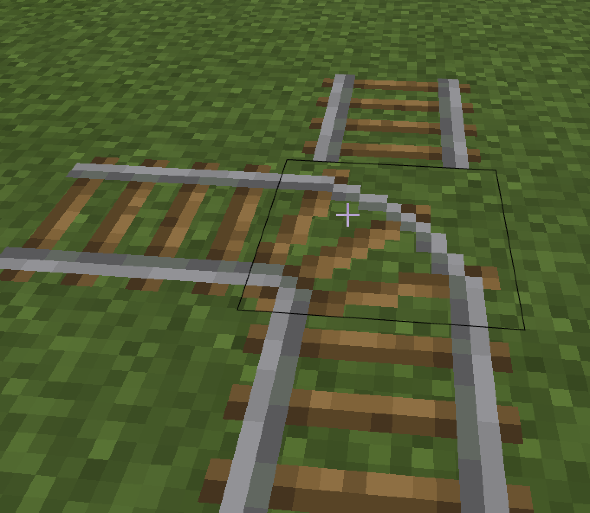
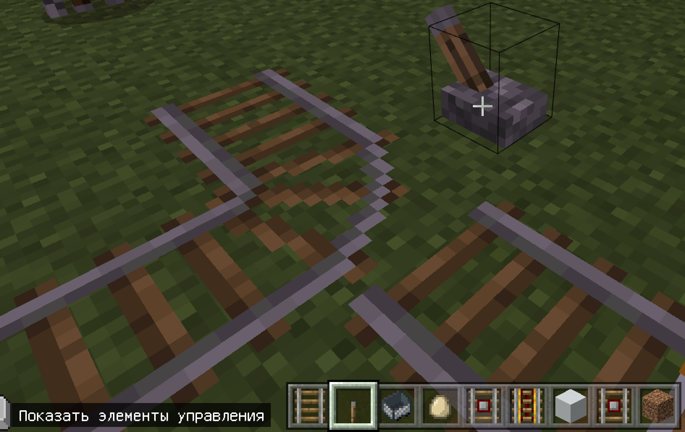
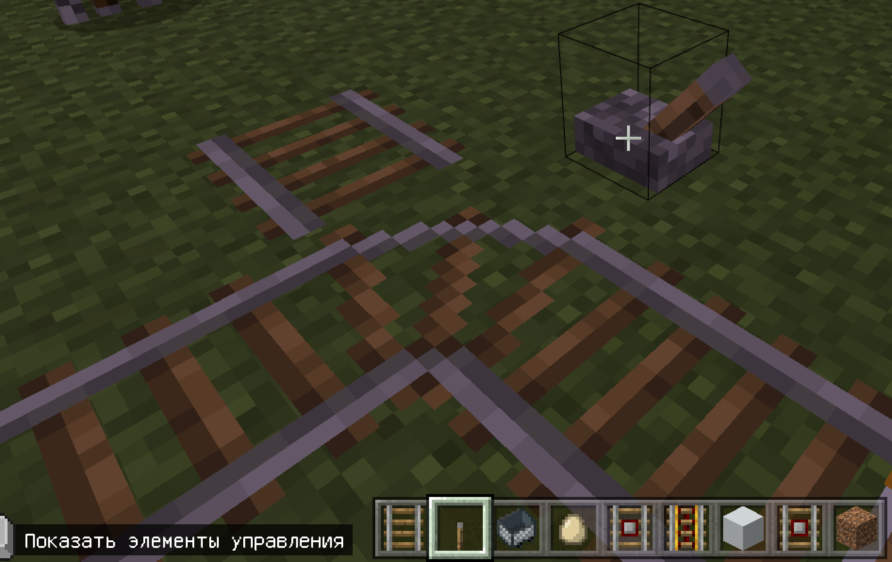
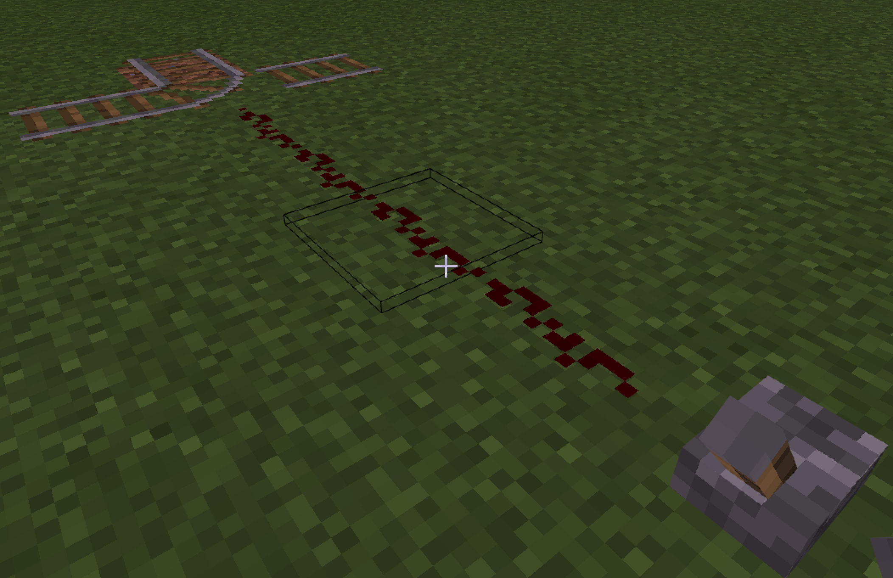
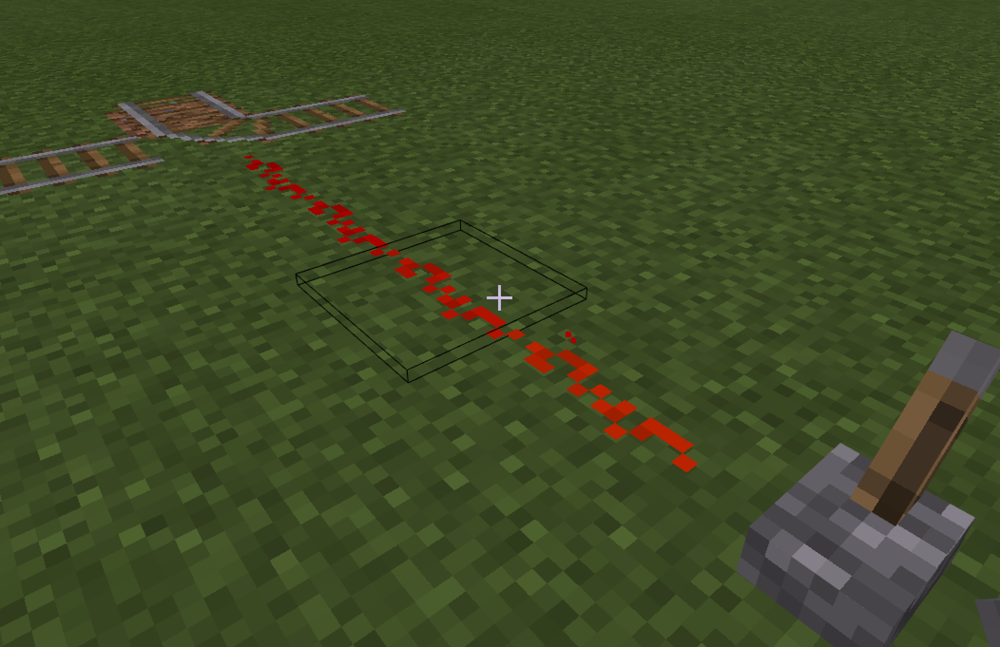

# Железная дорога
## Простая железная дорога
|#|Задания|Код|Результат|
|---|---|---|---|
|1|Постройте железную дорогу|player.onChat("rail", function () {<br>    agent.setItem(POWERED_RAIL, 1, 1)<br>    agent.setItem(DETECTOR_RAIL, 1, 2)<br>    for (let index = 0; index <= 100; index++) {<br>        if (index % 5 == 0) {<br>            agent.setSlot(2)<br>        } else {<br>            agent.setSlot(1)<br>        }<br>        agent.place(DOWN)<br>        agent.move(FORWARD, 1)<br>    }<br>})||

**Творческое задание:**
Постройте 2 здания, проведите между ними железную дорогу и проедьтесь на ней на вагонетке.

## Построить мост 1
|#|Задания|Код|Результат|
|---|---|---|---|
|2|Постройте рельсы, ведущие вверх|function uprail () {<br>    agent.setItem(WHITE_CONCRETE, 1, 1)<br>    agent.setItem(POWERED_RAIL, 1, 2)<br>    agent.setItem(DETECTOR_RAIL, 1, 3)<br>    agent.setItem(REDSTONE_BLOCK, 1, 4)<br>    for (let index33 = 0; index33 <= 10; index33++) {<br>        agent.destroy(DOWN)<br>        agent.place(DOWN)<br>        agent.setSlot(2)<br>        agent.place(DOWN)<br>        if (index33 % 4 == 0) {<br>            agent.setSlot(4)<br>        } else {<br>            agent.setSlot(1)<br>        }<br>        agent.move(FORWARD, 1)<br>        agent.move(UP, 1)<br>    }<br>}<br><br>player.onChat("uprail", function () {<br>    uprail()<br>})||

```js
function uprail () {
    agent.setItem(WHITE_CONCRETE, 1, 1)
    agent.setItem(POWERED_RAIL, 1, 2)
    agent.setItem(DETECTOR_RAIL, 1, 3)
    agent.setItem(REDSTONE_BLOCK, 1, 4)
    for (let index33 = 0; index33 <= 10; index33++) {
        agent.destroy(DOWN)
        agent.place(DOWN)
        agent.setSlot(2)
        agent.place(DOWN)
        if (index33 % 4 == 0) {
            agent.setSlot(4)
        } else {
            agent.setSlot(1)
        }
        agent.move(FORWARD, 1)
        agent.move(UP, 1)
    }
}

player.onChat("uprail", function () {
    uprail()
})
```


## Построить мост 2
|#|Задания|Код|Результат|
|---|---|---|---|
|2|Постройте рельсы, идущие ровно над землей|function flatrail () {<br>    agent.setItem(WHITE_CONCRETE, 1, 1)<br>    agent.setItem(POWERED_RAIL, 1, 2)<br>    agent.setItem(DETECTOR_RAIL, 1, 3)<br>    agent.setItem(REDSTONE_BLOCK, 1, 4)<br>    for (let index32 = 0; index32 <= 10; index32++) {<br>        agent.destroy(DOWN)<br>        agent.place(DOWN)<br>        agent.setSlot(2)<br>        agent.place(DOWN)<br>        if (index32 % 4 == 0) {<br>            agent.setSlot(4)<br>        } else {<br>            agent.setSlot(1)<br>        }<br>        agent.move(FORWARD, 1)<br>    }<br>}<br><br>player.onChat("flatrail", function () {<br>    flatrail()<br>})||


```js
function flatrail () {
    agent.setItem(WHITE_CONCRETE, 1, 1)
    agent.setItem(POWERED_RAIL, 1, 2)
    agent.setItem(DETECTOR_RAIL, 1, 3)
    agent.setItem(REDSTONE_BLOCK, 1, 4)
    for (let index32 = 0; index32 <= 10; index32++) {
        agent.destroy(DOWN)
        agent.place(DOWN)
        agent.setSlot(2)
        agent.place(DOWN)
        if (index32 % 4 == 0) {
            agent.setSlot(4)
        } else {
            agent.setSlot(1)
        }
        agent.move(FORWARD, 1)
    }
}

player.onChat("flatrail", function () {
    flatrail()
})
```

## Построить мост 3
|#|Задания|Код|Результат|
|---|---|---|---|
|3|Постройте рельсы, идущие ровно над землей|function downrail () {<br>    agent.setItem(WHITE_CONCRETE, 1, 1)<br>    agent.setItem(POWERED_RAIL, 1, 2)<br>    agent.setItem(DETECTOR_RAIL, 1, 3)<br>    agent.setItem(REDSTONE_BLOCK, 1, 4)<br>    for (let index3 = 0; index3 <= 10; index3++) {<br>        agent.destroy(DOWN)<br>        agent.place(DOWN)<br>        agent.setSlot(2)<br>        agent.place(DOWN)<br>        if (index3 % 4 == 0) {<br>            agent.setSlot(4)<br>        } else {<br>            agent.setSlot(1)<br>        }<br>        agent.move(FORWARD, 1)<br>        agent.move(DOWN, 1)<br>    }<br>}<br>player.onChat("downrail", function () {<br>    downrail()<br>}))||

```js
function downrail () {
    agent.setItem(WHITE_CONCRETE, 1, 1)
    agent.setItem(POWERED_RAIL, 1, 2)
    agent.setItem(DETECTOR_RAIL, 1, 3)
    agent.setItem(REDSTONE_BLOCK, 1, 4)
    for (let index3 = 0; index3 <= 10; index3++) {
        agent.destroy(DOWN)
        agent.place(DOWN)
        agent.setSlot(2)
        agent.place(DOWN)
        if (index3 % 4 == 0) {
            agent.setSlot(4)
        } else {
            agent.setSlot(1)
        }
        agent.move(FORWARD, 1)
        agent.move(DOWN, 1)
    }
}
player.onChat("downrail", function () {
    downrail()
})
```
### Дополнительное задание
Объедините все функцию в одну и запустите:  


```js
player.onChat("totalrail", function () {
    uprail()
    flatrail()
    downrail()
})
```


## Стрелки
Для того, чтобы создать стрелки необходимо добавить обычные рельсы (можно сделать вручную)  
  
Для переключения стрелок можно использовать рычаг:   
  
 

### Творческое задание:
**Постройте станцию** - у которой от основного пути есть путевое развитие на 2-3 пути с платвформами, при этом переключение стрелок осуществляется с помощью стрелок.

## Стрелки с дистанционным управлением
Стрелками можно управлть, передавая к ним сигнал с использованием красного камня (в том числе от рычага):  
    
   

### Творческое задание:
Создайте пункт управления станцией - точку в которую сходятся все инструменты управления стрелками станции.  
После этого - сделайте круговую ветку с электрорельсами, на которой можно переключать стрелки.  
