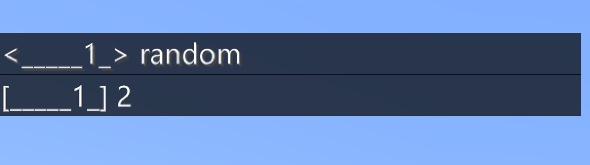
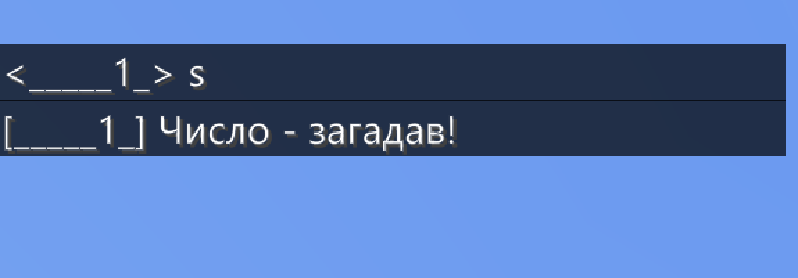
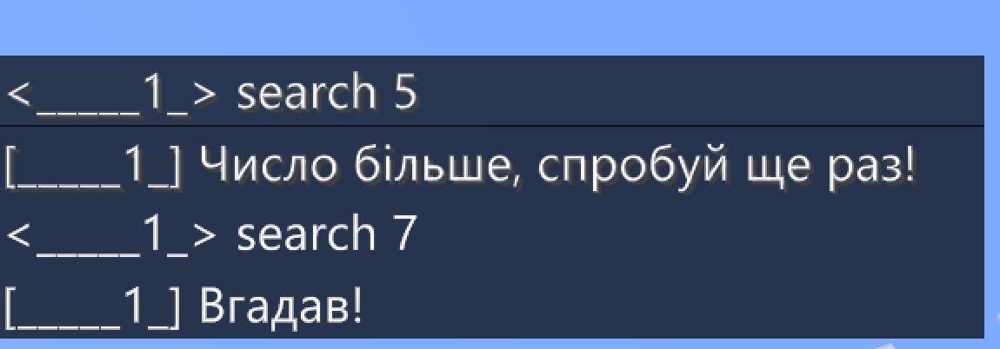

# Випадкові числа та ігри
В програмуванні  важливим інструментом є генерація випадкових чисел. Даним інструментом часто користуються, в тому числі, для розробки ігор для задання значень, які не залежать від гравця і невідомі йому.
Код
```js
player.onChat("random", function () {
    player.say(randint(0, 10))
})
```
Генерує випадкове число від 0 до 10.


## Гра "Відгадай число"
Найпростішою грою із угадування буде "Відгадай число", коли програма зберігає число в певній змінній. І гравець також вводить число. Якщо числа збігаються - гравець виграв, якшо ні - програв.  
```js
player.onChat("guess", function (num1) {
    n = randint(0, 2)
    if (n == num1) {
        player.say("Вгадав!")
    } else {
        player.say("Не вгадав, вірне число:" + n)
    }
})
```

## Пошук числа
Гру, описану вище можна реалізувати із більш цікавим алгоритмом із наявністю підказки:
```js
player.onChat("s", function () {
    n = randint(0, 10)
    player.say("Число - загадав!")
})

player.onChat("search", function (num1) {
    if (n == num1) {
        player.say("Вгадав!")
    } else {
        if (n < num1) {
            player.say("Число менше, спробуй ще раз!")
        } else {
            player.say("Число більше, спробуй ще раз!")
        }
    }
})

```
  
  

## Блоки
Але випадковим може бути не тільки задумане число, але й місце в просторі де з'являється певний блок.
В наступному прикладі при команді **start** блок із деревини дуба з'являється у випадковому місці між координатами (0;4;0) до (10;4;10). При знищенн і блок з деревини дуба він переміщуєтсья в іншу випадкову точку між координатами (0;4;0) до (10;4;10).


```js
let n = 0
player.onChat("start", function () {
    blocks.place(PLANKS_OAK, world(randint(0, 10), 4, randint(0, 10)))
    n = 0
})

blocks.onBlockBroken(PLANKS_OAK, function () {
    blocks.place(PLANKS_OAK, world(randint(0, 10), 4, randint(0, 10)))
    n += 1
    player.say(n)
    gameplay.title(mobs.target(NEAREST_PLAYER), "" + n, "")
})
```
### Додаткові завдання:
1. Розміщуйте елементи в інтервалі від (-10;4;-10) до (10;4;10).
2. При старті розміщуйте блок в точці (0;4;0), при знищенні - в випадковому місці між координатами (-5;4;-5) до (5;4;5)
3. За кожен знищенний блок нараховуйте по 2 бали.
4. При команді **start** - виведіть правила гри на екран (за допомогою команди **gameplay.title(mobs.target(NEAREST_PLAYER), "Заголовок" , "Підзаголовк")** , або за допомогою команди **player.say("Повідмлення")**)