# Оценка

|#|Завдання|Код|Результат|
|---|---|---|---|
|1|1. 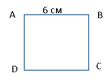 2.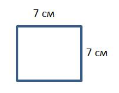 3.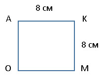|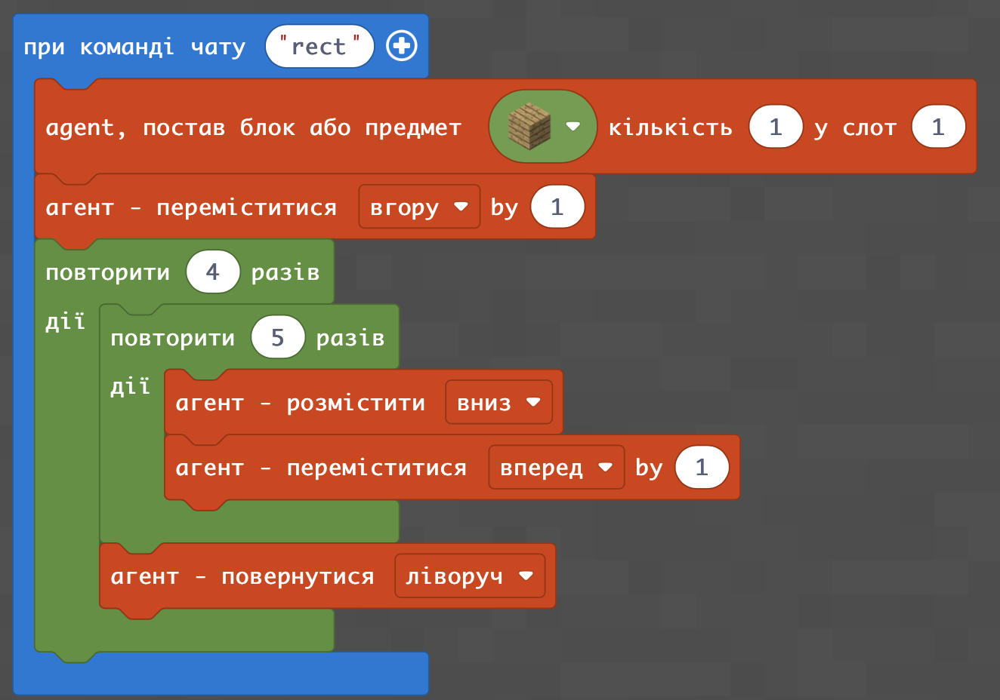|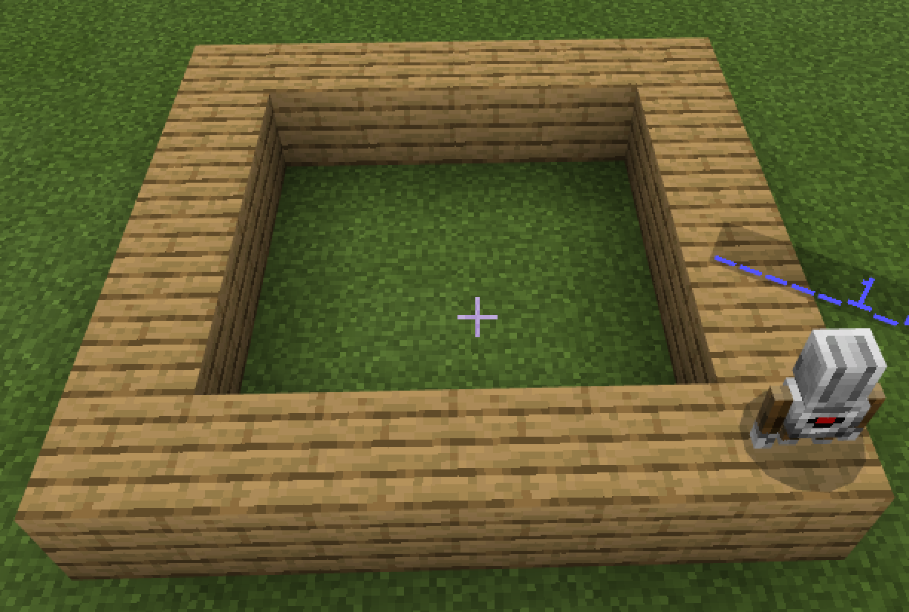|

|#|Завдання|Код|Результат|
|---|---|---|---|
|2|1. 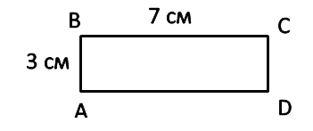 2.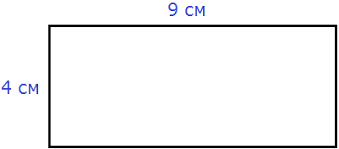 3.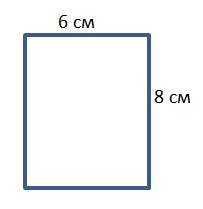 4.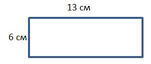|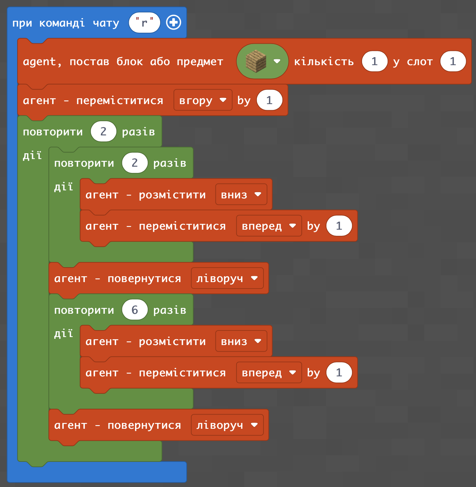|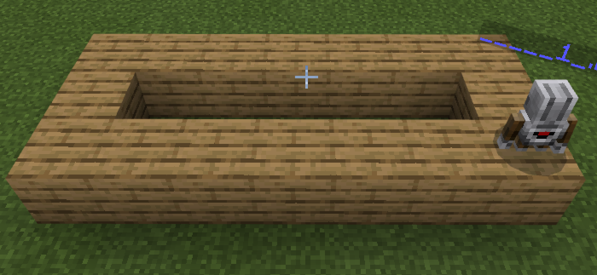|

### Додаткові завдання:
1. 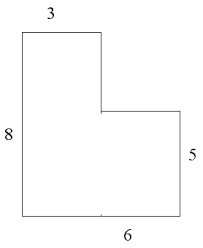
2. 
3. 
4. 

### Творче завдання:
Виміряйте розмір вашої кімнати та зробіть фігуру в Майнкрафті, що відповідє формі вашої кімнати, так, щоб 1 блок приходився на 10 см. вашої кімнати.
